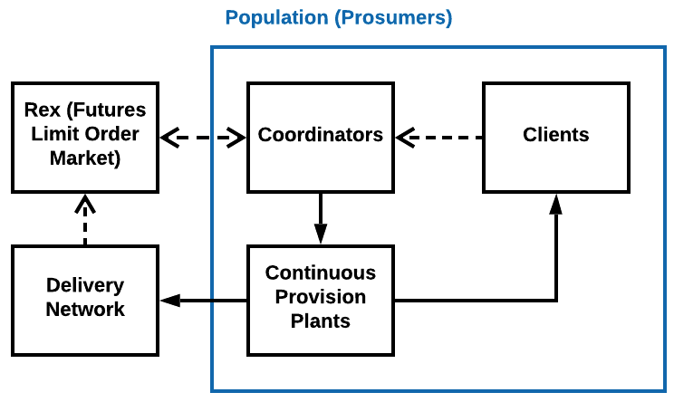

# RexNet: Next-Generation Market and Delivery Networks for Stochastic Service Systems

_Figure 1. Relationships between the population, the reservation exchange, and the service delivery network and external factors. Note that dashed lines and hollow arrows represent flows of information, while the solid lines and arrows represent physical impacts._

## Keywords

two-sided market, limit order books, agent-based models, reservation-realization-settlement, dynamic inconsistency, discrete event simulation, dynamic game with incomplete information, dynamic equilibrium discovery, asset pricing, forward market

## Abstract

- It is urgent to reduce the carbon emission from power generations and penetrate modern power systems in under-developed areas. The practice of procuring extra capacities for peak demand needs to be abandoned, especially when intermittent renewable generations become the principal source and active prosumers emerges.
- The direct participation of small-scale prosumers is the key, because the response introduced by demand side management programs is not enough. A new market design is brought up in this paper to replace the whole electricity market families. The necessity of reservation is the main difference, which frees utility companies from tracking uninformed loads all the time.

- To illustrate the market operations and explore the effect of external factors on the market performance, agent-based models are used to represent heterogeneous prosumers, and their interactions are demonstrated by discrete event simulations. The dynamics of the market is affected by the orders submitted by prosumers only, and the behaviors of prosumers are affected by their controllable, uncontrollable production and consumption.
- The resilience of the market against sudden changes of external factors is explored. Also, parameters describing prosumers have an impact on market operations. From the simulation, we find that ...

## Guidelines

- To provide a way for relatively poor prosumers to lower their electricity consumption, and not to lower the living standard of normal people.
- Distinguish discussion about the whole market design and simulation structure and models used in this paper, so that assumptions can be relaxed in the future and better models can be used.
- Remember to discuss the application in other industries, and explore literature from other industries.
- Not to prove the efficiency for now, but to demonstrate that the market allows direct participation.
- To analysis from the perspective of the designer of the market. We are not the centralized market organizer, because there is no one.
- Spatially lumped delivery networks for now.

## [Discussion](./discussion) and [Outline](./docs/outline.md)

2. [Self anticipation and manipulation of future state](./discussion/2.md)
3. [DES-MAS-CDA Simulation Platform for RexNet](./discussion/3.md)
5. [Why ABM and DES?](./discussion/5.md)
7. [Difference compared to ordinary limit order markets](./discussion/7.md)
9. [Why Prosumers Trade?](./discussion/9.md)
10. [New structure for energy systems](./discussion/10.md)
