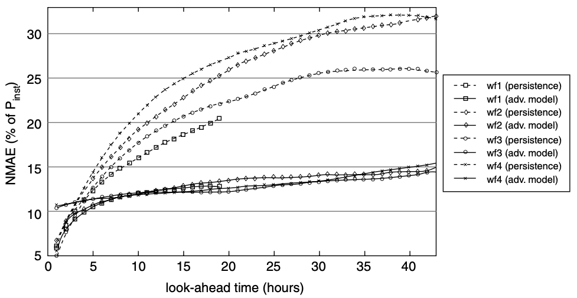

# Simulated Realization and Forecast

1. Analysis of Error Sequences
2. Martingale Model of Forecast Evolution (MMFE)
3. Continuous-Time Fixed-Volume MMFE
4. Resampling of Non-Stationary Dependent Time Series

## 1. Analysis of Error Sequences

time-dependent continuous-time Markov

sojourn times are uncorrelated

states will affect the transition probability

jump (increment and reduction) size fixed to 1

evolving time is fixed

multi-variate

whether the jump is increment or reduction dependent on states

using artificial data

How forecast errors for the same unit evolve with decreasing forecast horizon?

Example:

multiple realization of a stochastic process with fixed length

### 1-1. Performance in Different Horizons

_Figure 1. Performance in terms of normalized mean absolute error (NMAE) of two prediction models (persistence and a state-of-art artificial-intelligence based prediction method) for short-term wind power in four different sites._

- __madsen2005standardizing__ Standardizing the performance evaluation of short-term wind power prediction models
- __kariniotakis2004what__ What performance can be expected by short-term wind power prediction models depending on site characteristics?

reproduce the result using realized error sequence

### 1-2. Autocorrelation of Error Sequences

there is no correlation in the error

- __miettinen2020simulating__ Simulating wind power forecast error distributions for spatially aggregated wind power plants

### 1-3. Cross-Correlation of Error Sequences by Different Prosumers

the aggregated estimation will be lowered.

## 2. Martingale Model of Forecast Evolution (MMFE)

When horizons of forecasts are fixed, like those in electricity market families, there is no need for MMFE, because there is no evolution. Instead, empirical findings regarding relationships of two forecasts are essential.

> Let $\mathcal{D}_{s, t}$ be the forecast made in period $s$ for the demand in period $t \geq s .$ The realized demand in period $t$ is denoted by $\mathcal{D}_{t, t} .$ In each period, forecasts are updated for future $L$ periods; let the forecasts for all periods beyond be a constant. Thus, $L$ may be interpreted as the length of the forecasting horizon. Define $\varepsilon_{s, t} = \mathcal{D}_{s, t} - \mathcal{D}_{s-1, t}, t=s, s+1, \ldots, s+L-1,$ to be the change in the forecast in period $s$ for the demand of period $t .$ Thus, in each period $s,$ a forecast update vector $\varepsilon_{s} \equiv\left(\varepsilon_{s, s}, \varepsilon_{s, s+1}, \ldots, \varepsilon_{s, s+L-1}\right)$ is generated. (Note that the first element in the vector, $\varepsilon_{s, s},$ which is equal to the difference between the actual demand and the last forecast, represents the error that remains unresolved through forecasts.) The purpose of the MMFE is to analyze the probabilistic structure of this vector. [_sapra2012continuous_]

> The model requires an assumption that the forecast update vector in period $s, \varepsilon_{s},$ be a zero-mean normally distributed random vector that is identically distributed for all $s$ and that $\varepsilon_{s}$ is uncorrelated with past forecast update vectors $\varepsilon_{s_{1}}, s_{1}<s .$ The last assumption is satisfied if, for any $s,$ the forecast made in period $s$ for demand in period $t, \mathcal{D}_{s, t},$ is a conditional expectation of $\mathcal{D}_{t, t}$ given all of the information available at time $s$. In this case, the sequence of forecasts for the demand of period $t\left\{\mathcal{D}_{s, t}: s \leq t\right\}$ forms a Martingale process. [_sapra2012continuous_]

> Note that this assumption does not mean that the elements of $\varepsilon_{s}$ are uncorrelated. On the contrary, they are likely to be correlated since they are equal to forecast updates for future periods given the same new information in period $s$. [_sapra2012continuous_]

### 2-1. Dynamic Procurement

__wang2012multiordering__ A multiordering newsvendor model with dynamic forecast evolution.
  - Eq. 9 uses deterministic future ordering costs

> The newsvendor can spread her orders over the planning horizon to take advantage of lower ordering costs with early orders and more accurate demand forecasts with late orders. [_wang2012multiordering_]

### 2-2. Martingale Model of Asymmetric Forecast Evolutions (MMAFE)

> Both MMFE and CTMMFE are not forecasting techniques; they simply provide a framework to represent the evolution of forecasts over time. The actual forecasts could be made using any forecasting technique such as time-series methods or a combination of human judgement and statistical techniques. The MMFE and CTMMFE models treat the forecasts over time as realizations of a stochastic process, namely, a martingale process; that is, the forecasts are the conditional expectation of the future demand, given all the available information. [_sapra2013equilibrium_]

### 2-3. Forecast Cooperation

> The supplier, however, does not know the manufacturer’s private forecast information. To facilitate information sharing, the manufacturer can report her forecast prior to the capacity decision. However, the manufacturer’s forecast report is non-binding (it is not a firm order and can be canceled or revised), non-verifiable (after demand is realized, a third party cannot verify that the manufacturer disclosed her actual forecast), and costless (the manufacturer does not incur any cost when sharing her forecast). This kind of forecast reporting strategy leads to what is known as “cheap talk” communication. [_oh2013mechanism_]

Auctioneers collect everyone's forecast and willings to clear the markets once in a while.

### 2-4. Evolution of Forward Prices

When future forward prices are unknown, their realization should be simulated as well. Most of the time, the realization can be correlated to that of quantites.

- __hair2014energy__ energy procurement strategies in the presence of intermittent sources

> In general, conventional energy tends to be more expensive in markets closer to real time. The reason for this is that the marginal costs of production tend to be higher in spot markets than in forward or long term markets because any conventional energy that is demanded closer to real time is provided by generators that have low start up time and these generators typically are more expensive than generators that require several hours to start up. [_hair2014energy_]

## 3. Continuous-Time Fixed-Volume MMFE

it usually turns out to be one-way adjustment

- one-way adjustment
- early adjustment
- infrequent adjustment

### Horizon Distribution of Adjustments

## 4. Resampling of Non-Stationary Dependent Time Series

### Model-Based Resampling

> Model-based resampling is easily adopted to time series. The resamples are obtained by simulating the time series model. For example, if the model is ARIMA(p,d,q), then the resamples of an ARIMA(p, q) model with MLEs (from the differenced series) of the autoregressive and moving average coefficients and the noise variance. The resamples are the sequences of partial sum of the simulated ARIMA(p, q) process.

> Model-free resampling of time series is accomplished by block resampling, also called block bootstrap, which can be implemented using the tsboot function in R’s boot package. The idea is to break the series into roughly equal-length blocks of consecutive observations, to resample the block with replacement, and then to paste the blocks together. For example, if the time series is of length 200 and one uses 10 blocks of length 20, then the blocks are the first 20 observations, the next 20, and so forth. A possible resample is the fourth block (observation 61 to 80), then the last block (observation 181 to 200), then the second block (observation 21 to 40), then the fourth block again, and so on until there are 10 blocks in the resample.

### Model-free Resampling

Stationary sub-process -> Scenario

Assume that sub-processes are iid.

#### Scenario and Profile

> Taking the need for flexibility into account when assessing whether a portfolio of generation and other resources will meet future needs for electricity cannot be done on the basis of a projected load-duration curve because such curves do not reflect the time-domain variations of the load. To ensure that a set of resources will be able to meet a system’s operating constraints, their operation must be simulated on a set of demand profiles that reflect a sufficiently wide range of anticipated system conditions. For a more detailed discussion of this issue, see Ma et al. (2013) or Ulbig and Andersson (2015). [1]

> Note that a discrete stochastic process can be represented by a finite set of actual vectors, referred to as scenarios, resulting from the combinations of all the discrete values that its component random variables can adopt. In mathematical terms, if $\lambda$ is a discrete stochastic process, it can be expressed as $\lambda  = {\lambda(\omega), \omega = 1, 2, ..., N_{\Omega}}$, where $\omega$ is the scenario index and $N_{\Omega}$ is the number of possible scenarios. In order for the discrete stochastic process to be perfectly determined, a probability of occurrence π(ω) needs to be associated with each realization $\lambda(\omega)$ such that $\sum_{\omega = 1}^{N_{\Omega}} \pi(\omega) = 1$. [2]

#### Stochastic Process and Scenario

> A weakly stationary process is characterized by the fact that both the mean value and the variance are constant, while the auto-covariance function depends only on the time difference, i.e., by $(t_1 − t_2)$. [3]

> A stationary process is said to be ergodic if its ensemble averages equal appropriate time averages. By this definition we mean that any statistic of $X(t)$ can be determined from a single realization $x(t)$. This is a general requirement. In most applications we consider only specific statistics, as, e.g., the mean value. [3]

#### Scenario Generation and Reduction

> To adequately describe a stochastic process, it is critical to generate a sufficient number of scenarios so that these scenarios cover the most plausible realizations of the considered stochastic process. To achieve this, it is generally required to generate a very large number of scenarios, which may render the associated stochastic programming problem computationally intractable. [2]

> It is thus required to develop procedures to reduce the number of scenarios initially generated. These procedures should retain most of the relevant information on the stochastic process contained in the original scenario set while reducing significantly its cardinality. [2]

---

## 1, Introduction

> In the day-ahead market, the wind forecast is simulated based on the realization of WG and the simulation of wind forecast error. The realization of WG is assumed to be the same as historical data. Wind forecast error is simulated based on a probability distribution considering the associated temporal correlation. Demand forecast is also simulated using this approach. [4]

## 3, References

1. Kirschen, D.S. and Strbac, G., 2018. Fundamentals of power system economics. John Wiley & Sons.
2. Conejo, A.J., Carrión, M. and Morales, J.M., 2010. Decision making under uncertainty in electricity markets (Vol. 1). New York: Springer.
under uncertainty in electricity markets (Vol. 1). New York: Springer.
3. Madsen, H., 2007. Time series analysis. Chapman and Hall/CRC.
4. Ma, J., Silva, V., Belhomme, R., Kirschen, D.S. and Ochoa, L.F., 2013, July. Evaluating and planning flexibility in sustainable power systems. In 2013 IEEE power & energy society general meeting (pp. 1-11). IEEE.

[_wang2012multiordering_]: https://github.com/edxu96/symposium/tree/master/src/SRF
[_sapra2013equilibrium_]: https://github.com/edxu96/symposium/tree/master/src/SRF
[_oh2013mechanism_]: https://github.com/edxu96/symposium/tree/master/src/SRF
[_hair2014energy_]: https://github.com/edxu96/symposium/tree/master/src/SRF
[_madsen2005standardizing_]: https://github.com/edxu96/symposium/tree/master/src/SRF
[_sapra2012continuous_]: https://github.com/edxu96/symposium/tree/master/src/SRF
