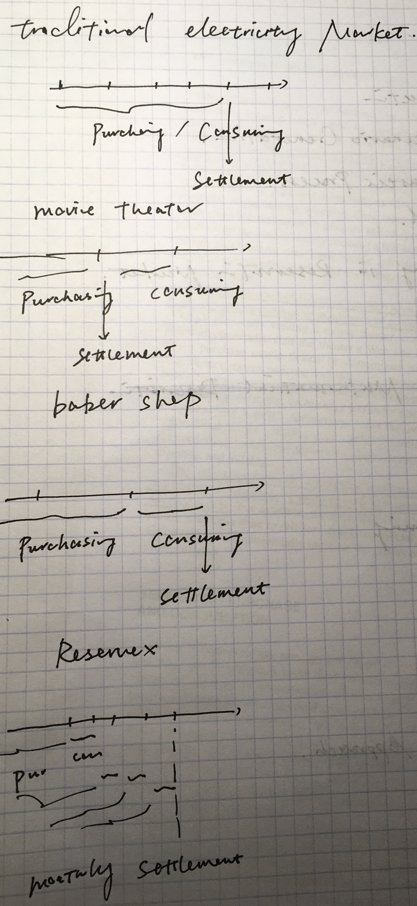
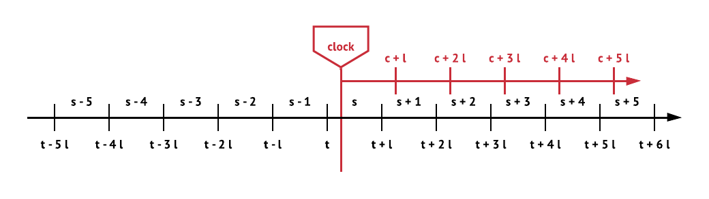
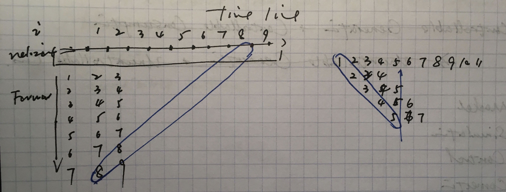

## 1, Introduction

When considering people consume manufactured goods or services, we usually implicitly assume that purchasing, producing, consuming and settlement happens at the same time. In fact, we do not even distinguish these four concepts, but they should be separated. Purchasing refers to the process when two sides reach agreements towards the consuming contents and prices. The producing and the consuming realizes the cost and utility. Settlement is the process of money transfer. The arrangements of four elements differ in different industries, and some prototypical instances are illustrated in figure 1.

If the purchase is separated from producing and consuming, at the time of purchase, buyers and sellers must anticipate the future states and the corresponding cost and utility.

_Figure 2, the timeline of Reservex operation. Note that the number of trading units in this illustration is 5. That is, prosumers can trading for 5 time units in the future._

The assets reserved are some constraints on service provision or consumption, which can be standardized. The standardized assets are discussed in the following subsection.

_Figure 3, Time Line of Reservation_

## 2, Types of Market for Service

### 2.1, Spot Market

Because of the service delivery, the spot market means the immediate service delivery after trading.

> Empirical evidence suggests that demand does decrease in response to a short-term price increase, but that this effect is relatively small [2], [3]. In other words, the short run price elasticity of the demand for electricity is small. [_kirschen2003demand_]

> Two economic and social factors explain this weak elasticity. First, the cost of electrical energy makes up only a small portion of the total cost of producing most industrial goods. It also rep- resents only a relatively minor fraction of the cost of living for most households. At the same time, electricity is indispensable in manufacturing and is regarded as essential to the quality of life by most individuals in industrialized societies. Most industrial consumers therefore will not reduce their production drastically to avoid a small increase in their electricity costs. In the short term, the savings might be more than offset by the loss of profit. Similarly, most residential consumers will probably not reduce their comfort and convenience to cut their electricity bill by a few percents. The second factor explaining this weak elasticity is partly historical. Since the early days of commercial electricity generation over a century ago, electricity has been marketed as a commodity that is easy to use and always avail- able. This convenience has become so ingrained that it is fair to say that very few people carry out a cost/benefit analysis each time they turn on the light. [_kirschen2003demand_]

> Adjusting prices in real time or very close to real time could lead to a true interaction between supply and demand in the setting of the price. Unfortunately, the scope for real time demand adjustments appears very limited at this point. Setting the price in advance gives consumers time to adjust their activities and their demand profile. [_kirschen2000factoring_]

### 2.2, Forward Market

> Achieving efficient short-run usage outcomes may also involve intertemporal decisions, such as whether or not to startup a generator or load, when to charge or discharge electricity storage, such as an electric vehicle, or when to make use of limited energy resources (such as hydro storage). In these cases, achieving efficient outcomes is likely to require high-quality forecasts of likely future supply, demand and network conditions. [5]

Number of target units should be set large enough for inter-temporal decision making. For example, if a generating company has the ability to produce a large amount of power for a period of hours or a retailer must supply a constant base load, they probably do not want to trade in 5-min intervals. They would rather agree on a quantity and price that remain fixed over a much longer period because it reduces their risks. In particular, before a generating company brings a large thermal unit on-line, it will want some certainty that this unit will remain synchronized long enough to recover its startup cost and respect its technical operating constraints. [6]

> These constraints would often make it impossible for a generating unit to follow dispatch instructions stemming from an hour-by-hour market clearing. Its owner would then be obliged to buy or sell energy on the spot market to compensate for the difference between what the market clearing said it should produce and what it was actually able to do. Furthermore, a large, efficient thermal generating unit usually burns a significant amount of fuel before it can begin injecting electrical energy into the grid. The cost of this fuel represents a fixed “startup cost” that must be amortized over the sale of enough electrical energy to justify starting this unit. [6]

> Advance selling is found in the service sector. It could result from the special properties of many services (e.g., Rust and Oliver 1994; Shugan 1994). An airplane, for ex- ample, departs on a specific date at a specific time. The same is true for sporting events, music concerts, trains, county fairs, Broadway plays, buses, circuses, county fairs, rodeos, cruises, and many other services. In each case, the customer of the service must be physically present at the service at a specific time, and advance selling at a different advance price becomes possible. Services adopt different practices concerning advance selling. Some offer it, whereas others do not. Some ser- vices offer advance sales but at the same advance price as the spot price. Repair services and public utilities usually offer no advance sales. Delivery services, airlines, and some entertainment services offer different spot and advance prices. Other services offer only advance ticketing (e.g., Las Vegas shows).

## 3, Reservation Inventory

Multi-Variate Inventory

Reserved forward quantity

The state of the prosumer $$n$$ at current unit $$i$$ can be described by $$(\boldsymbol{E}_{n, i}, \boldsymbol{p}_{n, i})$$, which can be represented by the following expressions:

$$
\begin{align}
	\boldsymbol{E}_{n, i} &= (e_{n, i+1}, e_{n, i+2}, ..., e_{n, i+A})^{T} \\
	\boldsymbol{p}_{n, i} &= (p_{n, i+1}, p_{n, i+2}, ..., p_{n, i+A})^{T} \\
\end{align}
$$

Because the forward prices for different prosumers may be different, the state of the exchange should be described by $$(\boldsymbol{E}_{i}, \boldsymbol{P}_{i})$$, which can be represented by the following expressions:

$$
\begin{align}
	\boldsymbol{E}_{i} &= (\boldsymbol{E}_{1, i}, \boldsymbol{E}_{2, i}, ..., \boldsymbol{E}_{N, i}) \\
	\boldsymbol{P}_{i} &= (\boldsymbol{p}_{1, i}, \boldsymbol{p}_{2, i}, ..., \boldsymbol{p}_{N, i}) \\
\end{align}
$$

### Deficit Reservation Inventory

Over-Booking in Airline Industry

The most prototypical example of reservation inventory is the number of seat in a plane.

> Faced with flying empty seats because of the no-shows, airlines adopted a strategy of overbooking. By accepting reservations for more than the available seats, airlines hedge against significant numbers of no-shows; however, the airlines risk turning away passengers with reservations if they overbook too many seats. [3]

### Inventory with Perishable Products

> The separation between purchase and consumption creates more buyer uncertainty, ceteris paribus, when buyers are unable to control when consumption occurs (e.g., a Saturday afternoon football game). When buyers control or influence the timing of consumption, buyers can wait to consume until a particular state occurs. When buyers inventory a soft drink, for example, they can consume only when they are thirsty. [_shugan2000advance_]

## 5, Reservation as Perishable Goods with Increasing Values

While a perishable item is one that has constant utility up until an expiration date (which may be known or uncertain), at which point the utility drops to zero [2], a perishable goods with increasing values is one that has increasing utility up until an expiration date.

Furthermore, three kinds of inventory theories are discussed in [Application/RexNet-Food](https://edxu96.gitbook.io/rexnet-docs/application/food).

The prosumption during different time units are different.

## 6, Queueing and Standby

The supply of energy should be treated as service. The energy is the facilitating goods, and the power grids or district heating networks are the facilitating infrastructures. The simultaneous presence of providers and adopters differs service operations from manufacturing operations, the latter of which are isolated or "buffered" from the customers by an inventory of finished goods. [1] Besides, the delivery of service takes time, while a transaction process for goods can be completed immediately. Usually, the service is perishable, which means it is hard to store it. These features challenge the efficient operation of service market. For a start, The arrival of customers is usually stochastic, which can be solved by two means. The simplest one is to set a queue, where customers waited to be served by a busy server. By waiting, the customer permits greater utilization of service capacity. [1] If the supply side is not competitive, the consumers may not receive enough compensation. For example, in some industries, like electricity and health care, the queueing can cause unacceptable losses, and the demanded compensation is too high. The airlines explicitly recognize this by offering standby passengers an unsold seat on the departing flight. This situation can be solved by the second method, to set standby servers. For example, to avoid the queue in front of the emergency room, extra doctors and facilities need to be standby all the time. To make sure the light can be turned on at any moment, extra electricity needs to be generated all the time, because the tracking ability of generators is limited.

When no one cares about global warming, it is relatively cheap to supply the electricity with extra standby volumes. Nevertheless, the internalized of the GHG emission will increase the electricity price dramatically. So people are welcoming the application of renewable energy generations, which causes another important problem, stochasticity from the supply side. Imagine, a new kind of facilities is introduced in the emergency room, and they can standby with low cost. But they will be out of order from time to time.

> Inventory also can be used to decouple the stages in a manufacturing process. For services, the decoupling is achieved through customer waiting. Inventory control is a major issue in manufacturing operations, whereas in services, the corresponding problem is customer waiting, or “queuing.” [1]

### Check-In, Starting Point, Service Rate and Service Time

In queueing theory, the length of service time is stochastic, and there is no service rate.

In Reservex, the starting point, service rate and service time are chosen by the prosumer.

## Reservation

> we assume that future consumption states are unknown. However, some interesting research suggests that consumers may manipulate their own states [_gibbs1993bidirectional_]. This research has potentially important implications for separating purchasing and consumption. [_shugan2000advance_]

## Options and Reservations in Different Industries

The options fee is to cover the opportunity loss.

For restaurant, the reservation fee covers the opportunity loss of the seat. Because there is no service  and food serving happening, there is no cost.

But for movie theaters and flight, the cost is sunk.

In energy system, when prosumers reserved, for system safety, they are guaranteed to receive the service.

## 7, References

1. Goel, G., Leonardi, S., Mirrokni, V., Nikzad, A. and Paes-Leme, R., 2016. Reservation exchange markets for internet advertising. In 43rd International Colloquium on Automata, Languages, and Programming (ICALP 2016). Schloss Dagstuhl-Leibniz-Zentrum fuer Informatik.
2. Nahmias, S., 2011. Perishable inventory systems (Vol. 160). Springer Science & Business Media.
3. Fitzsimmons, J.A., Fitzsimmons, M.J. and Bordoloi, S., 2008. Service management: Operations, strategy, information technology (p. 4). New York, NY: McGraw-Hill.
5. Biggar, D.R. and Hesamzadeh, M.R., 2014. The economics of electricity markets. John Wiley & Sons.
6. Kirschen, D.S. and Strbac, G., 2018. Fundamentals of power system economics. John Wiley & Sons.
