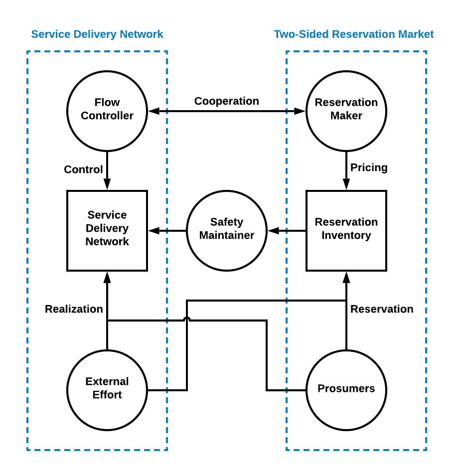

## 1, Introduction

There are supply and demand sides in every market, but a participant can be in different side during different time units. There is no need to distinguish a producers or consumers.

The size of RFC specifies the amount of the asset that has to be delivered under one contract. This is an important decision for the exchange. If the contract size is too large, many investors who wish to hedge relatively small exposures or who wish to take relatively small speculative positions will be unable to use the exchange. The size of contract for RFM is relatively small to allow small-scale customers to participate.

## 2, Five Kinds of Participants

There are five kinds of participants in RexNet, which are summarized below.

* Prosumer (PSR)
	- Terminal Prosumer
	- Secondary Prosumer
* External Effort (EE), uncontrolled external effort from the upper level model.
* Reservation Exchanger (RE)
* Flow Controller (FC)
* Safety Manager (SM)

## 3, Prosumers

There is no big difference between suppliers and customers, which are thus called participants in this project. Besides, the market organizer can be profitable or non-profitable agents. Being profitable means the market for establishing electricity market is also liberalized. There may be several companies providing the market organization service. Overall, we divide the stakeholders in this mechanism into three kinds: market participants, market organizers and government.

## 4, Components of Prosumers

