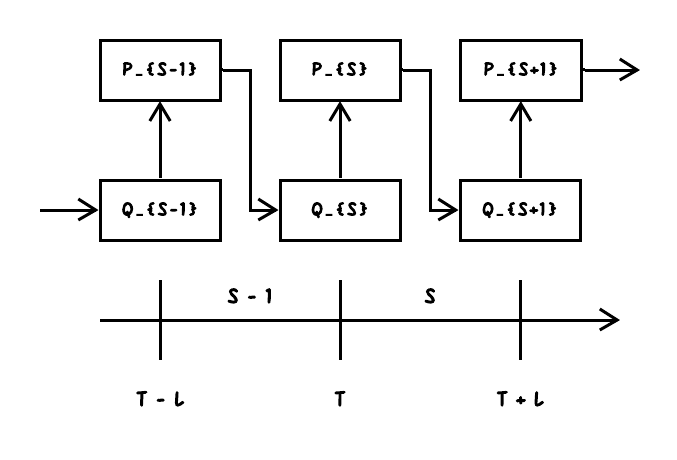
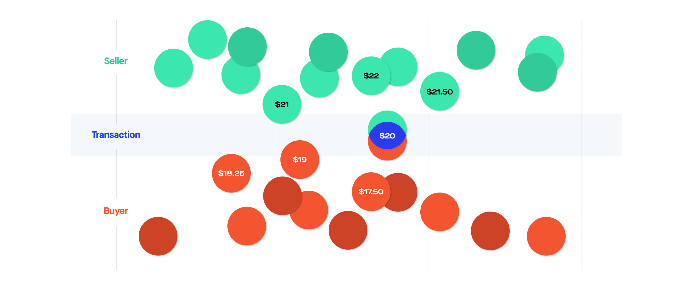
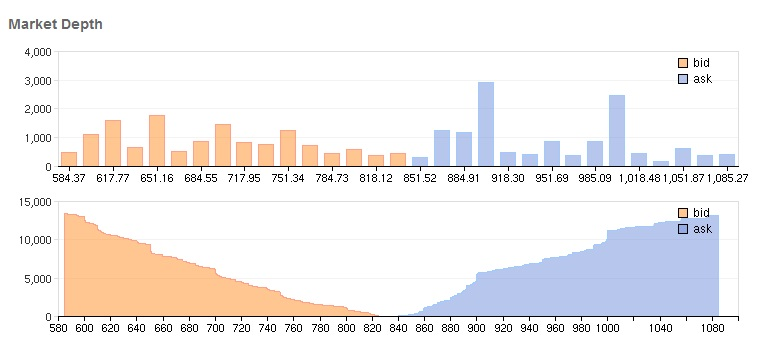

## 1, Introduction to Continuous Double Auction

> In a continuous trading market, traders can trade at any time when the market is open. Buyers and sellers continuously place their orders and are matched on a continuous basis. Most markets that we see today, including the stock exchanges, derivatives exchanges, and forex market, are continuous trading markets.

> Both types of markets have their own advantages and disadvantages. The biggest advantage of a call auction is that it provides high liquidity as all traders interested in a security have to make their trades at the same time and place. Continuous markets, meanwhile, give traders the flexibility to make their trades whenever they want.

> An exchange, or bourse also known as a trading exchange or trading venue, is an organized market where (especially) tradable securities, commodities, foreign exchange, futures, and options contracts are sold and bought. [1]

Stock exchange is another form of organized market mechanism for two-sided markets. The main different is that there is no exchanger in the stock exchange. The advantage is that the dynamics of prices are determined entirely by supply and demand sides, while the forward prices in reservation exchange is decided by the reservation exchanger. The disadvantage is that the transaction process cannot happen immediately, which is illustrated in figure 1. The market may not be liquid enough.

> Participants use electronic trading platforms to advertise offers to sell or bids to buy energy. All participants in such a computerized marketplace can observe the quantities and prices submitted by other parties but do not know the identity of the party that submitted each bid or offer. When a party enters a new bid, the software underpinning the exchange checks if there is a matching offer for the period of delivery of the bid. If it finds an offer whose price is lower than or equal to the price of the bid, a deal is automatically struck and the price and quantity are displayed for all participants to see. If no match is found, the new bid is added to the list of outstanding bids and remains there until a matching offer is made or the bid is withdrawn. A similar procedure is used each time a new offer is entered in the system. A flurry of trading activity often takes place in the minutes and seconds before the close of the market as generators and retailers fine-tune their position ahead of the delivery period. This form of trading is extremely fast and cheap. [_kirschen2018fundamentals_]

> To illustrate how orders are executed in an order-driven market let us consider the following simple example: suppose one trader (trader 1) has submitted a limit order to sell 1000 shares of the stock of a company X, provided that its price would exceed \$20 / share. Subsequently, another trader (trader 2) has submitted a limit order to sell 2000 shares of X if the price would exceed \$21 / share. Finally, a third trader decides to buy 2000 shares of X at the market price. In the absence of other limit orders his order will be filled as follows: he will buy 1000 shares from trader 1 at $20/share and 1000 shares from trader 2 at \$21 / share. After this transaction the limit order book would contain only one partially filled limit order to sell, that of trader 2 to sell 1000 shares of X at \$21 / share. [_maslov2000simple_]

## 2, Market Depth

> A stock exchange has the benefit of facilitating liquidity, providing transparency, and maintaining the current market price. In an OTC trade, the price is not necessarily publicly disclosed. [_[Over-the-counter (finance), Wikipedia](https://en.wikipedia.org/wiki/Over-the-counter_(finance))_]

## 3, Primary and Secondary Market

> The term "secondary market" is also used to refer to the market for any used goods or assets, or an alternative use for an existing product or asset where the customer base is the second market (for example, corn has been traditionally used primarily for food production and feedstock, but a "second" or "third" market has developed for use in ethanol production). [_[Secondary market, Wikipedia](https://en.wikipedia.org/wiki/Secondary_market)_]

> With primary issuances of securities or financial instruments, or the primary market, investors purchase these securities directly from issuers such as corporations issuing shares in an IPO or private placement, or directly from the federal government in the case of the government issuing treasuries. After the initial issuance, investors can purchase from other investors in the secondary market. [_Secondary market, Investopedia_]
