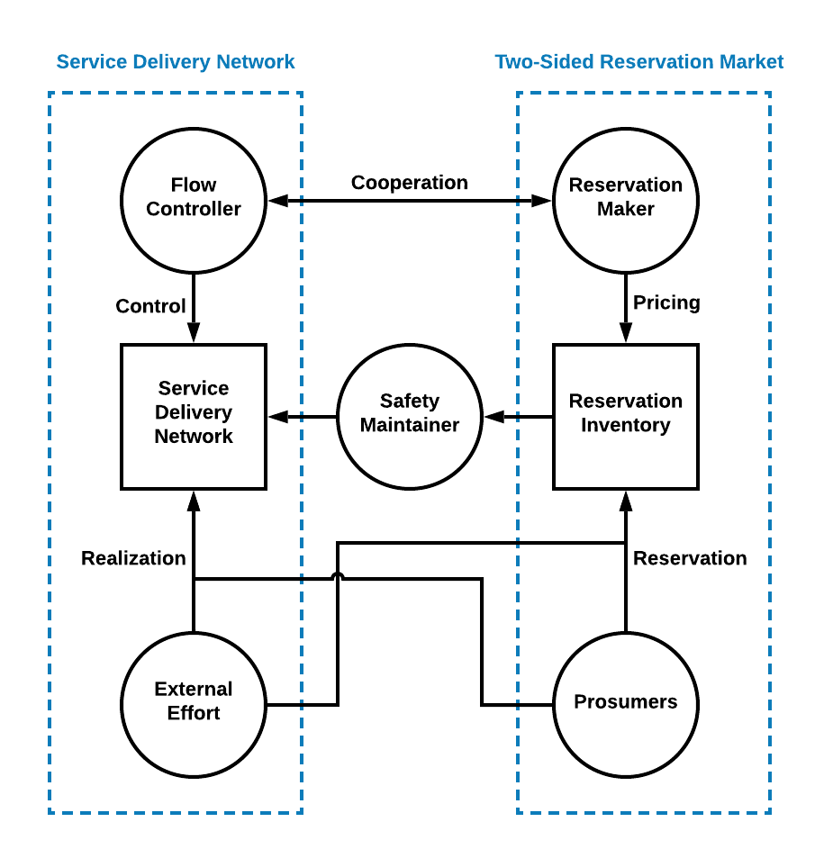
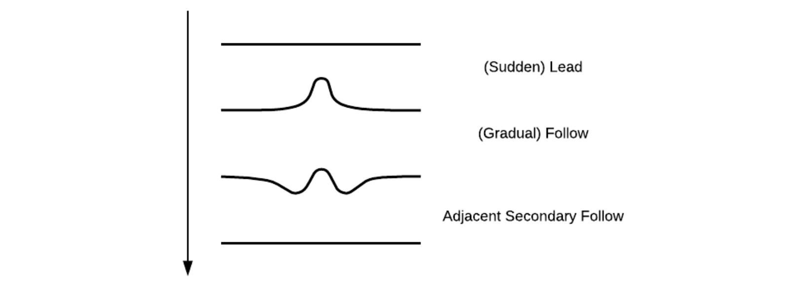
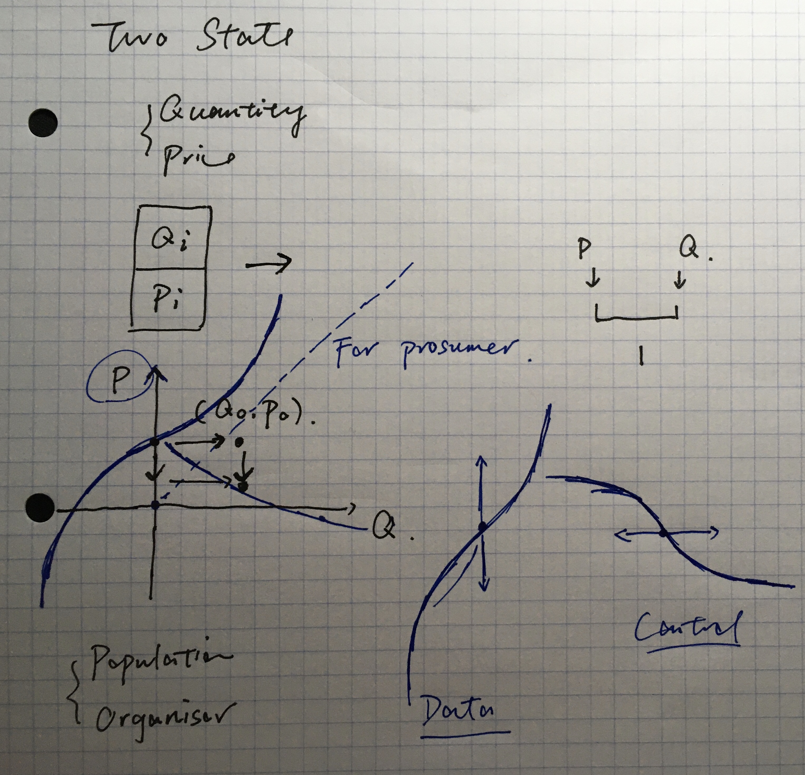

## 1, Control and Decision

The operation process of Reservex can be seen as a multi-stage two-sided game, or a chess. Here, the "two-sides" is different from the "two-sides" in "two-sided service market, because the two sides refer to the Reservex organizer and prosumers, while the two sides in TSSM refers to supply and demand sides. In every stage, the Reservex organizer updates the forward prices, and then the prosumers trade, which affects the outcome of forward prices for next stage.

Price-Based Control (PBC) means the price acts as the control signal.

The counterpart to reservation exchanger is the population, whose decision processes will be discussed in [RexNet-Docs/Agent-Based Modeling](https://edxu96.gitbook.io/rexnet-docs/simulation/abm/1-decision).

## 2, Control of Discrete Stochastic Dynamical System

From the perspective of market managers, the design of market mechanism is more like to design a control system. The objective is to ensure the economic effect, stability of long-time running and indication for future investment. That is, to realize model-based minimum variance control of price.

The following expressions can describe the transition from time unit $$i$$ to time unit $$i+1$$.

$$
\begin{align}
	\Delta \boldsymbol{P}_{i+1} &= f_{i+1}( \boldsymbol{P}_{i}, \boldsymbol{E}_{i}) \\
	\boldsymbol{P}_{i+1} &= \Delta \boldsymbol{P}_{i+1} + \boldsymbol{P}_{i} \\
	\Delta \boldsymbol{E}_{n, i+1} &= g_{n, i+1}(\boldsymbol{p}_{n, i+1}, \boldsymbol{E}_{n, i}) \quad \text{for } n \in N \\
	\boldsymbol{E}_{n, i+1} &= \Delta \boldsymbol{E}_{n, i+1} + \boldsymbol{E}_{n, i} \quad \text{for } n \in N
\end{align}
$$

where $$g_{n, i+1}$$ is the decision function of the prosumer $$n$$'s state at current unit $$i+1$$, which is only known to the prosumer itself, and $$f_{i+1}$$ is the pricing function of the reservation exchange at current unit $$i+1$$, which can be known to all the prosumers.

The objective is to realize minimum variance control by compensating the intermittency from renewable energy and inflexible consumption.

## 3, Minimum Variance Control

## 4, Discrete-Variables versus Continuous Variables

There are advantages and disadvantages to set the state space discrete.

## 4.1, Finite-Stage Multi-Variate Markov Decision Process

The state of the target unit should be represented using two groups of data. First group is all the quantifies of the population, and the second group is different prices for different prosumers. The data can be aggregated to two numbers, quantity and price.

## 4.2, Markov Decision Process

The possible outcome of the price is fixed.

We simulated the system until “stochastic steady state”. We were then able to describe this steady state:

- What is the distribution of occupied servers
- What is the rejection probability

The model was a “state machine”, i.e. a Markov Chain.

To obtain steady-state statistics, we used stochastic simulation, i.e. Monte Carlo.

### 4.3, Simplest Prototype

|   Price    | ejectionNet |
|:----------:|:-----------:|
| > priceStd |     < 0     |
| < priceStd |     > 0     |

## 5, Adjacent Secondary Follow

A major difference between forward market and other one-side optimizing market is that it allows adjacent secondary follow. It’s very usual in network industry that there is some following equipment adjust to changes gradually, which can cause undesired changes adjacent to that change. If there is no time for secondary adjust from the first side, the effect from adjacent changes is wasted, and the cost must be compensated by the benefits from the first change. Nevertheless, with adjacent secondary follow, the adjacent changes will be followed, so the second side will follow the first change with relief. The illustration of an ideal adjacent secondary follow is illustrated in figure 4.

For example, there is a sudden increase in a future trading area t, and the price spikes shows up. Some gas turbine company decides to raise its output to meet the demand at t, causing the supply around t increasing. The company trade all the supplies in the market to profit. While the price decrease to normal level in t, it decreases below normal level before and after t. Then, some following demand may participate, while don’t during t. This mechanism can fully utilize the flexible resources both from demand and supply side, and thus diminish the affect from physical constraints.

## 6, Decentralized Dynamic Price Discovery

> Market price over a period of time is determined by the interaction of the market supply and market demand. Movements between equilibrium must be explained utilizing comparative static analysis. But, when time is explicit in the system, dynamic analysis must replace the latter method. The ability of the system to successfully navigate between points of equilibrium is known as dynamic stability. [_gutierrez2004decentralized_]

![\[_gutierrez2004decentralized_\]](../images/Rex_19.png)

![\[_gutierrez2004decentralized_\]](../images/Rex_20.png)

## 7, References

1. Cassandras, C.G. and Lafortune, S., 2009. Introduction to discrete event systems. Springer Science & Business Media.
2. Aström, K.J. and Murray, R.M., 2010. Feedback systems: an introduction for scientists and engineers. Princeton university press.
