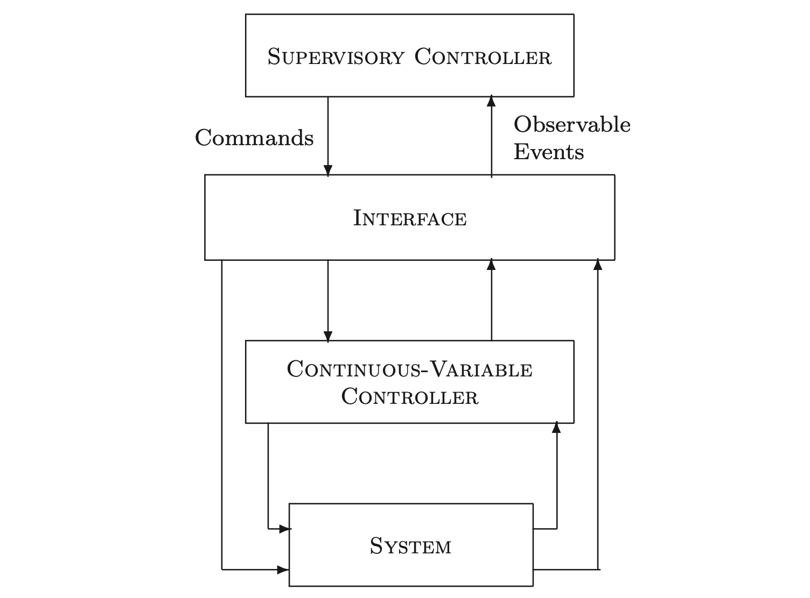
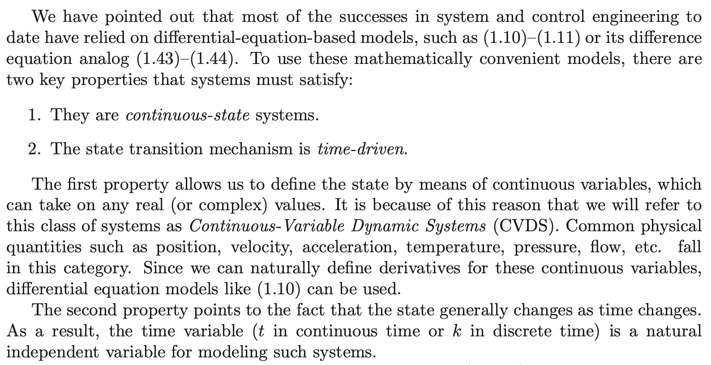
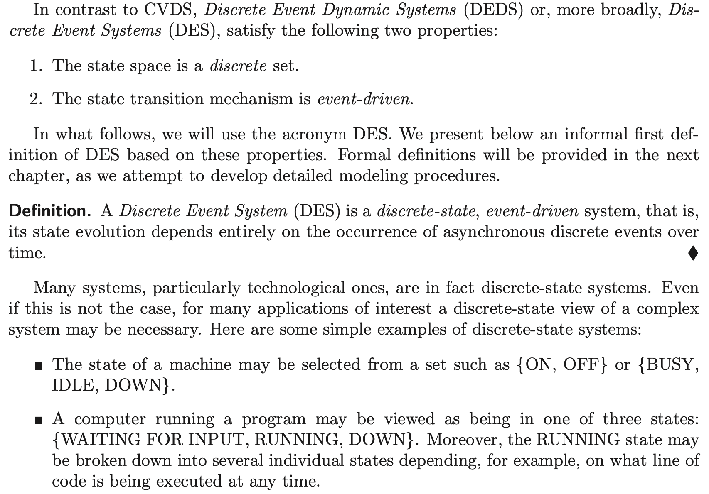

## 1, Hybrid System

> Systems that combine time-driven with event-driven dynamics are referred to as Hybrid Systems. [1]

> The term "hybrid system" has many meanings, one of which is: a dynamical system whose evolution depends on a coupling between variables that take values in a continuum and variables that take values in a finite or countable set. [2]

Distinguish the hybrid system of CVDS and DEDS with hybrid continuous variable dynamical system, which is the hybrid of continuous and discrete time dynamical systems. Are variables in cyber-physical systems discrete?

Control model: Point process and time series process.

For example, the presence of residuals in the apartments are discrete states.

### Hybrid bond graph

- HyBrSim - A Modeling and Simulation Environment for Hybrid Bond Graphs

## 2, Continuous-Variable Dynamic System (CVDS)

The measurement and control of stochastic CVDS is usually discrete in time, so time series can be used to describe them.

A time series is a realization of some stochastic process in discrete, while it can also be a measurement of a continuous stochastic process.

## 3, Discrete-Event Dynamic Systems (DEDS)

The stochastic DEDS can be described by point process. Markov chain can be used when the time intervals between events are not considered.

Language is the realization of DEDS.

The structure of large-scale DEDS is very import. Strict mathematical tools are needed to describe the system.

The relationship of DEDS and simulation.

The change must be modeled by event is because the change is too fast that there is no transient states?

### Continuous Time Markov Chains

Based on the previous discussion, we come to the conclusion that we can limit ourselves to discrete-time Markov chains. If a continuous-time model with discount factor $$ \beta $$ is of interest, then it is uniformized with rate $$ \gamma $$. In the resulting discrete-time model we use a new discount factor $$ \alpha = \gamma / (\beta + \gamma) $$, and replace the original costs $$ C(i, u) $$ by $$ C(i, u) / (\beta + \gamma) $$.

### SmEvents: model and simulate discrete-event systems

- https://www.mathworks.com/products/simevents.html

## 4, Examples

## 5, Model-Based Failure Detection and Diagnosis

Hybrid system modeling.

Detection of event is usually not possible, but the measurements from dynamical system are existing. If the operating dynamics shows sign of operating on another mode, there must be some event happened to change the state.

## 6, References

1. Cassandras, C.G. and Lafortune, S., 2009. Introduction to discrete event systems. Springer Science & Business Media.
2. Van Der Schaft, A.J. and Schumacher, J.M., 2000. An introduction to hybrid dynamical systems (Vol. 251). London: Springer.
