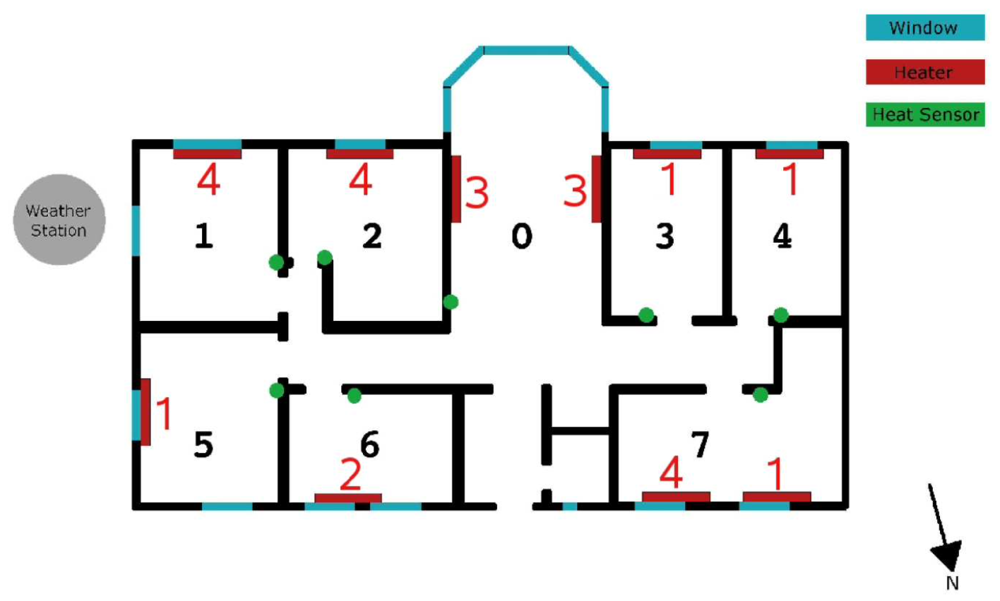

## 1, Introduction

There are three ways to model a system:

- Physical modelling
- Data-driven modelling
- Grey-box modelling

> For a model to be useful. we have to have confidence in the results and predictions that are inferred from it. Such confidence can be obtained by verifying and validating the model. In principle, model validation is done by comparing the model's behaviour with the system response and evaluating the difference. [4]

SpaceMeterNet is a package in R to model the dynamics of some space using measurement data, and the model is usually static networks or dynamical systems on networks. It's hosed on GitHub [edxu96/SpaceMeterNet](https://github.com/edxu96/SpaceMeterNet).

> While systems dynamic models are among the most widely used type of simulation model, many other model types and variations are possible. Of particular interest in this book are spatially explicit models, where we decide that representing distinct spatial elements and their relation- ships is important for a full understanding of the system. Thus, a spatially explicit model has elements representing individual regions of geographical space or individual enities located in space (such as trees, animals, humans, cities and so on). Each region and entity has its own set of state variables and interacts continuously through time with other regions and entities, typically interacting more strongly with those objects that are nearest to it. These interactions may be governed by mathematical equations, by logical rules or by other mechanisms, and they directly represent mechanisms that are thought to operate in the real-world system represented by the simulation. [1]

> For our purposes, the key feature of networks is that they are a highly general structure for representing the relations (spatial or otherwise) among a collection of objects. In a network, the objects are the nodes or vertices while the relations are links or edges. An important insight is to realise that a network defines a set of neighbourhoods over a collection of objects, such that each node’s neighbours are those other objects to which it is connected by a link. This structure is identical to the description we have set out above of spatial neighbourhoods. Given this fact, it should be apparent that any spatial model defined for a set of objects (be they vector objects or grid cells) with respect to the objects’ neighbourhoods could also be applied to a network.  [1]

## 2, Spatial-Temporal Stochastic Processes

> in some applications such as those involving variations in time and space of renewable power production, spatiotemporal processes are needed. These spatiotemporal stochastic processes can be equivalently seen, though, as a family of random variables indexed by time t and space z. [3]

## 3, Static Networks

> Complex systems are very often organized under the form of networks where nodes and edges are embedded in space. Transportation and mobility networks, Internet, mobile phone networks, power grids, social and contact networks, and neural networks, are all examples where space is relevant and where topology alone does not contain all the information. Characterizing and understanding the structure and the evolution of spatial networks is thus crucial for many different fields, ranging from urbanism to epidemiology. [2]

## 4, Network Dynamics

> In this chapter we will look at two broad types of spatial model that have been used to represent these types of dynamics: percolation and growth (or aggregation) models. These two approaches provide a broad framework for discussing issues relating to the dynamics of spread processes and the patterns formed by them. [1]

## 5, Examples

A building with 7 rooms is illustrated by figure 3, and two buildings with three floors are illustrated in figure 4.

> The generality of the network concept means that the links between entities may be spatial or aspatial. Where we are primarily concerned with understanding the nature and likely behaviour of systems, the structural characteristics of all the networks of links in a model may be just as interesting as the nature of the links themselves. [1]

partition and aggregation

linear stochastic dynamical system

## 6, Reachability and Observability

There are many problems to be solved:
- If a possible state can be reached with the proper choice of inputs (reachability)
- If the measurements contain enough information to reconstruct the state (observability)

The identification of MIMO systems is very hard.

## 7, Data-Driven Abstraction of Physical System

## 8, References

1. O'Sullivan, D. and Perry, G.L., 2013. Spatial simulation: exploring pattern and process. John Wiley & Sons.
2. Barthélemy, M., 2014. Spatial networks (pp. 1967-1976). Springer New York.
3. Morales, J.M., Conejo, A.J., Madsen, H., Pinson, P. and Zugno, M., 2013. Integrating renewables in electricity markets: operational problems (Vol. 205). Springer Science & Business Media.
4. Lennart Ljung, Torkel Glad, Modeling and identification of dynamic systems, 2017
