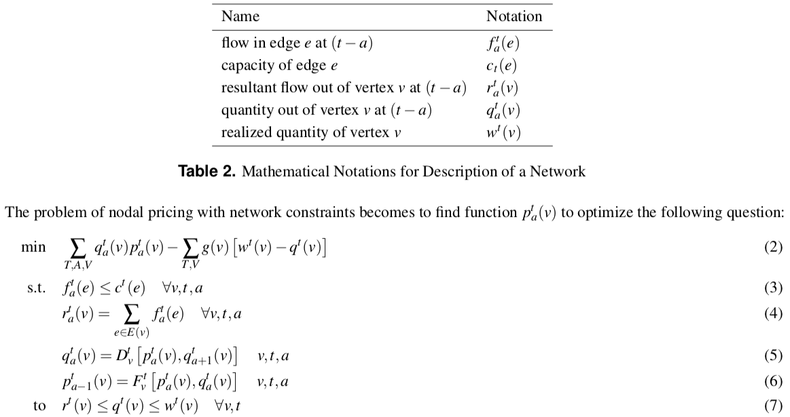

## 1, Introduction

> In general, network constraints increase opportunities for strategic bidding because not all generators are connected at locations where they can relieve a given constraint. In many cases, the number of generators that can effectively alleviate a constraint is likely to be small. Congestion in the transmission network can therefore transform a reasonably competitive global market into a collection of smaller local energy markets. Since these smaller markets inevitably have fewer active participants than the global market, some of them are likely to be able to exert market power. [_kirschen2018fundamentals_]

> The nodal marginal price is equal to the cost of supplying an additional megawatt of load at the node under consideration by the cheapest possible means while respecting the constraints imposed by the network capacity limits. [_kirschen2018fundamentals_]

Never use hard constraints in MPC. They will cause disturbances, and it's hard to get feasible solutions.

- Design
- Compute
- Predict

We first consider market clearing in one nodal, which means the inside network constraints are neglected and there is no flow in or out of this nodal. The assumption will be loosen in the following sections after a clear explanation of the mechanism. It can be seen that if there is some bottle-neck constraints inside the nodal, the nodal can be divided into two components by the bottle-neck. As for the nodal pricing of the network, there will be mutual influence, and brokers between nodes can be introduced with network constraints respected.



> When losses and congestion in the transmission network are taken into account, the price of electrical energy depends on the bus where power is injected or extracted. [_kirschen2018fundamentals_]

> In general, network constraints increase opportunities for strategic bidding because not all generators are connected at locations where they can relieve a given constraint. In many cases, the number of generators that can effectively alleviate a constraint is likely to be small. Congestion in the transmission network can therefore transform a reasonably competitive global market into a collection of smaller local energy markets. Since these smaller markets inevitably have fewer active participants than the global market, some of them are likely to be able to exert market power. [_kirschen2018fundamentals_]

## 2, Quadratic Programming Solver

## 3, Conditional Marginal Cost of Input


## 4, Inter-Temporal Value of Input

The current values of input as a result of future requirements must be calculated.

## 5,  Store all the Info of the Node in `Node`

For every node in the whole energy network, an instance of class `Node` will be initiated.

```Python
class Node(object):
    """
    Class to store all the information about this node.
    """
    def __init__(self, num, ahead_max, len_interval, num_interval, p_std):
        # 1,  Characteristics of this node
        self.num = num  # [number of participants]
        self.ahead_max = ahead_max  # [maximum time ahead for dynamic price]
        self.len_interval = len_interval  # [number of minutes in time interval]
        self.num_interval = num_interval  # [number of intervals per cycle]
        self.p_std = p_std  # [standard price]
        self.capacity = 0  # [adaptive capacity]
        # 2,  Dict of variables in this node
        self.parts = {}  # [dict of Participant(serial)]
        self.ejects = {}  # [dict of EjectionNet(time)]
        self.prices = {}  # [dict of Price(time)]
```

```Python
class Price(object):

    def __init__(self, time, ahead_max):
        self.time = time
        self.values = {i: 100 for i in range(time - ahead_max, time)}
```

```Python
class EjectionNet(object):

    def __init__(self, time, ahead_max):
        self.time = time  # [time of the value]
        self.values = {i: 0 for i in range(time - ahead_max, time + 1)}  # price.EjectionNet.parts[time].values[now]
        self.q_fix = 0
        self.delta_supply = {i: 0 for i in range(time - ahead_max, time + 1)}
        self.delta_demand = {i: 0 for i in range(time - ahead_max, time + 1)}
```
