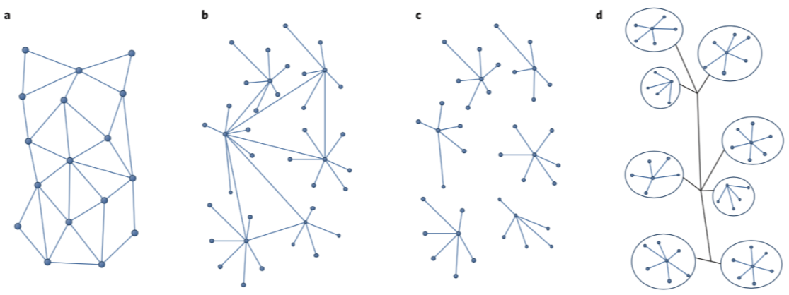

## 1, Introduction

The service process involves facilitating surroundings, goods, and labors. These factors are considered within the Pipe-Effort-Event-Flow-Control (PEEFC) model in this project, which covers a lots of engineered networks, like power grids and district heating networks. Besides, a toolbox to build PEEFC model using real-world data is discussed.

Usually, the delivery of the service requires facilitating surroundings, goods and labors. There are two reasons. One is that the presence of the customer as a participant in the service process requires an attention to facility design that is not found in traditional manufacturing operations. [1] For example, dishes are served within restaurants. Why street foods are relatively cheap is due to fact that they do not need to rent a big room to accommodate the customers. The other is that some medium is needed to deliver the service. For example, in district heating networks, thermal flows carry the heat from power plants to end users.

This is a mathematical model to high-perform computing ability. Only relevant information is kept in the model. The purpose is to provide high-level control instructions.

The models for service delivery networks varies a lot in different domains. For example, queueing theory and Inventory theory are used to model service and manufacturing systems respectively. The states in those two theories are discrete. In this project, the model Pipe-Effort-Event-Flow-Control, PEEFC in short, is used. The hybrid dynamical system is used to describe the underlying physical systems. Different models will be discussed in following sections.

There are many physical constraints in service delivery networks. For example, two types of physical limits or constraints appear on any electric power system. The first is the requirement that the supply of electricity must match the demand at every point in time. This is known as the energy balance requirement. The second set of physical requirements or limits on power systems relate to the physical characteristics of the network itself. [2]

## 4, Data-Drive Abstraction of SDNs using SpaceMeterNet

- Abstraction of large-scale engineered systems
- Model of "fruits", where there are correlated nodes, in a tree structure
- Simulation of real-world systems using computer

## 5,  Possible Structural Attributes of Prosumer Electricity Markets

Structural attributes of three prosumer markets. a, Peer-to-peer model. b, c, Two kinds of more structured models involving prosumers connected to microgrids. d, Organized prosumer group model.

## 6, References

1. Fitzsimmons, J.A., Fitzsimmons, M.J. and Bordoloi, S., 2008. Service management: Operations, strategy, information technology (p. 4). New York, NY: McGraw-Hill.
2. Biggar, D.R. and Hesamzadeh, M.R., 2014. The economics of electricity markets. John Wiley & Sons.
