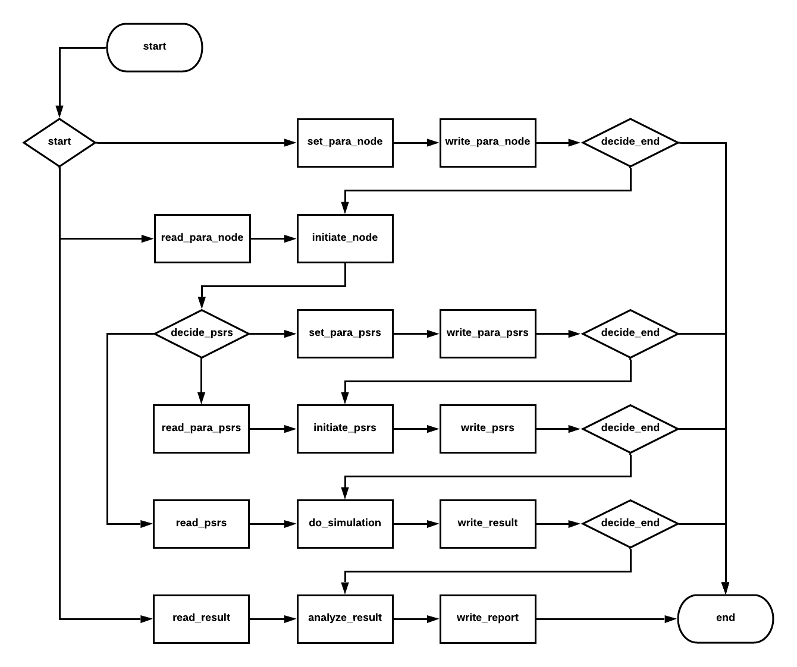

# 1, Introduction

To launch the software, run `python3 main.py` in terminal.

# 2,  About the Simulation Program

The set of parameters about nodes or about the population can be stored in json file.

# 3, Data Needed
