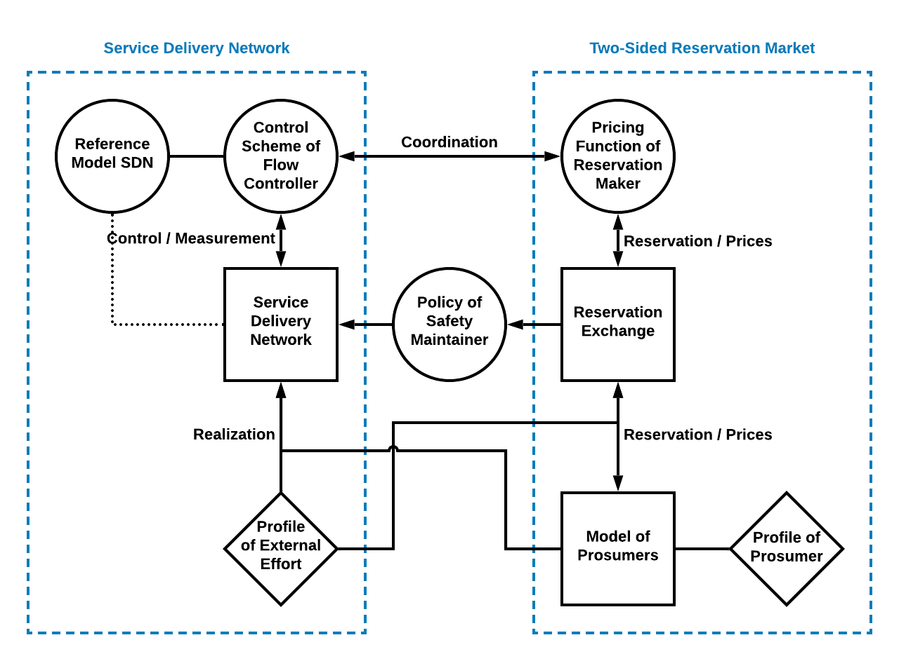

## 1, Introduction

RexNet is a framework to model and control stochastic service systems. There are many different configurations in the implementation of RexNet. Different combinations of configurations are explored by computer experiments.

From the perspective of the reservation maker, the goal of the experiments is to find the most robust pricing function and specified pricing functions.

Computer experiments with mathematical model can be conducted to explore the feasibility of RexNet in real-world application and optimize the configuration.

There are three kinds of computer programs used in the computer experiments:

* Real-World Systems
	- Real-world physical system -> Digital Twin
	- Real-world agent -> ABM
	- Real-world social system -> discrete event
* Simulated profiles
* Policy Configuration -> logic

## 2, Three Resolution

The service delivery network is a real-world system, whose simulation should be in high-resolution. But the time space for the operation of reservation exchange is discrete, so the simulation can be in the resolution corresponding to the length of the time unit. When implemented in real-world, the algorithms for reservation exchange can be used without change.

## 3, Configuration in RexNet

- Pricing function of the reservation maker
- Coordination method between the reservation maker and the flow controller
- Control scheme of the flow controller
- Policy of safety maintainer

## 4, Simulated Profiles

- Profiles of external effort
- Profiles of prosumers
- External condition, like weather, fuel price.

Decompose