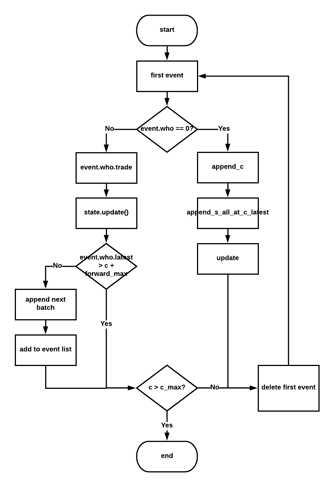
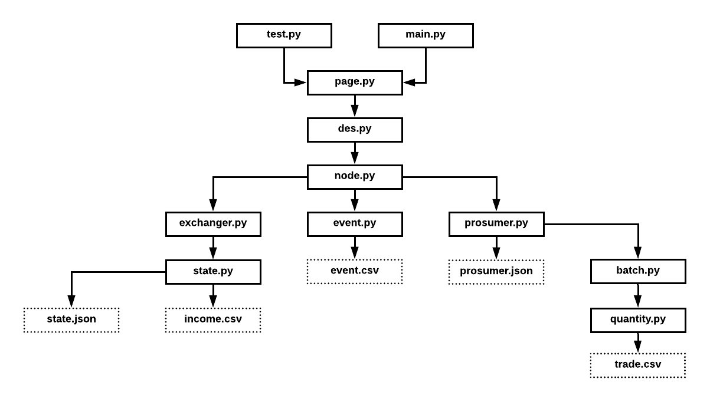

It’s hard to describe the process using pure mathematical models. Discrete event simulation can be used to explore the technical feasibility.

There are three levels in this mechanism, user, community and region, which are summarized in table 1. Prosumers and their trading volumes are in user level. In practice, only basic information about prosumers can be revealed to market organizer. The extend to which the prosumers react to dynamic price changes all the time. In other words, there is stochasticity in the decision making process regarding trading volumes.

Overall, three sources of randomness are introduced in the simulation:

1. uncertain fixed quantity for each time units
2. uncertain fixed quantity trading strategy
3. uncertain flexible quantity trading strategy

Information about some node and its net ejection and price is in community level. For every node, because of negligible delay, relatively low voltage and small current, we assume that the physical constraints can be neglected. Any information in community level will be shared to public. Prosumers can then tailor their own trading strategies.

|  User Level   | Community Level | Region Level |
|:-------------:|:---------------:|:------------:|
| Participation |      Node       |    Region    |
|   Ejection    |   EjectionNet   | RegionExcess |
|       -       |      Price      | RegionPrice  |

Now, the simulation can only be conducted in one node. In the future, the effect from high-voltage transmission can be studied in region level, where there are many nodes with different prices and even different pricing algorithms.

## 2,  Control Flow Diagram of the Simulation

