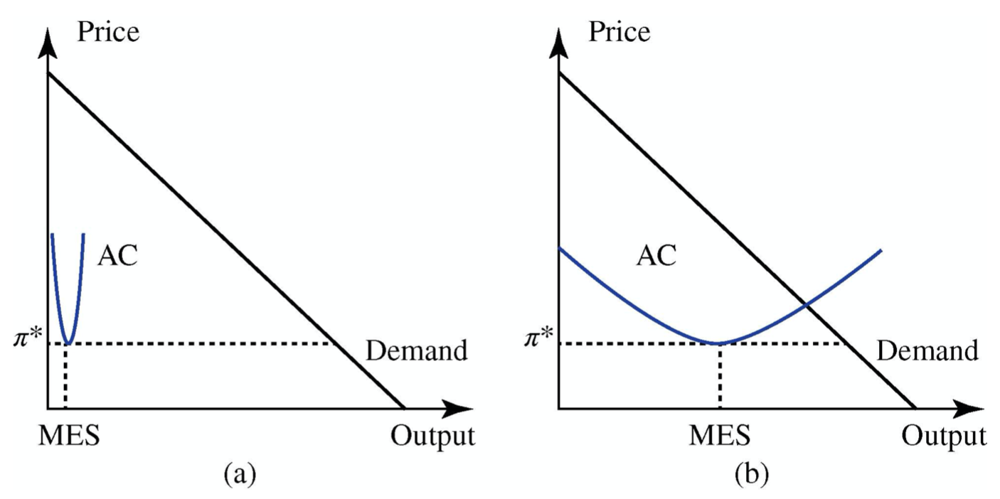

## 1, Introduction

> In almost all practical circumstances, firms do not just interact once. Instead, they interact repeatedly in the market. This ongoing interaction allows for a much richer set of strategies and actions than can be represented in a one-shot game. In particular, firms can react to the choices made by other firms in the past, rewarding or punishing them. When players interact repeatedly over time, the appropriate modelling tool is a repeated game. [1]

## 2, Repeated Sequential Game

https://en.wikipedia.org/wiki/Sequential_game

## 3, Monopoly

> The minimum efficient size (MES) of a firm in a particular industry provides a rough indication of the number of competitors that one is likely to find in the market for the product of this industry. This MES is equal to the level of output that minimizes the average cost for a typical firm in that industry. The shape of this curve is determined by the technology used to produce the goods. If, as illustrated in Figure 2.23a, the MES is much smaller than the demand for the goods at this minimum average cost, the market should be able to support a large number of competitors. On the other hand, if, as shown in Figure 2.23b, the MES is comparable to the demand, the market cannot support two profitable firms and a monopoly situation is likely to develop. [2]

Try to prove there is no big price spikes.

## 4, References

1. Biggar, D.R. and Hesamzadeh, M.R., 2014. The economics of electricity markets. John Wiley & Sons.
2. Kirschen, D.S. and Strbac, G., 2018. Fundamentals of power system economics. John Wiley & Sons.
