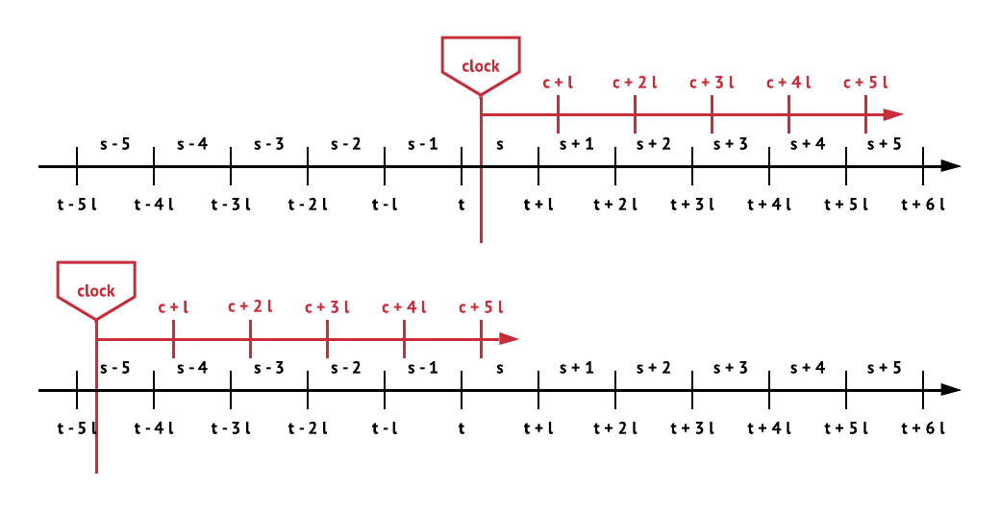
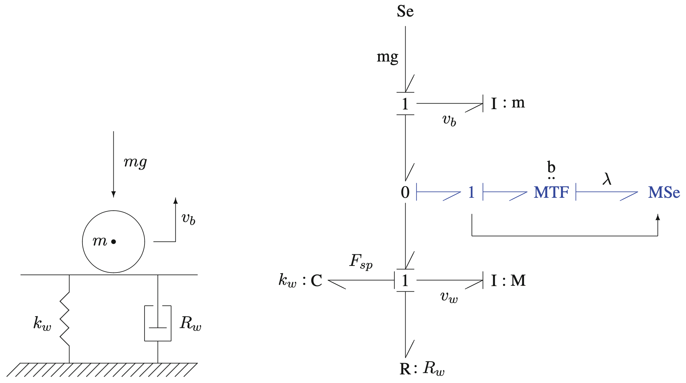
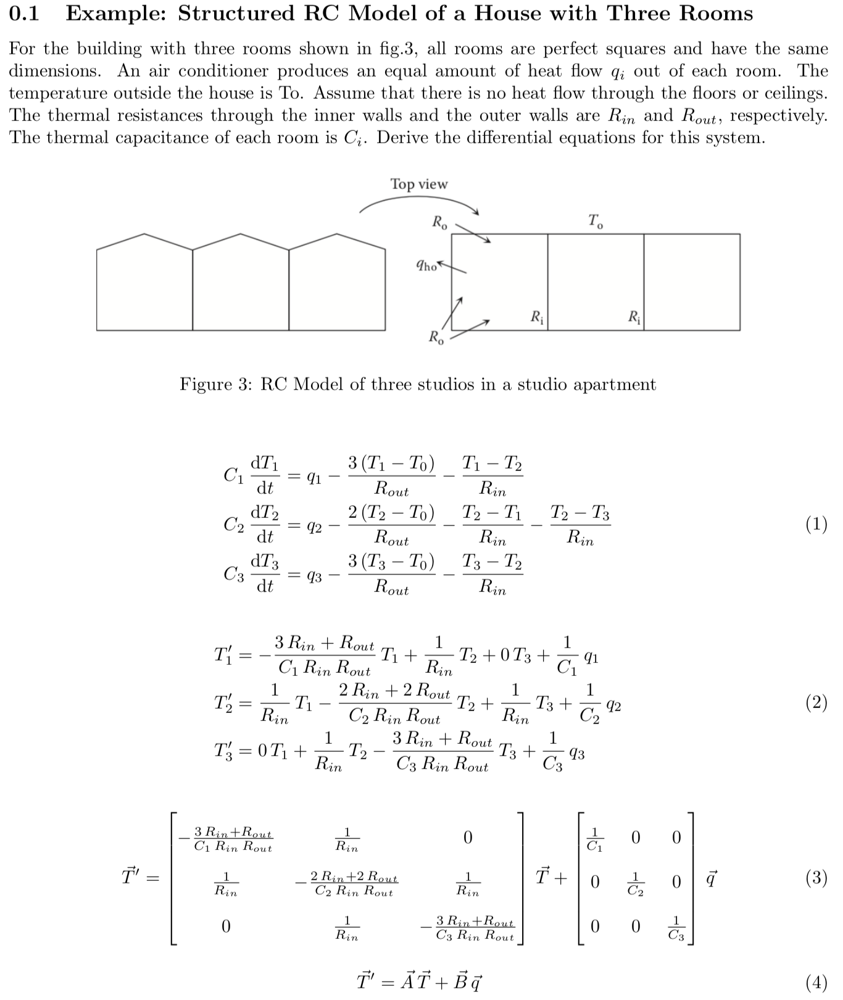

## 1, Stochastic Service Network - RexNet

Many real-world systems can be treated as `stochastic service networks`, which is composed of two parts:

- `Two-Sided Reservation Markets`: Supply and demand sides all participating in the market, and are treated as prosumers with positive and negative service rates.
- `Service Delivery Networks`: The facilitating devices, goods, and labors evolve over time and are controlled.

`RexNet` is a framework to model and control stochastic service networks, and it has two parts correspond to the two parts of stochastic service networks:

- `Reservation Exchange`: Reservation-based exchange market.
- `CEEFC`: Conduits-Efforts-Events-Flow-Control models.

The relationships between stochastic service networks and RexNet are summarized in table 1 and illustrated in figure 1. Note that the `passive conduits` is the underlining physical pipes without flowing carriers or goods, and the `SpaceMeterNet` is a tool to model it using measurement data.

|            Object            |         Tool         |
|:----------------------------:|:--------------------:|
|  Stochastic Service Network  |        RexNet        |
| Two-Sided Reservation Market | Reservation Exchange |
|   Service Delivery Network   |        CEEFC         |
|       Passive Conduit        |    SpaceMeterNet     |

_Table 1, Summary of relationships between stochastic service network and RexNet._

## 2, Basic Settings

Stochastic service networks are very special because of the following features:

- Service instead of goods.
- Rate matters more than quantity.
- Markets are two-sided, because they are all stochastic.

There are some key settings in reservation exchange which are different from ordinary markets and other organized markets.

- Discretization of time.
- Only forward market, without spot market.
- If you don't reserve, you can generate or consume.

There are five kinds of participants in the stochastic service networks, and their relationships are summarized in figure 2.

## 3, Two-Sided Reservation Market - Reservation Exchange

There are two ways to think about the trading decisions from the perspective of prosumers.

There are some features distinguishing the Reservex from other markets:

- Gate cloture at the beginning of the target time unit.
- Constant volume during the whole time unit.
- Realized service rates are constrained by the traded volume.

From the perspective of the Reservex organizer, the objective is to realize the minimum variance control of the process.

## 4, Service Delivery Network - CEEFC

The dynamics of flows in conduits caused by efforts and events is very different from that of drones or cars, and the control is distributed to different agents with their preferences. CEEFC can be used to model can control such systems.

- `Conduits`: the physical pipes in the engineered networks
- `Effort`: the input / output power or goods, which is decided by prosumers
- `Event`: the discrete event, which results in the transformation of modes of dynamical systems
- `Flow`: the flow of power or goods
- `Control`: the controlled facilities, like pumps and joints

Most of the service delivery networks in the energy sector are this kind, like power grids and gas networks, which will be summarized briefly in the following subsections.

## 5, Prototypical Example: District Heating for Multi-Dwelling Buildings

## 6, Expectations and Challenges

- The main benefit is to save stand-by efforts by allowing direct participation of small-scale prosumers.
- Couple different engineered systems and industries.
- Help mitigate climate change by reducing waste of stand-by efforts.
- Help develop low-cost low-carbon infrastructure in developing countries.
- Other kinds of models for service delivery networks may be introduced in the future.

## 7, Contact Information

- Edward J. Xu (<edxu96@outlook.com>), MSc in Energy System Analysis, DTU Management
- Website: <https://edxu96.gitbook.io/rexnet-docs/>
- Edward's master thesis proposal: Reservation Exchange Based District Heating for Multi-Dwelling Buildings. [RexNet/Docs/Energy/MSc-Proposal](https://edxu96.gitbook.io/rexnet-docs/application/rexnet-energy/3-multi-dwelling)
