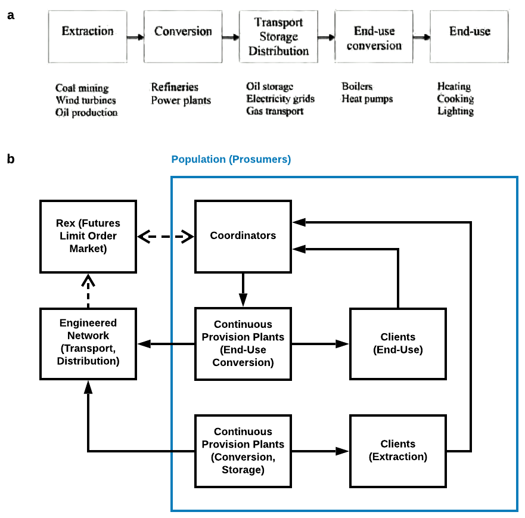

# `PhD Proposal` Reservation-Based Futures Exchange Market and its Intermediated Participants

## Keywords

reservation-realization-settlement, two-sided market, dynamic equilibrium discovery, agent-based models, stochastic simulation, model predictive control, forward market, discrete event simulation, revenue management, multi-agent system, market microstructure

## 1. What is RexNet

Small-scale producers/consumers (__prosumer__) [parag2016electricity](#reference) prefer entering into contracts to isolate themselves from the vagaries of the wholesale market, so their participation is mediated by retailers, who take the risk and profit from premiums. This strategy is widely applied in industries with durable goods, while is impractical for fresh foods and electricity because of their continuous generation/consumption, reliance on __delivery networks__, and perishability. Thus retailers must face price spikes from time to time because they are obliged to satisfy the needs of his customers. In addition, these features further prevent the application of unorganized markets and most of organized markets. Disposal of food inventory and backup electricity generations increase average costs. Instead, the mechanism to coordinate prosumers should satisfy the following conditions:

* Adaptive to external factors temporally and spatially. For example, time varying peak loads because of more penetration of renewable generations exclude the application of traditional load shifting or shedding. [connell2014benefits](#reference)
* Information. The market should be as transparent as possible, while private information is tightly protected. So centralized command-and-control nor retailing is efficient in such settings because of the conflict between better market clearings and the information protection. [kirschen2018fundamentals](#reference) It is prosumers who anticipate their future states, formulate trading strategies and act accordingly.
* Low-cost. None of large-scale storages, hydropower, nuclear power can be relied on for the promotion of power systems in underdeveloped area. []
* Prosumers have time to react to price signals. The real-time incentives from spot markets are hard to catch, because not only the current signals can hardly reveal any information about future, but also prosumers need time to adapt their activities to fit traded quantities. [varian2017intermediate](#reference)
* Transactions can be instantaneous, because some prosumers arrive randomly and may demand liquidity. Also, some would like to trade for long time periods covering many trading units to save the trouble from making decisions regarding few units but in high frequency. [foucault2013market](#reference)
* The market is thick enough but not congested, so prosumers do not have to search or bargain. In other words, the market is liquid enough for prosumers to lower transaction costs.
* The number of statistics for decision making is as low as possible but different services can be distinguished based on those statistics.
* The imbalance within trading units can be maintained without centralized system operators [kirschen2018fundamentals](#reference), because it may be hard to establish trustworthy regulatory authorities and operators responsible for the system safety.

In this project, at least one market satisfying previous requirements is designed. Some settings have been introduced to convert electricity into tradable assets and differentiate them temporally and spatially. [varian2014intermediate](#reference) For now, there is one candidate, whose mechanism is __continuous double auction__ with __3-dimensional limit order books__, where prosumers can bid/offer continuously and get transacted once matched with another order. It allows immediate transactions and standby orders at the same time. More specific settings vary according to different features in different industries. Because of the constraints in delivery networks, the transactions are not allowed to happen in the spot market, so it is a __forward market__ in essence. There is gate closure at the beginning of any time units. The behavior of trading can be referred to as reservation, therefore the market is named __reservation exchange (Rex)__. With delivery networks having huge impact, the whole system is named __RexNet__. For power industries, RexNet can be used to replace the market families for power systems including the day-ahead market, the intra-day market, the balancing market, the capacity market and other ancillary markets, so prosumers can focus on just one market.

In this project, all kinds of delivery networks can be divided into two levels: distribution networks (whose constraints can be ignored) and transmission networks. So the market is spatially fragmented by transmission networks when relevant edges are congested. Spatial arbitragers can be introduced to represent the participants of transmission networks. Moreover, the market can be established hierarchically.

For example, to liberalize the electricity generation market, the periodic double auction has been used in day-ahead market to find the equilibrium, and other facilitating markets are needed. However, small-scale prosumers, which refer to the participants who can be either supply or consume in low power rate, cannot participate directly due to three requirements. First of all, it is hard to anticipate and express the demand and supply curves for future units. Even if they manage to provide, the periodic clearings require them to present in the market at the same time. Also, transactions are not instantaneous. Additionally, the complexity from the existence of market families is another challenge for home-own generation business. The flexibility in demand side can be the solution to many problems. Many kinds of demand response programs have been designed to invite small-scale prosumers to participate, but the resulted flexibility is not enough.

The most important function of Rex is the __quantity discovery__, which is similar the concept of price discovery in limit order markets for financial assets. The consensus values of financial assets can be discovered as transaction prices because the market incentive participants to reveal their private information. [birchler2007information](#reference) The process creates knowledge by incorporating dispersed information in high speed. [maloney2003complexity](#reference) Likewise, prosumers are encouraged to take advantage of their information about the aggregated prosumptions in RexNet. That way, deviations from power balance can be eliminated in high speed without necessity for centralized monitoring.

The main difference of Rex is the lack of responsible party for satisfying uninformed demand. For example, utility companies are not obliged to satisfy demand in peak hours. If someone does not have the reservation to consume or supply, he/she has to be responsible himself/herself.

## 2. What is RHPO

Take energy systems, including power systems, for example, they can be represented by figure `a`, showing the supply chain from extractions to end-uses. The key stage is the distribution of energy from the supply side to the demand side. Alternatively, the system can be restructured using figure `b` by introducing RexNet. Prosumers can be modeled as three parts. __Clients__ are used to simulate the ultimate need of the prosumer, which can be expressed by stochastic processes. For example, the temperature of the room. __Continuous provision plants (CPPs)__ are underlying physical and economical systems with inputs being energy mainly and output to meet	the	needs	of clients. For example, a electricity-driven heat pump and pipes to supply heat to the room. It is __coordinators__ who control CPPs and participate in Rex whose objectives are to make more profit (or lower costs), satisfy needs and respect constraints at the same time. The direct participation of small-scale prosumers is a critical premise for this structure, so that there is no friction between these three parts because they refer to the same prosumer. In addition, CPPs may correlate with each other so they must be modeled by an aggregated CPPs controlled by one coordinator to satisfy several clients. For example, the space heating system for multi-dwelling buildings must be modeled by MIMO. The distribution of assets must rely on __delivery networks__.

In this project we are interested in both the market and prosumers, which therefore have to be modeled as a __multi-agent system__, because prosumers have diverging information and interests. [shoham2009multiagent](#reference) There is no centralized manager knowing all the variable outcomes and controlling everything, so the market clearing process needs to be optimized in a distributed manner, so prosumers coordinate with each other through RexNet. However, it must be hard to obtain analytical solutions directly compared to literature in market microstructure. __Agent-based models__ are used to represent heterogeneous prosumers, and their interactions through RexNet are demonstrated by __discrete event simulations__. [iori2012agent](#reference), [lebaron2001builder](#reference)

Clients are endowed with prosumptions, the quantity of which are simulated with similar patterns to historical data. Because they don't know the precise quantity in advance, they will forecast based on the current information, the processes of which are simulated as well. Once their forecasts update, they will convey differences to coordinators, who are obliged to react to it before the gate closure. High-resolution models of CPPs are known to corresponding coordinators only, in order to protect the privacy. Future outputs can be predicted from CPP models and planned inputs. Then, coordinators modify plans, participate in Rex and respond to clients. The decisions can be optimized by the program called __receding horizon plan & order management (RHPO)__, which has similar structures to model predictive control problems. [rawlings2019model](#reference). Coordinators can be seen as intermediaries between clients and the market, which resembles the intermediation theory of firms. [spulber1996market](#reference) After deciding trading volumes, coordinators have to make make- and take- decisions according to order flows and states of limit order books. [foucault2013market](#reference) Overall, the states of RexNet are changed instantaneously at separate time points when some coordinator submits order according to its RHPO instructions.

Specifically, there are many stochastic simulation programs used in this project. For example:

* To simulate wind power output at new locations according to historical data as needs of some clients to sell electricity. Statistical in frequency domain can be introduced to exhibit the spatial diversity and utilize available information as much as possible. [woods2013simulation](#reference)
* To simulate consumptions. [page2008generalised](#reference)
* Martingale model of forecast evolution (MMFE) to simulate requests sent to coordinators because of arrival of new information. [heath1994modeling](#reference) Cumulative adjustments can managed using methods from inventory management. [wang2012multiordering](#reference)
* Multi-input multi-output state space stochastic control systems as models of CPPs. [siroky2011experimental](#reference) Grey-box modelling techniques, which combines statistical methods and physical knowledge, can be used to calibrate the models. [bacher2011identifying](#reference)

There are some problems need to be solved:

* The effect of reservation on future requests of responsive clients. Responsive clients will adapt their needs to current states. It may be modeled by an intra-personal game where a decision-maker is summarized by a succession of selves [brocas2009dynamic](#reference) and joint workings of time inconsistency and consciousness. [birchler2007information](#reference)
* When optimization problems in RHPO are formulated nonlinearly, it is hard to obtain shadow prices, which helps indicate costs of flexibility and responsiveness.
* Agent-based models should be able to learn and adapt to evolving situations.
* The determination of weight matrices is the challenge faced by MPC researchers as well. [rawlings2019model](#reference)
* Rex may be unstable because of coordination failures.

## 3. How to Prove RexNet Practical and RHPO Representative

There are three alternative perspectives on how to analyze the multi-agent system, which can be illustrated using the following figure. Firstly, the two solid blue boxes include three elements for any prosumer. Coordinators optimize CPP operations, cooperate with the client and submit orders to the market. There is much relevant literature, like the newsvendor problem with multiple procurements in supply chains [wang2012multiordering](#reference), dynamic pricing techniques for capacity-constrained services [shy2008how](#reference) and inventory management for perishable products [nahmias2011perishable](#reference). The second perspectives is to focus on the evolution of market and it includes coordinators only, which is shown by the dashed red box. How to deducted the stylized facts of the market is the primary question, which makes it possible to construct the market directly. [buchanan2011it](#reference) The effect of different resolution parameters, introductions of market makers, replacement with periodic double auctions, etc may be explored. It also provides opportunity for researcher with the first perspective to tune parameters. Last but not least, a holistic view including all models is necessary. The shift from quantity-based to power-time-based cost allocation is the primary concern.

It is vital to validate simulation programs based on measured data. [ross2012simulation](#reference) For example, simulated forecast evolution should be analyzed according to standard statistical tools for forecasting. [madsen2005standardizing](#reference)

The impact of structures of delivery networks is important as well. Spatial arbitragers representing transmission networks can be introduced as well.

Some small-scale experiments regarding key assumptions can be conducted. As a new type of retailer

## 4. How RexNet and RHPO Contribute

Once validated procedures to simulate RexNet are formulated, they can help design reservation-based exchange markets for other industries like food supply chains, retailing, banking, etc. For example, similar assets can still be pooled, when personalized limit order books are introduced to make matches satisfy requirements from both sides. The process is similar to that in Peer-to-Peer markets with bilateral trade agreements. [sousa2019peer](#reference)

The assumption of time invariance can be relaxed once short-term model are mature. The existence of investments, aging and accident brings about more randomness and flexibility. [spyrou2019planning](#reference) The ultimate goal of this project is to formulate a new structure for resilient, low-carbon, low-cost energy systems.

The expected outputs are listed:

* master thesis
* other forms of interaction: stochastic MIMO with identification
* responsive clients
* different rules and market design
* real-world application as a new retailer

## Reference

* [bacher2011identifying](https://www.sciencedirect.com/science/article/pii/S0378778811000491) Identifying suitable models for the heat dynamics of buildings.
* [birchler2007information](https://www.taylorfrancis.com/books/9780203946558) Information economics. How the market aggregates information is discussed in 5 chapters in part 2. All kinds of deviations of behaviors by later self are introduced briefly in chapter 17.
* [brocas2009dynamic](https://link.springer.com/article/10.1007/s11238-009-9183-x) Dynamic inconsistency and choice.
* [buchanan2011it](https://www.nature.com/articles/nphys2191) It's a (stylized) fact.
* [foucault2013market](https://www.oxfordscholarship.com/view/10.1093/acprof:oso/9780199936243.001.0001/acprof-9780199936243) Market liquidity: theory, evidence, and policy. How real-world markets work is introduced at the beginning of chapter 1. Make- and Take- decisions in LOB markets are discussed in chapter 6.
* [heath1994modeling](https://www.tandfonline.com/doi/abs/10.1080/07408179408966604) Modeling the evolution of demand forecasts with application to safety stock analysis in production/distribution systems.
* [iori2012agent](https://www.oxfordhandbooks.com/view/10.1093/oxfordhb/9780199844371.001.0001/oxfordhb-9780199844371-e-43) Agent-based modelling for financial markets. Section 4-2 is about heterogeneous agents with market mediated interactions.
* [kirschen2018fundamentals](https://www.wiley.com/en-us/Fundamentals+of+Power+System+Economics%2C+2nd+Edition-p-9781119213253) Fundamentals of power system economics. Issues associated with retailers are discussed in section 4-3, and those with centralized tradings are in section 3-3-3. Why and how centralized system operators in incumbent electricity markets maintain safety within trading units are discussed in chapter 6. However, system operators are expected to be eliminated in this project.
* [lebaron2001builder](https://www.tandfonline.com/doi/abs/10.1088/1469-7688/1/2/307) A builder’s guide to agent-based financial markets. "It is not really a survey, but a kind of view from the trenches in terms of building artificial markets."
* [madsen2005standardizing](https://journals.sagepub.com/doi/abs/10.1260/030952405776234599) Standardizing the performance evaluation of short-term wind power prediction models.
* [maloney2003complexity](https://www.sciencedirect.com/science/article/pii/S092911990200055X) The complexity of price discovery in an efficient market: the stock market reaction to the Challenger crash. An empirical event study on how the new knowledge and its associated equilibrium price is discovered.
* [nahmias2011perishable](https://www.springer.com/gp/book/9781441979988) Perishable inventory systems.
* [page2008generalised](https://www.sciencedirect.com/science/article/pii/S037877880700031X) A generalised stochastic model for the simulation of occupant presence.
* [parag2016electricity](https://www.nature.com/articles/nenergy201632) Electricity market design for the prosumer era
* [rawlings2019model](https://sites.engineering.ucsb.edu/~jbraw/mpc/) Model predictive control: theory, computation, and design. MPC regulators are introduced in chapter 1.
* [ross2012simulation](https://www.elsevier.com/books/simulation/ross/978-0-12-415825-2) Simulation.
* [shoham2009multiagent](https://www.cambridge.org/core/books/multiagent-systems/B11B69E0CB9032D6EC0A254F59922360) Multiagent systems: algorithmic, game-theoretic, and logical foundations. MASs with continuous double auctions are discussed in section 11-4.
* [shy2008how](https://www.cambridge.org/core/books/how-to-price/27B182881BC668B688F8DA949DF52554) How to price: a guide to pricing techniques and yield management.
* [siroky2011experimental](https://www.sciencedirect.com/science/article/pii/S0306261911001668) Experimental analysis of model predictive control for an energy efficient building heating system. There are two outputs and inputs in the model.
* [spulber1996market](https://www.aeaweb.org/articles?id=10.1257/jep.10.3.135) Market microstructure and intermediation. The similarity does not refer to market makers being intermediaries. There are at least three layers between clients from the second perspective, while the market maker are the only layer between two sides.
* [spyrou2019planning](https://www.nature.com/articles/s41560-019-0346-x) Planning power systems in fragile and conflict-affected states.
* [varian2017intermediate](https://wwnorton.com/books/9780393689983/about-the-book/product-details) Intermediate microeconomics with calculus: a modern approach. Chapter 3 writes "it is often useful to think of the “same” good available in different locations or circumstances as a different good, since the consumer may value the good differently in those situations." The short-term elasticity is expected to decrease as the gate closure approaches.
* [wang2012multiordering](https://pubsonline.informs.org/doi/pdf/10.1287/msom.1120.0387) A multiordering newsvendor model with dynamic forecast evolution. Discrete forecast evolutions are used, and there is only one target selling season. Instead, continuous updates are required in the CDA market and the provision process is discrete over time.
* [woods2013simulation](https://ieeexplore.ieee.org/document/6262462) Simulation of wind power at several locations.
* [sousa2019peer](https://www.sciencedirect.com/science/article/pii/S1364032119300462) Peer-to-peer and community-based markets: A comprehensive review.
* [connell2014benefits](https://www.sciencedirect.com/science/article/pii/S1364032114005504) Benefits and challenges of electrical demand response: A critical review. In section, the necessity of continuous demand response is disucssed.

## Appendix

- [A brief mathematical description](./appendix.md).
- [GitHub/edxu96/RexNet](https://github.com/edxu96/RexNet): discrete event simulations of reservation-based exchange as multi-agent system.
- [RexNet-Docs](https://edxu96.gitbook.io/rexnet-docs/)
- [关于进一步调整2020年国家建设高水平大学公派研究生项目及部分国外合作项目工作安排的通知](https://www.csc.edu.cn/chuguo/s/1820)
- [2020年国家留学基金资助出国留学人员选派简章](https://www.csc.edu.cn/article/1710)
