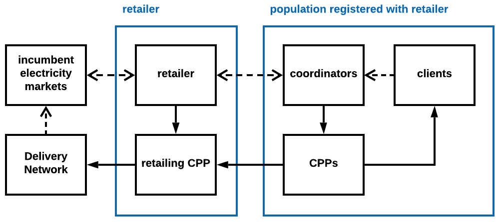

# `PhD Proposal` Reservation-Based Exchange Market & Dynamic Pricing and Procurement Problems

## Highlights

- A continuous double auction market with a new type of limit order books is proposed to replace incumber electricity families, making it possible for small-scale prosumers to directly participate.
- Discrete event simulations of multi-agent systems are used as the main research tools.
- A new decision making framework based on model prediction control is introduced to facilitate procurement, control and response of participants.
- The core idea can be borrow by a new type of retailer in the power industry, and a series of real-world experiments can be conducted. The problem can be simplified, being a vendor facing dynamic pricing and procurement of perishable products with uncertain spot demands and replenishment costs.
- Simulations can provide statistics for long-term investments, and a new structure for power systems can emerge, especially in underdeveloped areas.
- The market can be applied in other industries, like food supply chains, the retailing and the banking.

## 1. Introduction

In the power industry, it is urgent to reduce the carbon emission from power generations, avoid backup generators and penetrate modern power systems. Other industries, like food supply chains, face similar challenges. The lack of direct participation from the demand side is the central question, which may be solved by the market designed in the project. Arguments for the new market can be established in two stages:

- Because of the complexity, in the first stage, simulations instead of analysis are used primarily to demonstrate how the market operates under different settings. To facilitate the simulation of participants in the market, a new decision making framework is defined.
- In the second stage, a new type of retailing business with similar features can be tested in incumbent power systems. Key assumptions can be examined using data obtained in this way.

The necessity for the new market is discussed in section 2, followed by the description of the market in section 3. The methodology is discussed in four parts of section 4. The first part introduces the simulation schemes used, and the second part discuss the core simulation programs. The project can be researched into from three perspectives, which are listed in the third, and the most important one is elaborated in the last part. Expected contributions are summarized in the last section.

## 2. Background and Motivation

Small-scale producers/consumers (__prosumer__) [parag2016electricity](#reference) prefer entering into contracts to isolate themselves from the vagaries of wholesale markets, so their participation is mediated by retailers, who take the risk and profit from premiums. This strategy is widely applied in industries with durable goods, while is impractical for fresh foods and electricity because of their continuous generation/consumption, reliance on __delivery networks__, and perishability. Retailers must face price spikes from time to time because they are obliged to satisfy the needs of their customers. [kirschen2003demand](#reference) Instead, mechanisms satisfying the following requirements should be applied:

* Adaptive to external factors temporally and spatially. For example, time-varying peak loads resulted from penetration of renewable generations exclude applications of traditional load shifting or shedding. [connell2014benefits](#reference)
* The market should be as transparent as possible, while private information is tightly protected. So centralized command-and-control nor retailing is efficient in such settings because of the conflict between better market clearings and information protection. [kirschen2018fundamentals](#reference) It is prosumers who anticipate their future states, formulate trading strategies and act accordingly.
* Low-cost. Coordinated demand response is essential to ensure the quality of energy supply when none of the advanced technologies, like large-scale storage, hydropower, nuclear power, can be relied on to balance power systems in underdeveloped areas. [jacome2019power](#reference)
* Purchases should be ahead of prosumptions. [shugan2000advance](#reference) The real-time incentives from spot markets are hard to catch, because not only the current signals can hardly reveal any information about future, but also prosumers need time to adapt their activities to fit traded quantities. [kirschen2000factoring](#reference)
* Transactions can be instantaneous because some prosumers arrive randomly and may demand liquidity. [foucault2013market](#reference) Also, some would like to trade for long periods covering many trading units to save the trouble from making decisions regarding few units but in high frequency.
* The market is thick enough but not congested, so prosumers do not have to search or bargain. In other words, the market is liquid enough for prosumers to lower transaction costs.
* The number of statistics for decision making is as low as possible but different assets can be distinguished based on those statistics.
* The imbalance within trading units can be maintained without centralized system operators [kirschen2018fundamentals](#reference), because it may be hard to establish trustworthy regulatory authorities and operators responsible for the system safety.

Till now, all market designs fail to fulfill these requirements, while in this project, at least one capable market is designed. Above all, some settings have been introduced to convert electricity into tradable assets and differentiate them temporally and spatially, and they vary in different industries. The most promising candidate so far is introduced in the next section, following discussions about its primary function, two features, and superiority over others.

## 3. Solution: Reservation-Based Exchange Market

Reservation-based exchange market is a __continuous double auction__ market with __3-dimensional limit order books__, where prosumers can bid/offer continuously and get transacted once matched with another order. It allows immediate transactions and standby orders at the same time. Similar to computerized reservation systems in airline industries, prosumers have to book before the delivery, and markets are segmented according to when bookings are made. [shy2008how](#reference) Therefore the market is named __reservation exchange (Rex)__. With delivery networks integrated, the whole system is named __RexNet__. For power industries, RexNet can be used to replace the market families including the day-ahead market, the intra-day market, the balancing market, the capacity market and other ancillary markets.

The most important function of Rex is the __quantity discovery__, which is similar to the concept of price discovery in limit order markets for financial assets when markets motivate participants to reveal their private valuation. [maloney2003complexity](#reference) Both of them can be generalized as the dynamic equilibrium discovery, which creates knowledge by incorporating dispersed information at high speed. [birchler2007information](#reference) Likewise, prosumers are encouraged to take advantage of their information about the aggregated prosumptions in RexNet, so mismatches can be eliminated in high speed without the necessity for centralized monitoring.

In this project, all kinds of delivery networks can be divided into two levels: distribution networks (whose constraints can be ignored) and transmission networks. The market is __spatially fragmented__ by transmission networks when relevant edges are congested, so stakeholders in control of transmission networks can participate in RexNet as spatial arbitragers. Moreover, RexNet can be established __hierarchically__. Representatives of prosumers in lower levels can serve as retailers, which makes the experiments in subsection 4-4 plausible.

Though the structure of Rex is similar to that composed of day-ahead market and intraday market in the power industry, the main difference is that there is no one responsible for satisfying uninformed demand of prosumers in Rex. For example, utility companies are not obliged to satisfy demand in peak hours. There is no need for centralized managers to maintain system safety. If someone does not have the __reservation__ to consume or supply, he/she has to be responsible himself/herself. Trading volumes in intraday markets are insignificant compared to those in day-ahead markets and balancing markets [weber2010adequate](#reference), so most of current researches focus on periodic double auctions used in day-ahead markets. Approaches to Rex deviate from the majority of current researches. The way prosumers in Rex make decisions is different as well.

With only one type of agents (prosumers) providing and consuming liquidity, Rex is an __order-driven continuous double auction market__ in essence. [gould2013limit](#reference) There are many variations like quote-driven markets, where market makers are the primary source of liquidity. Besides, the periodic double auction is an alternative. As discussed in section 2, it may be hard for small-scale prosumers to participate if the market is not the most simple and flexible one, making Rex the focus in the simulation stage. With adequate data and assumptions validated in the second stage, it may be possible that better options are identified.

## 4. Methodology

Models and methods in the simulation stage will be elaborated first in subsection 3-1, then the decision making framework of prosumers is introduced in subsection 3-2. Some specific simulation programs are presented as well. In in subsection 3-3, three different ways to analyze RexNet are discussed, and experiment design in the second stage is outlined.

### 4-1. Discrete Event Simulation of Multi-Agent Systems

Take energy systems, especially power systems, for example, they can be represented by the following figure `a`, summarizing the supply chain from extractions to end-uses, where the key stage is the distribution from the supply side to the demand side. [blok2017introduction](#reference) Alternatively, the system can be restructured using figure `b` by introducing RexNet. Prosumers can be modelled as three parts. __Clients__ are used to simulate the ultimate needs of the prosumer like the minimum requirements of room temperature in winter. __Continuous provision plants (CPPs)__ are underlying physical and economical systems with inputs being energy mainly and outputs to meet the needs of clients. For example, it can be an electricity-driven heat pump and pipes for space heating. Usually, there is inter-temporal dynamics within these systems. It is __coordinators__ who control CPPs and participate in Rex, and their objectives are to make more profit (or lower costs), satisfy needs and respect constraints at the same time. The direct participation of small-scale prosumers discussed in section 1 is a critical premise for this structure so that there is no friction between these three parts because they refer to the same prosumer.

In this project, we are interested in both the market and prosumers, which therefore have to be modelled as __multi-agent systems__, because prosumers have diverging information and interests. [shoham2009multiagent](#reference) There is no centralized manager knowing all variable outcomes and controlling everything, so the market clearing process needs to be optimized in a distributed manner. Compared to the literature on market microstructure, it is hard to obtain analytical solutions directly, because the welfare of participants is considered. [] So __agent-based models__ are used to represent heterogeneous prosumers [iori2012agent](#reference), [lebaron2001builder](#reference), and their interactions through RexNet are demonstrated by __discrete event simulations__. In the early stage, there is only one type of agents, prosumers, and the interaction is completely mediated by the market.

### 4-2. Decision Making Framework for Prosumers

Some clients, like wind turbines in power systems, are endowed with prosumptions, the quantity of which are simulated with similar patterns to historical data. Because they don't know the precise quantity in advance, they will forecast based on their private up-to-date information, the processes of which are simulated as well. Once their forecasts update, they will convey differences to coordinators, who are obliged to react to it before gate closures. For the sake of privacy protections, high-resolution models of CPPs are known to corresponding coordinators only. Future outputs can be predicted from CPP models and planned inputs. Then, coordinators modify plans, participate in Rex and cooperate with clients.

The decisions can be optimized by __receding horizon plan & order management (RHPO)__, which has similar structures to model predictive control problems. [rawlings2019model](#reference) After deciding trading volumes, coordinators have to make make-take decisions according to order flows and states of limit order books. [foucault2013market](#reference) Overall, the states of RexNet are changed instantaneously at separate time points when some coordinator submits order according to its RHPO instructions.

Specifically, there are some stochastic simulation programs used in this project:

* To simulate stochastic outputs, like those from wind turbines, at new locations according to historical data, statistical methods in the frequency domain can be utilized to exhibit the spatial diversity and make use of available information as much as possible. [woods2013simulation](#reference)
* To simulate evolutions of discrete states in a bottom-up way, inhomogeneous Markov chains can be constructed using detailed survey data. [page2008generalised](#reference) For example, electricity consumptions of residents associated with their occupant presences can be obtained.
* Martingale models of forecast evolution can be used to simulate requests sent to coordinators. [heath1994modeling](#reference)
* CPPs may correlate with each other so they must be modelled by an aggregated CPPs controlled by one coordinator to satisfy several clients. For example, the space heating system for multi-dwelling buildings must be modelled by multi-input-multi-output control systems. [siroky2011experimental](#reference) Thus hierarchical Rex can be introduced.
* Grey-box modelling techniques, which combines statistical methods and physical knowledge, can be used to calibrate CPP models. [bacher2011identifying](#reference)

### 4-3. Three Ways to Analyze Rex

There are three angles on how to analyze this multi-agent system, which can be illustrated using the following figure.

- The first one is from coordinators, and it includes three elements for prosumers like those in two solid blue boxes. It is the perspective for real-world experiments discussed in this section.
- The second one is to focus on the evolution of Rex and it includes coordinators only, which is shown by the dashed red box. The induction of stylized facts of Rex is the primary task, which makes it possible to construct the market directly. [buchanan2011it](#reference) Then the effect of different resolution parameters, introductions of market makers, replacement with periodic double auctions, etc may be explored. It also provides opportunities for researchers with the first perspective to tune parameters.
- Last but not least, a holistic view including all models is necessary, because lots of features of Rex, like the shift from quantity-based to power-time-based cost allocation [hougaard2009introduction](#reference), must be examined this way.

### 4-4. The Second Stage: a Dynamic Pricing & Procurement Problem

A new business as a retailer in incumbent power systems can be tested in the second stage. As discussed in section 3, RexNet can be established in a hierarchical structure, so retailers can be introduced to represent a group of prosumers, which can be applied in incumbent power systems. Retailers act as market makers with one side being electricity market families and the other side being prosumers. Thus, retailers face a __dynamic pricing & procurement problem__. There is much relevant literature, like the newsvendor problem with multiple procurements in supply chains [wang2012multiordering](#reference), dynamic pricing techniques for capacity-constrained services [monahan2004dynamic](#reference) and inventory management for perishable products [nahmias2011perishable](#reference). There is similar literature like [nair2014energy](#reference) and [secomandi2014optimal](#reference), but their situations are not as complicated.

Some real-world experiments regarding key assumptions can be conducted. reservation. [] It is vital to validate simulation programs based on measured data. [ross2012simulation](#reference) For example, simulated forecast evolution should be analyzed according to standard analytical tools for forecasting [madsen2005standardizing](#reference) and compared to results from state-of-art forecast techniques.

## 5. Expected Contributions

Two stages in this project are summarized in the following table.

| Stage  | Standpoint      | Respondent                      | Experiment |
| ------ | --------------- | ------------------------------- | ---------- |
| first  | market designer | agent-based models of prosumers | computer   |
| second | retailer        | real-world prosumers            | real-world |

I have not given too much thought to details about computer experiments in the first stage.

The assumption of time invariance can be relaxed once short-term models are mature. The existence of investments, ageing and accidents bring about more randomness and flexibility. [spyrou2019planning](#reference) The ultimate goal of this project is to formulate a new structure for resilient, low-carbon, low-cost energy systems based on Rex.

Once simulation methods validated, reservation-based exchange markets can be applied in other industries like food supply chains, retailing, banking, etc. For example, similar assets can still be pooled, when personalized limit order books are introduced to make matches satisfy requirements from both sides. The process is similar to that in Peer-to-Peer markets with bilateral trade agreements. [sousa2019peer](#reference)

Some problems are expected to be solved:

* The effect of reservations on responsive clients, who can adapt their needs to current states, is not clear. It may be modelled by an intra-personal game where a decision-maker is summarized by a succession of selves [brocas2009dynamic](#reference) and joint workings of time inconsistency and consciousness. [birchler2007information](#reference)
* When optimization problems in RHPO are formulated nonlinearly, it may be hard to obtain shadow prices, which helps indicate costs of flexibility and responsiveness.
* Agent should be able to learn and adapt to evolving situations. [franklin1997it](#reference)
* The determination of weight matrices is the challenge faced by MPC researchers as well [rawlings2019model](#reference), and the tuning relies heavily on methods discussed in section 3-4.
* Rex may be unstable because of coordination failures.

As discussed above, the project can be divided into two stages. Expected outputs of simulation experiments in the first year are:

* Introduction to Rex. (my DTU master thesis)
* RHPO for more complex CPPs, like those with stochastic MIMOs, and their statistical identification methods.
* Rex with responsive clients.

Based on the simulation results, field experiments can be conducted in the second year. Data is essential for assumptions to be examined. Furthermore, different rules and market design, like the introduction of centralized market makers and periodic double auctions, for Rex can be explored, the results of which can be used to compare.

## Reference

* [bacher2011identifying](https://www.sciencedirect.com/science/article/pii/S0378778811000491) Identifying suitable models for the heat dynamics of buildings.
* [birchler2007information](https://www.taylorfrancis.com/books/9780203946558) Information economics. How the market aggregates information is discussed in 5 chapters in part 2. All kinds of deviations of behaviours by later self are introduced briefly in chapter 17.
* [blok2017introduction](https://www.taylorfrancis.com/books/9781315617213) Introduction to energy analysis. Figure `a` is the figure 0.1 on page xxv.
* [brocas2009dynamic](https://link.springer.com/article/10.1007/s11238-009-9183-x) Dynamic inconsistency and choice.
* [buchanan2011it](https://www.nature.com/articles/nphys2191) It's a (stylized) fact.
* [connell2014benefits](https://www.sciencedirect.com/science/article/pii/S1364032114005504) Benefits and challenges of electrical demand response: A critical review. In section, the necessity of continuous demand response is discussed.
* [foucault2013market](https://www.oxfordscholarship.com/view/10.1093/acprof:oso/9780199936243.001.0001/acprof-9780199936243) Market liquidity: theory, evidence, and policy. How real-world markets work is introduced at the beginning of chapter 1. Make- and Take- decisions in LOB markets are discussed in chapter 6.
* [franklin1997it](https://link.springer.com/chapter/10.1007/BFb0013570) Is it an agent, or just a program: a taxonomy for autonomous agents.
* [gould2013limit](https://www.tandfonline.com/doi/abs/10.1080/14697688.2013.803148) Limit order books.
* [heath1994modeling](https://www.tandfonline.com/doi/abs/10.1080/07408179408966604) Modeling the evolution of demand forecasts with application to safety stock analysis in production/distribution systems.
* [hougaard2009introduction](https://link.springer.com/book/10.1007/978-3-642-01828-2) An introduction to allocation rules.
* [iori2012agent](https://www.oxfordhandbooks.com/view/10.1093/oxfordhb/9780199844371.001.0001/oxfordhb-9780199844371-e-43) Agent-based modelling for financial markets. Section 4-2 is about heterogeneous agents with market mediated interactions.
* [jacome2019power](https://www.pnas.org/content/116/33/16308) Power quality and modern energy for all. The operation of power grids in less-developed areas is different from that in developed countries because the systems are not resilient enough for lack of responsive generators, large-scale connections, regulations, etc.
* [kirschen2000factoring](https://ieeexplore.ieee.org/document/867149) Factoring the elasticity of demand in electricity prices.
* [kirschen2003demand](https://ieeexplore.ieee.org/document/1198281) Demand-side view of electricity markets. Price spikes in electricity markets are discussed in section 2.
* [kirschen2018fundamentals](https://www.wiley.com/en-us/Fundamentals+of+Power+System+Economics%2C+2nd+Edition-p-9781119213253) Fundamentals of power system economics. Issues associated with retailers are discussed in section 4-3, and those with centralized tradings are in section 3-3-3. Why and how centralized system operators in incumbent electricity markets maintain safety within trading units are discussed in chapter 6. However, system operators are expected to be eliminated in this project.
* [lebaron2001builder](https://www.tandfonline.com/doi/abs/10.1088/1469-7688/1/2/307) A builder’s guide to agent-based financial markets. "It is not really a survey, but a kind of view from the trenches in terms of building artificial markets."
* [madsen2005standardizing](https://journals.sagepub.com/doi/abs/10.1260/030952405776234599) Standardizing the performance evaluation of short-term wind power prediction models.
* [maloney2003complexity](https://www.sciencedirect.com/science/article/pii/S092911990200055X) The complexity of price discovery in an efficient market: the stock market reaction to the Challenger crash. An empirical event study on how the new knowledge and its associated equilibrium price is discovered.
* [monahan2004dynamic](https://pubsonline.informs.org/doi/abs/10.1287/msom.1030.0026) The dynamic pricing problem from a newsvendor’s perspective. There is only one chance to procure stocks, and "the randomness in demand is price independent and multiplicative in nature, and the parameter b denotes the price elasticity of demand."
* [nahmias2011perishable](https://www.springer.com/gp/book/9781441979988) Perishable inventory systems.
* [nair2014energy](https://dl.acm.org/doi/10.1145/2591971.2591982) Energy procurement strategies in the presence of intermittent sources.
* [page2008generalised](https://www.sciencedirect.com/science/article/pii/S037877880700031X) A generalised stochastic model for the simulation of occupant presence.
* [parag2016electricity](https://www.nature.com/articles/nenergy201632) Electricity market design for the prosumer era
* [rawlings2019model](https://sites.engineering.ucsb.edu/~jbraw/mpc/) Model predictive control: theory, computation, and design. MPC regulators are introduced in chapter 1.
* [ross2012simulation](https://www.elsevier.com/books/simulation/ross/978-0-12-415825-2) Simulation.
* [secomandi2014optimal](https://pubsonline.informs.org/doi/10.1287/msom.2013.0473) Optimal energy procurement in spot and forward markets.
* [shoham2009multiagent](https://www.cambridge.org/core/books/multiagent-systems/B11B69E0CB9032D6EC0A254F59922360) Multiagent systems: algorithmic, game-theoretic, and logical foundations. MASs with continuous double auctions are discussed in section 11-4.
* [shugan2000advance](https://journals.sagepub.com/doi/abs/10.1177/109467050023001?casa_token=nHdK2gtk0ZUAAAAA:JZm0jvC2O9C0qr7WPZZphEZINBT2hpYCLNSB5hykwAO1buCHLim0JzlleOeUOwCv0uIZWbmfE8vI) Advance pricing of services and other implications of separating purchase and consumption. Elasticities are different regarding purchasing for the same asset at different times.
* [shy2008how](https://www.cambridge.org/core/books/how-to-price/27B182881BC668B688F8DA949DF52554) How to price: a guide to pricing techniques and yield management.
* [siroky2011experimental](https://www.sciencedirect.com/science/article/pii/S0306261911001668) Experimental analysis of model predictive control for an energy efficient building heating system. There are two outputs and inputs in the model.
* [sousa2019peer](https://www.sciencedirect.com/science/article/pii/S1364032119300462) Peer-to-peer and community-based markets: A comprehensive review.
* [spyrou2019planning](https://www.nature.com/articles/s41560-019-0346-x) Planning power systems in fragile and conflict-affected states.
* [varian2017intermediate](https://wwnorton.com/books/9780393689983/about-the-book/product-details) Intermediate microeconomics with calculus: a modern approach. Chapter 3 writes "it is often useful to think of the 'same' good available in different locations or circumstances as a different good, since the consumer may value the good differently in those situations." So preferences for assets with different leads time are different, and the short-term elasticity is expected to decrease as the gate closure approaches.
* [wang2012multiordering](https://pubsonline.informs.org/doi/pdf/10.1287/msom.1120.0387) A multi-ordering newsvendor model with dynamic forecast evolution. Discrete forecast evolutions are used, and there is only one target selling season. Instead, continuous updates are required in the CDA market and the provision process is discrete over time.
* [weber2010adequate](https://www.sciencedirect.com/science/article/pii/S0301421509005564) Adequate intraday market design to enable the integration of wind energy into the European power systems. Trading volumes in intra-day markets in Europe 10 years ago are shown in table 3.
* [woods2013simulation](https://ieeexplore.ieee.org/document/6262462) Simulation of wind power at several locations.

## Appendix

- [A brief mathematical description](./appendix.md).
- [GitHub/edxu96/RexNet](https://github.com/edxu96/RexNet): discrete event simulations of reservation-based exchange as multi-agent system.
- [RexNet-Docs](https://edxu96.gitbook.io/rexnet-docs/)
- [关于进一步调整2020年国家建设高水平大学公派研究生项目及部分国外合作项目工作安排的通知](https://www.csc.edu.cn/chuguo/s/1820)
- [2020年国家留学基金资助出国留学人员选派简章](https://www.csc.edu.cn/article/1710)

<!-- ## Keywords

reservation-realization-settlement, two-sided market, dynamic equilibrium discovery, agent-based models, stochastic simulation, model predictive control, forward market, discrete event simulation, revenue management, multi-agent system, market microstructure -->

<!-- The closet literature is [garnier2015balancing](#reference).
* [garnier2015balancing](https://link.springer.com/article/10.1007/s12667-015-0143-y) Balancing forecast errors in continuous-trade intraday markets
-->

<!-- * [spulber1996market](https://www.aeaweb.org/articles?id=10.1257/jep.10.3.135) Market microstructure and intermediation. The similarity does not refer to market makers being intermediaries. There are at least three layers between clients from the second perspective, while the market maker are the only layer between two sides. -->
