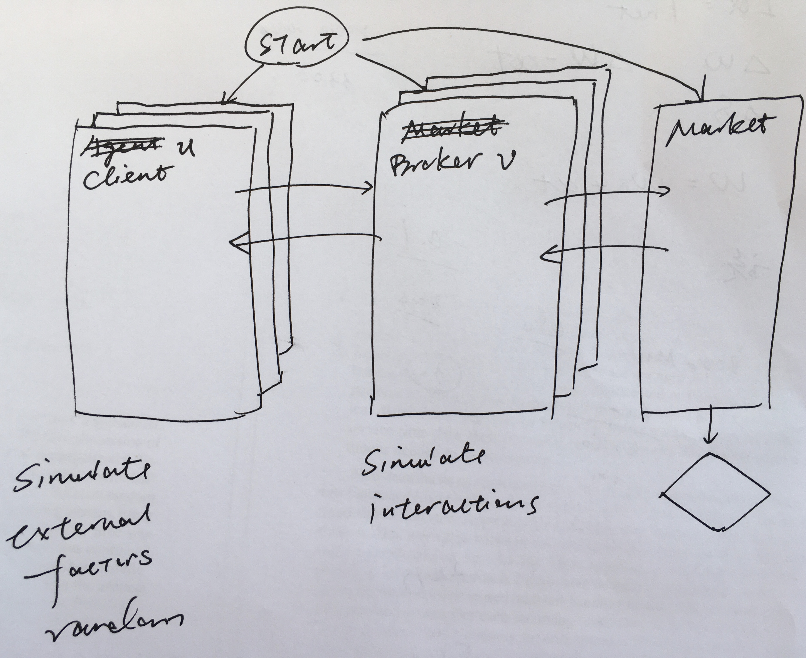
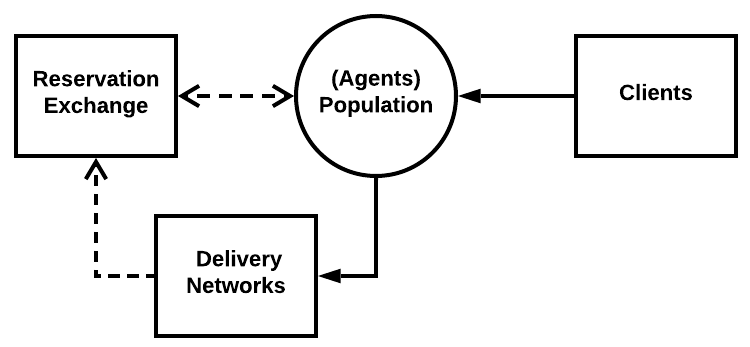

# Multi-Agent Discrete Event Simulation

simulation program structure

- system event list (SEL)
- agent event list (AEL)

## Agents

- prosumer
- agent
- broker and client

System states compose states of all agents.

Agents don't know others states.

External factors will affect agents' events.

Agents affect other's event through the market.

systems of agents are important as well.

the state of market matters, but the agent can only sense it when they arrive

composition of the population is given, we should focus on the design of the market

Agent states:
  - info about clients
  - belief about others

## Agent Program

## Main Program
