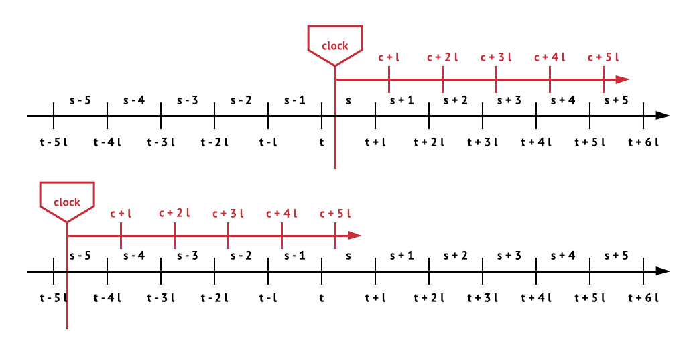
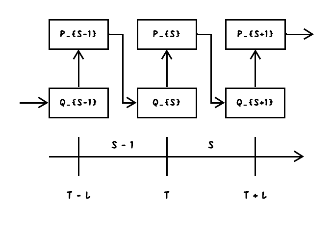
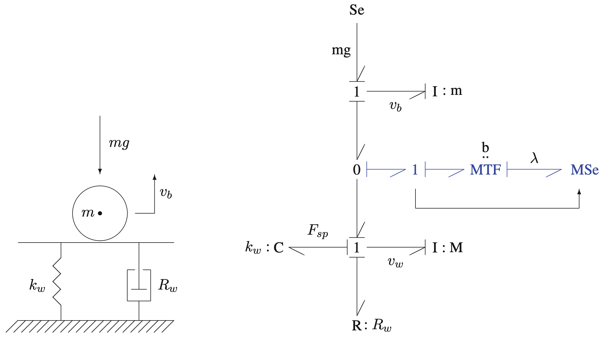

# RexNet-Heating: Framework for Low-Carbon Low-Cost Distributed Heating Systems

## 1, Overview

---
### Stochastic Service System and RexNet

Stochastic service system can be used to model a special kind of markets and their delivery networks. For example, power grids, district heating networks, the Internet. RexNet is a framework to model and control stochastic service system. The components and relationships of two concepts can be summarized in table 1 and illustrated in figure 1.

|            Object            |         Tool         |
|:----------------------------:|:--------------------:|
|  Stochastic Service System   |        RexNet        |
| Two-Sided Reservation Market | Reservation Exchange |
|   Service Delivery Network   |        CEEFC         |
|       Passive Conduit        |    SpaceMeterNet     |

_Table 1, Summary of relationships between stochastic service network and RexNet._

_Figure 1, illustration of a RexNet model. The rounded	rectangles represent the participants. The circles filled with crosses represent the addition of flows. Solid directed lines represent the physical flows or control signals, while the dashed non-directed lines represent the interactions._

## 2, Reservation Exchange

---
### Comparison with Incumbent Electricity Market

_Figure 2, ways to think about the trading decisions. One is to consider all the trading time units for a single target time units, and one is to consider all the available target time units at current time unit._

_Figure 3, Market decision timeline: one day-ahead market and 24 balancing markets. \[_morales2013integrating_\]_

- Difference in volume and quantity, to eliminate the need for frequency regulation.
- Exchange instead of one-time double auction

---
### Exchange instead of One-Time Double Auction

> In a centralized or pool-based trading system, producers and consumers submit their bids and offers to the system operator, who also acts as market operator. The system operator, which must be independent from all the other parties, selects the bids and offers that optimally clear the market while respecting the constraints imposed by the transmission network. As part of this process, the system operator also determines the market clearing prices. [_kirschen2018fundamental_]

The electricity market family nowadays can be only be seen as markets for commodity, and the demand is inelastic. Auction needs time to collect bids and offers, and the B&Os are usually complex functions showing the marginal cost.

The market clearing process is dynamic, which can be illustrated in figure 4. Common marginal cost cannot be used as the clearing price for being too low because of high penetration of renewable generations.

_Figure 4, illustration of transaction process in stock exchange._

However, we do introduce the contract makers as the organizer, which is inspired by the market makers in the stock exchange. For now, we say that there is only one contract maker in the exchange, and all the prosumers have to deal with the contract maker. Then the process of market clearing can be illustrated using figure 5.

_Figure 5, illustration of updates of quantity and price under realistic condition. The calculation time to update the price based on quantity is assumed to be infinite small._

---
### Sequential Game with Fixed End Point

_Figure 6, illustration of Reservex as a stochastic feedback control system. There are two groups of decision makers, the population and the Reservex organizer. The population consists of all the prosumers in the Reservex. From the perspective of the Reservex organizer, the decision function can be modeled from historical data. There are stochastic factors in the decision process because of the update of forecasting information._

For prosumers, they can trade with contract makers to update their efforts inventory, while contract makers can update the forward prices for prosumers according to the advice from flow controllers and their own algorithms.

The following expressions can describe the transition from time unit  to time unit .

These two functions are the key configurations in the framework. From the perspective of market managers, the design of market mechanism is more like to design a control system. The objective is to ensure the economic effect, stability of long-time running and indication for future investment. That is, to realize model-based minimum variance control of price.

## 3, Modeling and Control of SDNs using CEEFC

The models of SDNs are critical to provide nodal pricing and avoid system failure. CEEFC, which stands for conduit, efforts, events, flow and control, is a toolbox to model and control SDNs.

---
### Bond Graph

The foundation for CEEFC is bond graph, which is a powerful tool to model and visualize dynamical systems. Besides, number of algorithms from graph theory can be applied to manipulate the models. These two feature are be used to summarized bond graph as a related approach to graph theory for modeling large-scale systems is bond-graph modeling, wherein connections between a pair of subsystems are captured by a bond and energy, matter, or information is exchanged between subsystems along connections. [_haddad2011stability_] The two most important components in CEEFC, effort and flow are derived from those in bond graph.

_Figure 7, switching off and on degrees of freedom by sinks of invariant causality_

The expected result of CEEFC can be that illustrated by figure 8.

_Figure 8, illustration of possible models using CEEFC._

---
### Objects in this Project

The object in this study is a district heating network with several multi-dwelling buildings and stochastic thermal generations.

_Figure 9 & 10, illustration of multi-dwelling buildings to be modeled._

There are two kinds of networks.  
- Radial Network, without loops
- Meshed Network, with loops

Overall, the district heating networks can be seen as a combination of two radial networks, which are the supply network and the return network. Because the return network don't supply heat, we can see the district heating networks as a radial network supplying heat. In a multi-dwelling building, the heat transfers between flats form a meshed network.

Usually, the capacity of end-using pipes are limited, so the congestion in multi-dwelling buildings must be considered. Nodal prices are needed to distinguish the effect from different prosumers. To model this structure, hierarchical models can be used, which will be discussed in the following sections.

## 4, Scalability and Hierarchy

---
### External Effort, Hierarchy and Scalability

Hierarchical models can be used to model the whole system. Some external efforts in the lower level can be seen as an aggregated prosumer in the upper level, which is illustrated in figure 11. The model in lower level may be used to model a building, while that in upper level models the area.

Being external means not to be affect by the market signals in this level. But it can be updated according to the condition in the lower level, which is conducted by the market organizer.

_Figure 11, illustration of some external efforts in the lower level being seen as an aggregated prosumer in the upper level._

---
### Nodal Pricing, Market Segmentation and Market Power

- If there are  congested lines, there are only  independent prices. [_biggar2014economics_]
- Network constraints increase opportunities for strategic bidding. [_kirschen2018fundamentals_] Because the thickness and liquidity is reduced.
- Nodal pricing increase the level of price discrimination, and reduces the effect of market power.
- Settlement should be based on the prosumers' behaviors instead of marginal cost.
- There will be average prices for every unit, which will be the average settled prices of stochastic supply and demand.
- It's expensive to have adequate capacities.

_Figure 12, illustration of price discrimination when the market is segmented_

_Figure 13, summary of prosumers in the two-sided reservation market_

> In general, network constraints increase opportunities for strategic bidding because not all generators are connected at locations where they can relieve a given constraint. In many cases, the number of generators that can effectively alleviate a constraint is likely to be small. Congestion in the transmission network can therefore transform a reasonably competitive global market into a collection of smaller local energy markets. Since these smaller markets inevitably have fewer active participants than the global market, some of them are likely to be able to exert market power. [_kirschen2018fundamentals_]

> The nodal marginal price is equal to the cost of supplying an additional megawatt of load at the node under consideration by the cheapest possible means while respecting the constraints imposed by the network capacity limits. [_kirschen2018fundamentals_]

---
## 5, Team Members

- Edward J. Xu
- Peder Bacher
- Nicolai
