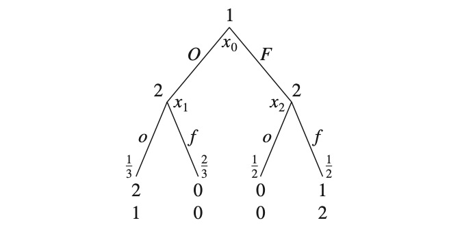

# Prototype: "2-State-2-Price" Rex with Anticipated Switch Probability

This experiment simulate the one-sided reservation market for the presence of prosumers at home. The cost to meet requirements of prosumers is higher when they present. For example, during winter, the temperature of the rooms has to be maintained above a set point, and the negative effect of low  temperature on present prosumers is significant. So prosumers will reserve their state as "presence" if they anticipate that they will be at home that time.

The rest part of this section is organized as follows. The settings regarding reservation exchange, especially the formation of furthest forward prices, will be discussed in subsection 1. The ways in which prosumers perceive their future states, reserve accordingly, and realize their states will be discussed in subsection 2.

## 1, Settings in Reservation Exchange

For the evolution of forward prices in the reservation market, we make the following assumptions:

- The prices are given randomly according to a time-invariant model.
- There are only two values for all the forward prices.
- The formation of furthest forward prices are simulated using a time invariant Markov chain.
- If the furthest forward price switches the value, the effect will transmit backward to other forward prices.

### Formation of Furthest Forward Price

There are $K$ forward units. The formation of the furthest forward price ($p_{i+K, i}$ for current unit $i$) is described by a discrete-time Markov chain with the following one-step stationary transition probability matrix:

$$
\begin{align}
    \mathbf{P}_{\text{price}} = \left|\left| \begin{array}{cc}
    0.9 & 0.1 \\
    0.1 & 0.9
    \end{array} \right|\right|
\end{align}
$$

where the state space and label are $\{5, 10\}$ and $\{1, 2\}$ respectively. It means $\mathrm{Pr} \left\{p_{i+K, i} = 5 | p_{i-1+K, i-1} = 5 \right\} = 0.9$.

### Update of the other Forward Prices

The other forward prices of the same current unit are updated using a discrete-time Markov chain with $\mathbf{P}_{\text{price}}$ with the previous value being the ASP at last current unit for this target unit. That is, if we are going to update $p_{i+k, i}$, $p_{i+k, i-1}$ is the previous value.

## 2, Agent-Based Model and Simulation of Prosumers

When the realized states are discrete, it is hard to distinguish the effect from controllable factors and that from uncontrollable factors. For example, in this experiment, the state of any prosumer is either presence at home or absence from home, so the outcome of the state cannot be the combination of two factors representing controllable and uncontrollable effects respectively. So the anticipated switching probability will be introduced as the way to express the their perception of future states, which will be discussed in subsubsection 2.2. Furthermore, for the population in Rex, we assume:

- All prosumers are price takers.
- The formations of different anticipations of prosumers are uncorrelated, and they are uncorrelated with the formation of furthest forward prices.
- Prosumers don't forecast to form belief about future forward prices, so they don't arbitrage. Their decisions are based solely on their ASP and current forward prices.

### Realization State and Reservation

For any target unit $j$, prosumers can reserve in any of its corresponding $K$ forward trading units and realize in target unit sequentially. The conditions are different and correlated, so the decisions have mutual impacts. We can treat the same prosumer in different units as different players in a multi-stage extensive-form game with imperfect information. That is, $K + 1$ players are used to describe the reservation and realization behaviors of one prosumer for one target unit. Players are labeled with $0$ representing the realization, $1$ being 1-step backward reservation, $2$ being 2-step backward reservation, etc., so the finite set of players, $N$, is $\{0, 1, 2, ..., k, ..., K \}$. They play sequentially in a reversed order of their labels. That is, player $K$ plays first, and player 0 is the last one to play.

The available actions for prosumer $u$ in trading unit $(j, i)$, which means for target unit $j$ at current unit $i$, are whether to reserve the presence state, so $A_{z} = \{0, 1 \}$ and the decisions are represented in $z^{u}_{j, i}$. The available actions in realization are whether to present, so $A_{x} = \{0, 1 \}$ and the outcomes are stored in $x^{u}_{j}$.

### Sub-Game and Anticipation

The sub-game involving players 0 and 1 can be visualized by the decision tree in figure 1. Because of the existence of stochasticity, the player 0 does not adopt any pure strategies. The decision by player 1 is known to player 0, so the realization is affected by the reservation, so player 0 adopts a behavioral strategy instead of a mixed strategy. For example, in figure 1, $\mathrm{Pr} (x_{i} = 1| z_{j, j-1} = 0) = 1 / 3$, while $\mathrm{Pr} (x_{i} = 1| z_{j, j-1} = 1) = 1 / 2$. However, it is assumed that the exact conditional probabilities are not known to player 1, because the anticipation is based on other external factors, and the effect from reservation varies a lot. So the action by player 1 is based on its belief of unaffected behavior of player 0, which is expressed by the __anticipated switching probability (ASP)__ in this case. For prosumer $u$ at current unit $i$, the belief of itself switching the state of last target unit $(j-1)$ is $y^{u}_{j, i}$. That is, the anticipated realization of states can be described by a Markov chain with the following time-variant transition probability matrix:

$$
\begin{align}
    \mathbf{P}^{\text{anticipation}}_{j-1, j| i} = \left|\left| \begin{array}{cc}
    1 - y^{u}_{j, i} & y^{u}_{j, i} \\
    y^{u}_{j, i} & 1 - y^{u}_{j, i}
    \end{array} \right|\right|
\end{align}
$$

where the state space and label are $\{0, 1\}$ and $\{1, 2\}$ respectively. It means $\mathrm{Pr} \left\{\hat{x}^{u}_{j} = 1 | \hat{x}^{u}_{j-1} = 0, i \right\} = y^{u}_{j, i}$. Note that $\hat{x}^{u}_{j}$ is used because $\hat{x}^{u}_{j-1}$ is not determined as well if $j > i + 1$. To get $\mathrm{Pr} \left\{x^{u}_{j} = 1 | x^{u}_{i} = 0, i \right\}$, we need the $(j-i)$-step transition probability matrix:

$$
\begin{align}
    \mathbf{P}^{\text{anticipation}}_{i, j| i} &= \mathbf{P}^{\text{anticipation}}_{i, i+1| i} \times \mathbf{P}^{\text{anticipation}}_{i+1, i+2| i} \times \cdots \times \mathbf{P}^{\text{anticipation}}_{j-1, j| i} \\
    &= \prod_{s = i}^{j-1} \mathbf{P}^{\text{anticipation}}_{s, i+1| i}
\end{align}
$$

Then, knowing $x_{i}$, we can calculate the conditional probability of presence in unit $j$, $\mathrm{Pr} \left(x_{j} = 1| x_{i}, i \right)$.

_Figure 1, decision tree of sub-game involving players 0 and 1 in extensive-form game._

It is assumed that there is no inter-temporal forecast and arbitrage. The most significant feature of reservation exchange is to allow prosumers to do real-time cost-benefit analysis, so they don't need to forecast. As a result, player $k$ sees preceding players except player 0 as dummy players, and this sub-game can be described by the above model as well.

### Formation of New ASP

For prosumer $u$ at current unit $i$, the formation of new ASP, $y^{u}_{i+K, i}$, is described by a discrete-time Markov chain with the following one-step stationary transition probability matrix:

$$
\mathbf{P}_{\text{ASP}} = \left|\left| \begin{array}{cc}
    0.9 & 0.1 \\
    0.9 & 0.1
\end{array} \right|\right|
$$

where the state space and label are $\{0.1, 0.9\}$ and $\{1, 2\}$ respectively. It means $\mathrm{Pr} \left\{y_{t|t-1} = 0.9 | y_{t|t-2} = 0.9 \right\} = 0.1$. That is, it is hard for ASP to be 0.9, which is a reasonable setting, because prosumers don't switch their states too often.

### Update ASP

The newly generated ASP will have an effect on the ASP for preceding target units. For target unit $j$, the anticipations $y^{u}_{j|j-k}$ of prosumer $u$ are updated using the following equation:

$$
y^{u}_{j|j-k} = 0.5 y^{u}_{j+1|j-k} + 0.5 y^{u}_{j-1|j-k-1} \quad \text{for } k = K - 1, K - 2, ..., 1
$$

which means the new anticipation has backward effect on the anticipations. Because if there is a behavior change in the future, the anticipation about the units around that unit is less determined.

On the other hand, the realization of state switching will lower ASPs for following target units, because prosumers usually do not switch the state too frequently. So if the state is switched, the following equations is used to update the ASPs:

$$
y^{u}_{i+k|i} = y^{u}_{\text{default}} \quad \text{for } k = 1, 2, ..., K - 1
$$

where $y^{u}_{\text{default}}$ is the default ASP value of prosumer $u$.

### Reservation Strategy

The best response functions of player $K$ to $1$ given their ASPs are their reservation strategy, which is assumed to be homogeneous among players and prosumers for now. The 8 pure strategies are summarized in table 1.

| Pre-Re | Reserve | Real | Utility            | Total U         |
| ------ | ------- | ---- | ------------------ | --------------- |
| 1      | 0       | 1    | (sink, 0)          | sink            |
| 1      | 0       | 0    | (sink, 0)          | sink            |
| 1      | -1      | 1    | (sink + p, - loss) | sink + p - loss |
| 1      | -1      | 0    | (sink + p, 0)      | sink + p        |
| 0      | 1       | 1    | (sink - p, 0)      | sink - p        |
| 0      | 1       | 0    | (sink - p, 0)      | sink - p        |
| 0      | 0       | 1    | (sink, - loss)     | sink - loss     |
| 0      | 0       | 0    | (sink, 0)          | sink            |

_Table 1, illustration of actions and payoffs._

At current unit $i$, prosumer $u$ will make decisions about whether to reserve for target unit $j$. If the previous reservation state is 0 and $\left(c^{u}_{j, i-1} - \mathrm{Pr} \left(x^{u}_{j} = 1| x^{u}_{i}, i \right) \cdot l^{u} \right)$ is smaller than $\left(c^{n}_{j, i-1} - p_{j, i} \right)$, the prosumer will reserve, that is $z^{u}_{j, i} = 1$, or $z^{u}_{j, i} = 0$. If the previous reservation state is 1 and $\left(c^{u}_{j, i-1} + p_{j, i} - \mathrm{Pr} \left(x^{u}_{j} = 1| x^{u}_{i}, i \right) \cdot l^{u} \right)$ is smaller than $c^{u}_{j, i-1}$, the prosumer will keep the reserve, that is $z^{u}_{j, i} = 1$, or $z^{u}_{j, i} = 0$. All in all, the best response function for player $(j - i)$ is if $\left(p_{j, i} - \mathrm{Pr} \left(x^{u}_{j} = 1| x^{u}_{i}, i \right) \cdot l^{u} \right)$ is smaller than 0, the prosumer will reserve, that is $z^{u}_{j, i} = 1$.

### Simulated Realization

The reservation has an effect on the realization process, and the effect differs in different prosumers and units. That is, during simulation, the probability to be present is not necessarily the same as the latest anticipation, because there are new factors after the latest trading unit.

For prosumer $u$, $\mathbf{P}^{\text{real}, u}_{j}$ will be slightly different from $\mathbf{P}^{\text{anticipation}, u}_{j-1, j| j-1}$ because of the unexpected factors after gate closure and reservation.

$$
\begin{align}
    z^{u}_{j} &= \begin{cases}
        -1 \quad \text{if } x^{u}_{j-1} = 1 \\
        1 \quad \text{if } x^{u}_{j-1} = 0
    \end{cases} \\
    y^{u}_{j} &= \begin{cases}
        0 \quad \text{if } y^{u}_{j} + \alpha \cdot z^{u}_{j} \leq 0 \\
        y^{u}_{j, j-1} + \alpha \cdot z^{u}_{j} \\
        1 \quad \text{if } y^{u}_{j} + \alpha \cdot z^{u}_{j} \geq 1
    \end{cases}
\end{align}
$$

Then we can get the time-variant one-step transition probability of Markov chain for describing the realization of state:

$$
\begin{align}
    \mathbf{P}^{\text{real}, u}_{j} = \left|\left| \begin{array}{cc}
    1 - y^{u}_{j} & y^{u}_{j} \\
    y^{u}_{j} & 1 - y^{u}_{j}
    \end{array} \right|\right|
\end{align}
$$

where the state space and label are $\{0, 1\}$ and $\{1, 2\}$ respectively. The previous realization $x^{u}_{j}$ is known.

### Preference and Utility

Prosumers are expected to regulate their transition state. For those units, if the price is low, prosumers should reserve relatively more to make sure they don't bear the losses, while they should take chances to save money when the price is high. The other important feature is to motivate them to report their state.

The expected total utility for target unit $i$ of prosumer $n$ at current unit $k$ can be expressed by:

$$
\hat{U}_{n, k, i} = \sum_{j=i-A}^{k} r_{n, j} + \int_{i l}^{(i+1) l} \left[\hat{z}_{n, k, i}(t) - s_{n, k, i} \right] \hat{y}_{n, k, i}(t) \mathrm{d} t
$$

where $j$ indicates the sequence number of the target unit, and $\hat{y}_{n, i}(t)$ is the expected bothering function. Notice the forecast of future realization $\hat{x_{n, i}(t)}$ and $\hat{x_{n, i-1}(t)}$ may be different from actual realization $x_{n}(t)$. Besides, $\hat{x_{n, i}(t)}$ may be different from $\hat{x_{n, i-1}(t)}$ because of the presence of new constraint $\Delta e_{n, i, j}$.

## 3, Result

