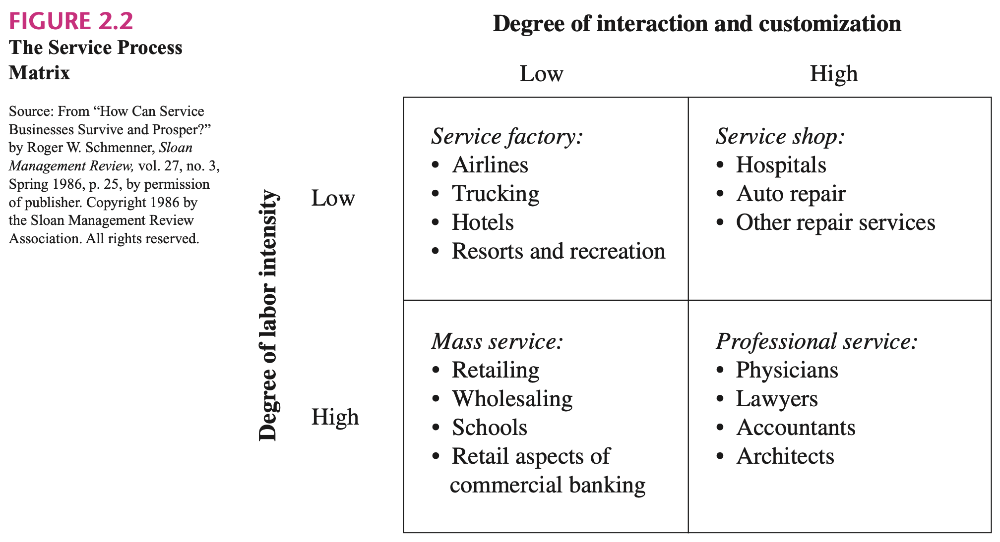
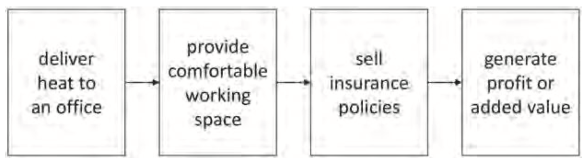

## 1, Introduction

> The distinction between a product and a service is difficult to make, because the purchase of a product is accompanied by some facilitating service (e.g., installation) and the purchase of a service often includes facilitating goods (e.g., food at a restaurant). [1]

For example, in power grids and electricity market, The supply and consume process of energy is a service process with energy being the facilitating goods.

> Management of queues and crowd control is a challenge for managers of physical facilities that are shared by a large population of customers. [1]

But there is another setting that we have taken for granted is that we can consume or generate energy immediately at any moment without informing anyone.

> Another significant, but somewhat less fundamental, difference between electrical energy and other commodities is that the energy produced by one generator cannot be directed to a specific consumer. Conversely, a consumer cannot take energy from only one generator. Instead, the power produced by all generators is pooled on its way to the loads. [3]

### Standardization and Pool

> The most fundamental differences are that the supply of electrical energy is inextricably linked with a physical system and that its delivery occurs on a continuous rather than a batch basis. [3]

> A commodity is simply a good that can be sold or bought in batches that can all be considered basically the same. [4]

### Rate instead of Quantity

The power system got its name from the fact that it is designed to supply energy on a continuous basis, i.e. power. Strictly speaking, electricity is therefore not traded in terms of energy but rather in terms of power over a certain interval of time. [3]

Designing an electricity market therefore involves choosing a time interval that serves as a trading period. Power is then translated into tradable energy by integrating it over each time interval. Looking at this the other way, a certain amount of energy traded over a given time period is thus deemed to be delivered at constant (i.e. average) power over that time interval. Because the physical and market conditions are assumed constant over each trading period, the price of energy is also deemed uniform over each trading period. [3]

The traded asset in Reservex is time-dependent service, which means same service in different time units is different. Besides, It is measured by rate, not by quantity. For example, power rate of electricity is the speed at which the prosumer generate or consume electricity. The reason is that the `capacity` of the equipment or people to provide service is limited. Additionally, to measure electricity by work (Joule) leaves out lots of the information, like how much they consume at a particular time and how fast do consumers change their consumption rate. Auxiliary markets like the capacity market must be introduced to prevent the potential hazard in existing electricity market systems.

This rule is the key to simplify the electricity market system. It decentralize the responsibilities to eliminate the accident like ration and blackout to every prosumer, and it rewards those who reduce the uncertainty or improve agility. For example, prosumers with stochastic generation, like those with solar panels and/or wind turbines, are encouraged to update their prediction as the delivery unit approaching. The updates may cause disturbance, but the other prosumers, like those with gas turbines, will react to it. Besides, they can try to equip themselves with gas turbine or battery and utilize more advanced control techniques to benefit more by compensating the intermittency.

## 2, Elements of Service

Service depends on four elements: supply and demand side, time and facility.

- Simultaneity
- Time-Dependence
- Facility-Dependence
- Stochasticity

> To demonstrate that management problems are common across service industries, Roger Schmenner proposed the service process matrix in Figure 2.2. [1]

## 3, Delivery Process

- Starting Time Point. Services cannot be stored for a future use. They are produced and consumed simultaneously. Service-relevant resources, processes and systems are assigned for service delivery during a specific period in time.
- Duration.
- Participants. The service provider must deliver the service at the time of service consumption. The service is not manifested in a physical object that is independent of the provider. The service consumer is also inseparable from service delivery.
- Facility. Service must take place in a physical environment. For example, a hospital, barber shop, or electricity network.
- Rate.

The service process includes three parts, provision, delivery and consumption.

### 3.1, Devices, Labor and Goods in Facilitating Systems

The most important element in facilitating systems is the service delivery network, which can be websites, mobile applications, restaurant chains, supply chains, power grids, etc. Some of the networks can be modeled using CEEFC, which is discussed in more detail in

### 3.2, Prosumer's Participation

## 4, Flow Goods and Stock Goods

> The distinction between flow and stock goods is based on the frequency of purchase. Theoretically, pure stock goods are those that can be stored indefinitely. Diamonds, gold, silver, and artworks are good examples. However, often we view mechanical and electrical appliances also as stock goods despite the fact that they tend to be replaced every few years. Flow goods are generally perishable goods for which the quantity demanded is measured by units of consumption during a certain time period. By perishable, we mean goods that cannot be stored for a long time, if at all. Therefore, perishable products must be repeatedly purchased. Food items, perhaps, provide the best examples of flow goods. Some food items can be stored for only a week, whereas others (such as boxed food) can be stored for six months or even longer. [5]

> Despite the fact that most services are perishable, not all services are flow goods in the sense that some services. [5]

> Buyers often inventory manufactured products for consumption in specific states. For example, buyers can inventory soft drinks until they are thirsty. With services, however, buyers are often less able to control the timing of consumption. Service providers, for example, can set fixed times when the services are offered and fixed times when they are sold. For example, many services have limited hours of operation. Here, buyers making advance ticket purchases for services often yield less control and more uncertainty about their future consumption states. [_shugan2000advance_]

## 5, Energy Functions

> It is important to recognize that energy services or energy functions can be defined on different hierarchic levels. For instance, heating an office in an insurance company is not an aim in itself, but is derived from a hierarchically ‘higher’ need: delivering insurance services to people (see Figure 1). Car transportation serves the need of moving from one place to another, which in turn serves other needs, for example visiting friends. [_blok2016introduction_]

## 7, References

1. Fitzsimmons, J.A., Fitzsimmons, M.J. and Bordoloi, S., 2008. Service management: Operations, strategy, information technology (p. 4). New York, NY: McGraw-Hill.
2. Biggar, D.R. and Hesamzadeh, M.R., 2014. The economics of electricity markets. John Wiley & Sons.
3. Kirschen, D.S. and Strbac, G., 2018. Fundamentals of power system economics. John Wiley & Sons.
4. Haeringer, G., 2018. Market design: auctions and matching. MIT Press.
5. Shy, O., 2008. How to price: a guide to pricing techniques and yield management (pp. 85-89). New York: Cambridge University Press.
