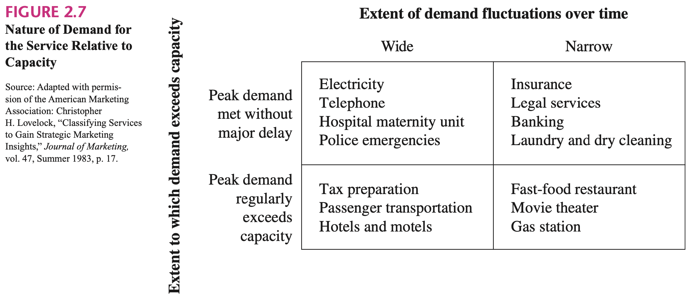

## 1, Introduction

The small-scale-friendly markets for energy should have the following features:

- Real-time confirmation
- chance to benefit without prediction

## 2, Two-Sided Market

The current debate over how small-scale consumers participate in the wholesale market is how to design aggregators to contract with small-scale consumers, in order to control the demand response to the market fluctuations. However, a market should be designed to tackle this problem instead of various kinds of aggregators.

> Broadly speaking, a two-sided market is one in which 1) two sets of agents interact through an intermediary or platform, and 2) the decisions of each set of agents affects the outcomes of the other set of agents, typically through an externality. [_rysman2009economics_]

> The distinguishing feature in this case is whether the seller is paid based on the success of the platform with the buying side. Strikingly, one-sided and two-sided selling strategies exist side-by-side at Amazon.com. For some products, like certain new books, Amazon (basically) buys at a wholesale price and sells for a retail price, which is a one-sided model. But for many other products, Amazon provides a web portal for a producer that sets the retail price that a consumer would see. [_rysman2009economics_]

> In this new paradigm the industry exists to provide a platform for the two-way trade of electricity, with all customers large and small, integrated with and responding to local market conditions. [_biggar2014economics_]

## 3, Stochasticity

Usually, the demand is stochastic, with variation between peaks and valleys. There are three ways to provide the service: [_fitzsimmons2008service_]

* Smooth demand by:
    - Using reservations or appointments.
    - Using price incentives (e.g., giving telephone discounts for evening and weekend calls).
    - Demarketing peak times (e.g., advertising to shop early and avoid the Christmas rush).
* Adjust service capacity by:
    - Using part-time help during peak hours.
    - Scheduling work shifts to vary workforce needs according to demand (e.g., telephone companies staff their operators to match call demand).
    - Increasing the customer self-service content of the service.
* Allow customers to wait.

> Each service is unique. It can never be exactly repeated as the time, location, circumstances, conditions, current configurations and/or as signed resources are different for the next delivery, even if the same service is requested by the consumer. Many services are regarded as heterogeneous and are typically modified for each service consumer or each service contextual.

## 4, Prosumer

An important consideration in providing a service is the realization that the customer can play an active part in the process. [_rysman2009economics_] But retailers for demand side and demand response programs can never be the solution to inelasticity in demand side, though there are more and more smart meters installed, trying to record the consumption with reference to time. Firstly, it's hard to forecast the consumption pattern of small participants. By taking into account all the meteorological, astronomical, economic, cultural, and special factors that influence the consumption of electricity and using the most sophisticated forecasting techniques available, it is possible to predict the value of demand at any hour with an average accuracy of about 1.5-2%, which is far from good. [_kirschen2018fundamentals_] Secondly, protection of customers' privacy and prediction precision are dilemma. Thirdly, a competitive market is ought to allow small consumers to change their retailers, which can cause a lot of trouble. Finally, there are too much work to do when designing these programs, which are very complex and with uncertainty by nature. When some factors change, it also takes a long time to modify the program. Fundamentally, markets for prosumption services are different from existing engagement platforms, such as demand reduction or demand response programs. That is because, in prosumer markets, users on the demand side not only react to price signals, but also actively offer services that electric utilities, transmission systems operators, or other prosumers have to bid for. [_parag2016electricity_]

Like flexible generation resources are needed for stochastic consumption in the past, there are more and more application of flexible consumption now to balance the stochastic generation from renewable energy. Renewable energy companies predict their generation and trade in the day-ahead market. Demand response is then introduced to eliminate the fluctuation. Just like stochastic generation, stochastic fixed demand can also be predicted and then reported to system operator. The researches about demand side response have already revealed many features. Prior to the consumption, the consumers can anticipate the future state and the corresponding utility. Overall, we have summarized all kinds of behaviors of service providers and consumers, and concluded with prosumers with leading and following behaviors, which is illustrated in table 1.

| Participant | Stochastic  | Flexible        |
| ----------- | ----------- | --------------- |
| Demand Side | Anticipaton | Demand Response |
| Supply Side | Forecast    | Load Following  |
| Prosumer    | Lead        | Follow          |

_Table 1, category of participants and behaviors in two-sided reservation markets_

Note that the prosumers here can also be called active consumers. Right now, small-scale consumers are forced to be passive towards reacting to price signals. But there are many agents eager to earn a profit from investing power generations because they may have sufficient production factors in their land, like strong wind, sun shire, or flexible working and life schedules. Participating in the end-user energy markets is like having a chance to play games, in order to earn a profit without disturbing personal life.

### On-Time Service

> This strategy is best illustrated by the fast-food restaurants that have significantly reduced the typical number of serving and cleaning personnel. The customer not only places the order directly from a limited menu but also is expected to clear the table after the meal. Naturally, the customer expects faster service and less expensive meals to compensate for these inputs, but the service provider benefits in many subtle ways. First, there are fewer personnel who require supervision and such things as fringe benefits. Second, and more importantly, the customer provides the labor just at the moment it is required; thus, service capacity varies more directly with demand rather than being fixed by the size of the employed staff. The customer acts like a temporary employee, arriving just when needed to perform duties to augment the work of the service staff. [_fitzsimmons2008service_]
