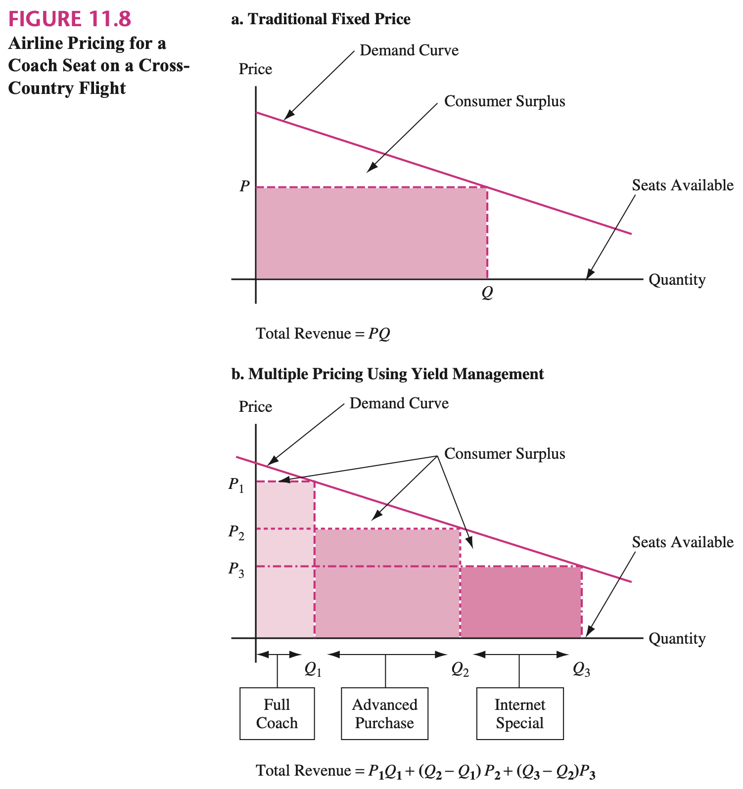

## 1, Introduction

The dynamic pricing has many advantages over the time-of-use tariff. The latter one is static, i.e., they are fixed long time in advance, and therefore unable to adapt to the rapid fluctuations of stochastic participation. As some stochastic productions, in particular solar power, can lower market prices even during the peak hours of the day, the price signal must adapt dynamically on the basis of the forecast level of renewable output. Real-time dynamic pricing is meant to serve this purpose. [2]

## 2, Stochastic Dynamic Programming with End Constraints

This process can be illustrated by a stochastic feedback control system, with all prosumers in this node being the controlled object which can be seen a decision function, and price function being feedback controller. The design of price function is the most important part in this market mechanism. Besides, the characteristics of the stochastic fixed quantity can be integrated into the price function.

multi-stage dynamic optimization

## 3, Surplus-Deficit Inventory with Increasing Value and End Point

> In display ads, the platform is auctioning inventory not owned by them, turning it into a two-sided market design problem, where incentives for buyers (advertisers) and sellers
(publishers, such as websites, blogs and news portals) need to be balanced. [1]

Inventory, Queueing and Reservation

Inventory control is a major issue in manufacturing operations, whereas in services, the corresponding problem is customer waiting, or “queuing.”

Overbooking

There is no spill.
Lower the rate of spoil.

## 4, References

1. Nahmias, S., 2011. Perishable inventory systems (Vol. 160). Springer Science & Business Media.
2. Morales, J.M., Conejo, A.J., Madsen, H., Pinson, P. and Zugno, M., 2013. Integrating renewables in electricity markets: operational problems (Vol. 205). Springer Science & Business Media.
