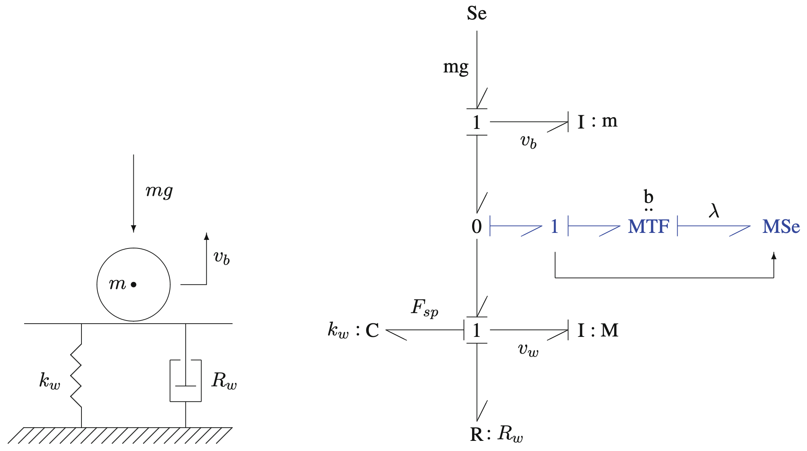

## 1, Introduction

When we say networks, it's important to distinguish the networks and the mediums inside the networks.

> Although a small amount of electricity is produced where it is consumed, there are several reasons why electricity generators are often located a long way from loads, giving rise to the need for electricity transmission and distribution networks connecting generation sources to electricity consumers. [_biggar2014economics_]

Why we need connections is that dis­connecting prosumers lose the benefit of electricity trade – importing power at times of local shortage and exporting power at times of local surplus. [_biggar2014economics_]

The capacities of pipes are critical factors in delivery process. For example, in electric power systems, Increases the utilization of the network by reducing the need to build network capacity to cater for just a few peak hours per year. [_biggar2014economics_] RexNet provides a way to make compromise in building large pipes and meeting demand of delivery processes.

The information about SDNs matters a lot during modeling and control. Most of the time, the flow controller has sufficient information about conduits in the SDNs. However, sometimes, the SDNs are too hard to be simulated because of their scale.

> The main role of many networks is to provide the physical substrate to the flow of some physical quantity, data, or information. In particular, this is the case for the transportation and technological infrastructures upon which the everyday functioning of our society relies. In this context, congestion phenomena, failures, and breakdown avalanches can have dramatic effects, as witnessed in major blackouts and transportation breakdowns. Also, in technological networks, if the single element does not have the capacity to cope with the amount of data to be handled, the network as a whole might be unable to perform efficiently. The understanding of congestion and failure avalanches is therefore a crucial research question when developing strategies aimed at network optimization and protection. [_barrat2008dynamical_]

## 2, Investment in Conduits

The long-term tasks include investments in efficient network resources. For example, those in power grids include the amount, type, location and timing of new transmission and distribution augmentation, and the retirement of existing transmission and distribution facilities. Again, this task must, of course, be coordinated with generation and load investment decisions. [_biggar2014economics_]

## 3, Examples

There are three kinds of networks to supply the necessity to small-scale customers.

- District Heating: Space Heating and Domestic Hot Water
- Electricity Current
- Domestic Water
- Natural Gas, [Gas networks simulation, Wikipedia](https://en.wikipedia.org/wiki/Gas_networks_simulation)

[Pipe network analysis](https://en.wikipedia.org/wiki/Pipe_network_analysis)

### Power Grids

### District Heating and Cooling Networks

### Gas Networks

The gas can be compressed to store potential energy, while the fluids are usually assumed to be non-compressible..

## 4, Net-Tree-Fruit

The topology
