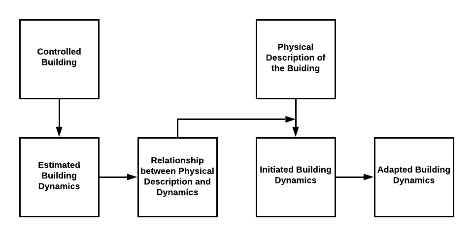

## 1, Introduction

> Control design problems have traditionally been approached from a signal-processing viewpoint; that is, the plant to be controlled and the controller are viewed as signal-processing devices that transform certain input signals into outputs. The control objectives are expressed in terms of keeping some error signals small and reducing the effect of certain disturbance inputs on the given regulated out- puts, despite the presence of some unmodeled dynamics. [5]

CEEFC is a toolbox to model and control the real-world service delivery networks (SDN). One typical type of SDN has the following five components: conduits, efforts, events, the flow and the control, whose first letters form the name "CEEFC". The repository is hosted on GitHub [edxu96/CEEFC]()

The foundation for CEEFC is bond graph, which is a powerful tool to model and visualize dynamical systems. Besides, number of algorithms from graph theory can be applied to manipulate the models. These two feature are be used to summarized bond graph as a related approach to graph theory for modeling large-scale systems is bond-graph modeling, wherein connections between a pair of subsystems are captured by a bond and energy, matter, or information is exchanged between subsystems along connections. [_haddad2011stability_] The two most important components in CEEFC, effort and flow are derived from those in bond graph. The bond graph modeling will be discussed in section 4.

The five parts have been introduced briefly in [Service Delivery Network/2, CEEFC: Pipe-Effort-Event-Flow-Control](https://edxu96.gitbook.io/rexnet-docs/model/sdn#2-CEEFC-pipe-effort-event-flow-control), and they will be discussed in more detail in following sections.

The dynamics of flows in pipes is very different from that of drones or cars. For example, there are many states and measure points. Furthermore, it cannot be controlled directly, which reflects the fact that centralized control scheme is out of date. PEEFC has been used to model SDNs in this project, thought other kinds of models may be introduced in the future. There are five components in PEEFC, which are summarized as:

- Pipes: the physical pipes in the engineered networks
- Effort: the input / output power or goods, which is decided by prosumers
- Event: the discrete event, which results in the transformation of modes of dynamical systems
- Flow: the flow of power or goods
- Control: the controlled facilities, like pumps and joints

Most of the SDNs in the energy sector are this kind, like power grids and gas networks, which will be summarized briefly in the following subsections.

## 2, Effort and Event

The effort can be viewed as power sources in energy-related systems. If no energy is injected and ejected from the system, the existence of conduits is meaningless.

### Distributed Non-Cooperative Coordinative Control

From the perspective of flow controller (FC), the efforts cannot be controlled directly. As discussed before, in the renewable era, transmission companies and energy generation companies are usually not set to be united. As FCs, transmission companies must reply on price signals to control the dynamics of efforts, which needs coordination among prosumers.

Information-Optimization-Command way

### Multi-Agent Modeling and Simulation

The participation of small-scale prosumers means increase of number of states. More advanced modeling methods like multi-agent modeling should be used to model the behaviour of prosumers.

https://edxu96.gitbook.io/rexnet-docs/simulation/abm

### Discrete-Event and Discrete-State

- Present: True / False
- Window: On / Off

https://edxu96.gitbook.io/rexnet-docs/modelling/sdn/4-hybrid

### Correlated Efforts/Events

Considering a multi-dwelling building in district heating networks equipped with RexNet, the prosumer may find it hard to forecast the exact effort, because it is correlated to conditions of other prosumers, and they do not have the information. They can only forecast that they are in one of the two discrete state, presence or absence.

## 3, Flow in Conduits

Why the service can be delivered by SDN is existence of flow in conduits. For example, the current in power grids and thermal fluids in district heating networks.

The flow can not be controlled directly, it must be changed by machines. We can control the machine.

There are two kinds of pipe systems, one with the flow as the carrier, and one with the flow as goods.

### Flow as Carrier

district heating networks

> The optimal operation of the buildings and the district heating system may be obtained by use of intelligent control of the heating system of buildings. The intelligent control makes use of weather forecasts to calculate the need for heating in each room and this information is used to control the operation of the heating system. This is especially relevant for floor heating installations, where a weather forecast based control of the floor temperature can improve the indoor environment. Moreover, the efficiency of the heating system improves, as the thermal capacity of the concrete deck may be allowed to discharge before the occurrence of excess solar gain. The peak load for space heating during a day may be reduced by use of higher thermal capacity of the building and by using space heating systems with a peak shaving control system. This may be realised in a simple way by use of a maximum flow controller. Alternatively, an intelligent control system based on 24-h weather forecasts may be used to calculate the required need for space heating and to feed the individual rooms with the predicted energy for heating. [2]

### Flow as Goods

Gas network, Power grids

## 4, Bond-Graph Modeling

> The basic concept in bond graph analysis is to specify the flow of energy in a system. The energy flow in any system is always governed by simultaneous intervention of two independent parameters. In the bond graph method these two parameters are defined by the general terms of effort and flow. The power of the instantaneous energy flow is product of these two factors. [1]

> The power variables are broken into two parts: flow and effort. For example, for the bond of an electrical system, the flow is the current, while the effort is the voltage. By multiplying current and voltage in this example you can get the instantaneous power of the bond. [4]

The control of bond graph will be discussed in [Multivatiable Control of Bond Graph](https://edxu96.gitbook.io/rexnet-docs/model/sdn/3-control#4-multivariable-control-of-bond-graph) of another chapter.

### BondGraphTools in Python

- <https://github.com/BondGraphTools>

### Simplifications in Bond Graph

## 5, Modeling Process

The estimation procedures for different buildings are almost the same.

The correlation between different outputs should be kept as low as possible.

Detailed physical model for precise prediction and validation, and mathematical model for fast computation

- Dymola
- Modelica

Always start with a simple model, and add more structures. So you at least always have something in your hand.

## 6, References

1. Appendix: An Introduction to Bond Graph Modelling
2. Lund, H., Werner, S., Wiltshire, R., Svendsen, S., Thorsen, J.E., Hvelplund, F. and Mathiesen, B.V., 2014. 4th Generation District Heating (4GDH): Integrating smart thermal grids into future sustainable energy systems. Energy, 68, pp.1-11.
3. Haddad, W.M. and Nersesov, S.G., 2011. Stability and control of large-scale dynamical systems: A Vector Dissipative Systems Approach (Vol. 41). Princeton University Press.
4. <https://en.wikipedia.org/wiki/Bond_graph>
5. Ortega, R., Van Der Schaft, A.J., Mareels, I. and Maschke, B., 2001. Putting energy back in control. IEEE Control Systems Magazine, 21(2), pp.18-33.
