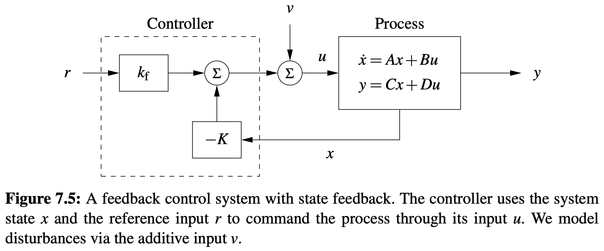
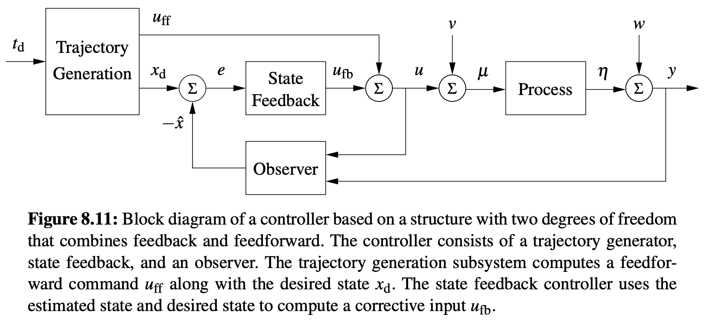
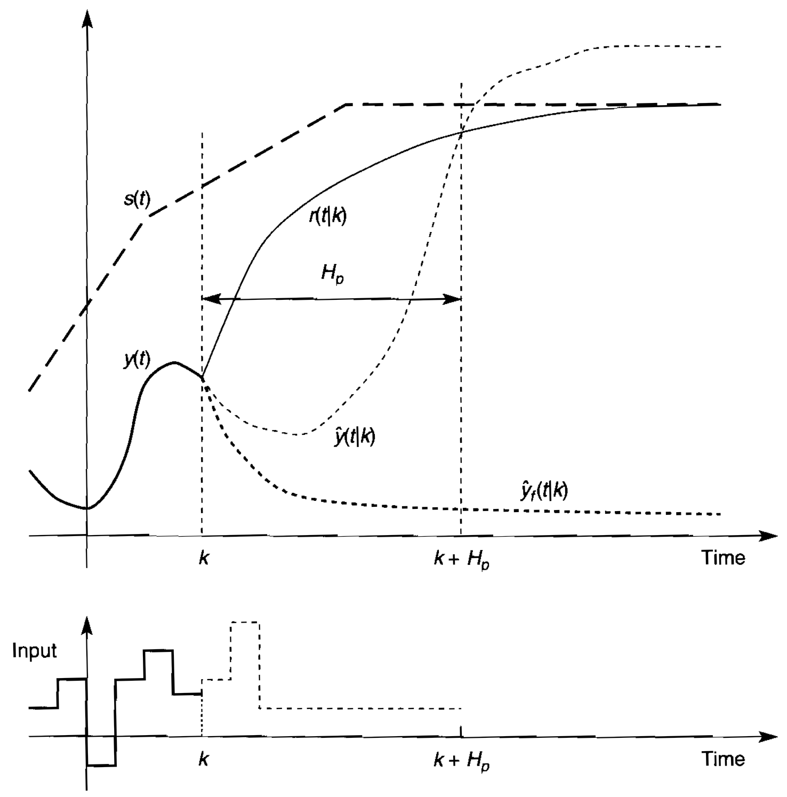

## 1, Introduction

There are two groups of different agents to control the service delivery network.

## 2, Flow Controller

The participant in controlling the flow in pipes is called flow controller, which is summarized briefly in [Participants, Settings](https://edxu96.gitbook.io/rexnet-docs/description/settings/3-part). The flow in pipes is affected by three factors, flow controller, efforts from prosumers, and external efforts. Here, the control of the flow in pipes is discussed from the perspective of the flow controller.

## 3, Multivariable Control of the Flow in Pipes

The objective of a control system is to make the output `vec_y` behave in a desired way by manipulating the plant input `vec_u`.

For example, the control of power grids is essential for the efficient use of the available network resources, which includes (i) efficient redistribution or reallocation of generation and demand resources to accommodate transmission or distribution constraints, and (ii) efficient operation of the transmission and distribution network. Efficient operation includes efficient setting of network limits taking into account, say, weather conditions and credible contingencies; efficient maintenance and inventory practices, efficient levels of forced outages, and efficient decisions regarding the timing of unforced outages. Efficient operation may also include efficient switching decisions, bringing network elements into or out of service in such a way as to maximise overall economic benefits. [2]

## 4, Two Degree-of-Freedom Controller

> For motion control problems, such as vehicle steering and robotics, the task description consists of the coordinates of a number of points (waypoints) that the vehicle should pass. In other situations the task description could be to transition from one state to another while optimizing some criterion. [1]

> This controller is said to have two degrees of freedom when the responses to command signals and disturbances are decoupled. Disturbance responses are governed by the observer and the state feedback, while the response to command signals is governed by the trajectory generator (feedforward). [1]

The input for trajectory generation is from Reservex.

The feedback part is to mitigate stochasticity.

## 5, Multivariable Control of Bond Graph

## 6, Model Predictive Control

Also, the MPC can determine the future marginal cost of input, please consult [RexNet-Docs/Nodal Pricing](https://edxu96.gitbook.io/rexnet-docs/model/sdn/6-nodal).

It's not receding horizon control scheme, because there is an end point.

CasADi is an open-source tool for nonlinear optimization and algorithmic differentiation. Build efficient optimal control software, with minimal effort. https://web.casadi.org

## 8, References

1. Aström, K.J. and Murray, R.M., 2010. Feedback systems: an introduction for scientists and engineers. Princeton university press.
2. Biggar, D.R. and Hesamzadeh, M.R., 2014. The economics of electricity markets. John Wiley & Sons.
