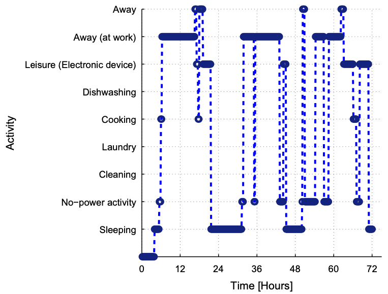

## 1, Introduction

- Shifting task, fixed time length and power
- Sawtooth task, fixed end time and total energy: washing machine, electric kettle

## 2, Discrete Task of Individual Consumption

## 3, Task Combination

The total power is the sum of power outputs from task combinations.

## 4, Computer-Aided Schedule, Reservation and Realization

## 2, Individual Profiles

### Discrete-State Profile for Temperature

## 3, Aggregated Profiles

### Aggregated Electricity Load Profile

> Methods for coping with the rapid increase in demand at sunset reflected in the duck curve, which becomes more serious as the penetration of solar generation grows [_lazar2016teaching_]

![Figure 1, California hourly electric load vs. load less solar and wind (Duck Curve) for October 22, 2016, with Blue curve being demand for electrical power, orange curve being supply of electrical power from non-renewable sources, and gray curve being supply of solar electrical power. Data is for the State of California on October 22, 2016 (a Saturday), a day when the wind power output was low and steady throughout the day. Note the red curve's steep rise from 17:00 to 18:00 as the sun sets, requiring some 5 gigawatt of generating capacity from non-renewable sources to come on line within one hour.](../images/RexNet_11.png)

## 4, Simulated Realization and Forecast of Stochastic Processes

- Historical Data
- Bootstrap of time series with dynamics
- Model-Free Scenario generation
- Simulated Forecast with Sliding Windows

## State of Prosumer and Related Effort

For energy systems, the occupant behavior is modelled by Markov chains with different states representing their activities, assuming that each household member is in one of these nine states in every discrete time step, which are classified into nine categories according to the corresponding energy required, like sleeping, no-power activity (e.g. reading), cleaning (e.g. vacuuming). away to work, etc. [_muratori2013highly_] The Markov chains are non-stationary to take the daily, weekly and monthly variations into account. Diurnal behavior patterns are reproduced by allowing transition probabilities to vary over the 24 hours, which is represented by the index $$h$$. Similarly, behavior differences between working and non-working days are captured by allowing the probabilities to vary between working ($$d = 1$$) and non-working days ($$d = 0$$). This approach requires the initial state to be chosen, which is that all individuals are sleeping at 4 a.m. of the first day simulated. [_muratori2013highly_]

_Figure 2, simulated behavior pattern for a working male during a 3-working-day period._

For prosumer $n$, the probability of realization of presence is:

$$
y_{t} = \max \left\{\min \left\{y_{t|t-1} + \Delta_{t} + \beta \cdot p_{t,t-1} \cdot x_{t,t-1}, 1 \right\}, 0 \right \}
$$

where $\Delta_{t}$ is the forecasting error, $\beta$ is the impact from reservation. That is, if $n$ has reserved the presence, the value of $y_{t}$ will increase.
