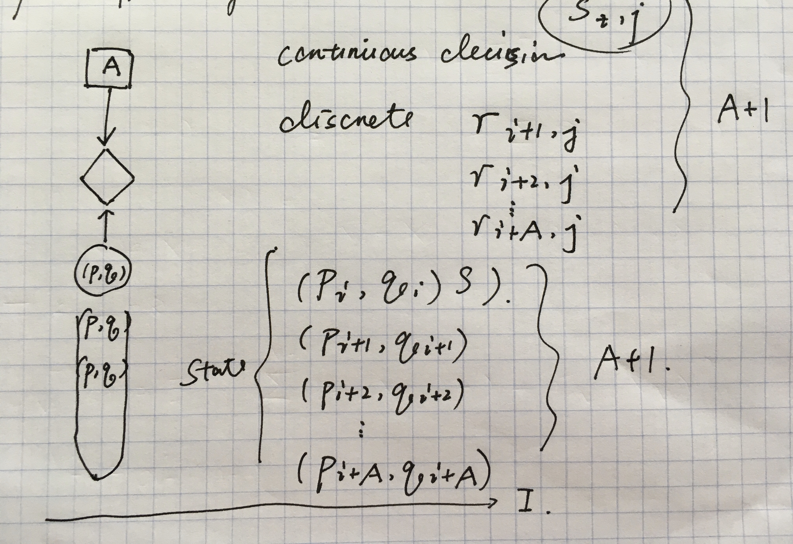

## 1, Introduction

$$ g_{n, i} $$ can be used to describe the reservation policy of prosumer $$ n $$ at current unit $$ i $$.

$$
\begin{align}
	\Delta \boldsymbol{q}_{n, i+1} &= g_{n, i+1}(\boldsymbol{p}_{n, i+1}, \boldsymbol{q}_{n, i}) \quad \text{for } n \in N \\
	\boldsymbol{q}_{n, i+1} &= \Delta \boldsymbol{q}_{n, i+1} + \boldsymbol{q}_{n, i} \quad \text{for } n \in N
\end{align}
$$

$$g_{n, i+1}$$ should be treated as a linear combination first.

> The sequential decision making model can be described as follows. At a specific point in time, an agent observes the state of the system. Based on this state, the agent chooses an action. The action choice produces two results: the agent receives an immediate reward (or incurs an immediate cost), and the system evolves to a new state as a subsequent point in time according to a probability distribution determined by the action choice. At this subsequent point in time, the agent faces a similar problem. [1]

The states for time units are set to be finite discrete.

The policies of different kinds of prosumers are very different.

## 2, Multi-Agent Multi-State Markov Decision Process

### Cooperative Decentralized Decision Making

> Agents seek to optimize a shared objective function but must develop plans of action based on a partial view of the environment. We describe modeling this problem as a decentralized partially observable Markov decision process (Dec-POMDP) and discuss the complexity and salient properties of this model. We also provide an overview of exact and approximate solution methods for Dec-POMDPs, discuss the use of communication between agents in this model, and describe notable subclasses with additional modeling assumptions and reduced complexity. [2]

### Non-Cooperative Decentralized Decision Making: Market



## 3,  RCCR Trading Strategy

RCCR is abbreviation for the simplest trading strategy to trade in batch. It's composed of two algorithms, which are designed for fixed and flexible quantity respectively.

```Python
def decide_q_rccr(self, c: int, s: int, s_x: int, batch, p: float, p_std, len_unit):
    """
    RCCR Algorithm to Trade Ejection
    """
    quantity_pre = batch.mat.search_cs(c - 1, s)
    # Use Ramp Climbing Algorithm to Trade Fixed Quantity
    ramp = self.vec_fix[s_x - 1] / (batch.s_2 - batch.s_1)  # [slope of the ramp for fixed quantity]
    slope = self.f_fix * (p - p_std) + ramp  # [slope of increment of trading fixed quantity]
    q_fix_pre = quantity_pre.fix
    q_fix_least = (c - (slope - batch.s_1)) * ramp
    q_fix_final = self.vec_fix[s_x - 1]
    q_fix_raw = q_fix_pre + slope * len_unit
    q_fix = self.decide_fix_rc(q_fix_least, q_fix_final, q_fix_raw)
    # To Trade Flexible Quantity in Constant Rate
    slope = self.f_flex * (p - p_std)
    q_flex_max = self.vec_max[s_x - 1]
    q_flex_pre = quantity_pre.flex
    q_flex_raw = q_flex_pre + slope * len_unit
    q_flex = self.decide_flex_cr(q_flex_max, q_flex_raw)
    # Update the fixed and flexible quantities in batch
    batch.mat.update_cs(c, s, q_fix, q_flex)
    return batch.mat.search_cs(c, s).ejection  # return the updated ejection value
```

## 4,  Ramp Climbing Algorithm for Fixed Quantity Trading

Fixed ejection requires the final total traded volume for the specific time unit reaches a certain level. For example, if some prosumer must consume at 5 kW for the 120-th time unit, the cumulative volume must be greater than 5 kW. To do that, a ramp, whose slope is `required volume` / `total trading time units`, is introduced. To continue the example, the prosumer decides to trade for the 120-th time unit starting from the 96-th time unit. There are 24 time units, so the slope is 5 / 24. Between the 96-th and 119-th time unit, the prosumers can trade at an adaptive rate, in order to gain more benefit. We also assume that the maximum traded fixed quantity should not exceed the required level, because more volume will be traded as flexible quantity. Overall, the following trading strategy is used:

```Python
@staticmethod
def decide_fix_rc(fix_least, fix_final, fix_raw):
    """
    Ramp Climbing Algorithm to Trade Fixed Quantity
    """
    fix = None
    if fix_final < 0:  # Inject
        if fix_raw <= fix_final:
            fix = fix_final
        elif fix_raw >= fix_least:
            fix = fix_least
        else:
            fix = fix_raw
    elif fix_final >= 0:  # Eject
        if fix_raw >= fix_final:
            fix = fix_final
        elif fix_raw <= fix_least:
            fix = fix_least
        else:
            fix = fix_raw
    return fix
```


## 5,  To Trade Flexible Quantity in Constant Rate

As for the trading of flexible volume, there is no slope to restraint the trading. However, there are two levels to make sure the trading is limited. In practice, the consuming or generating ability is indeed limited. For example, if a prosumer is going to consume in some amount of power in 120-th time unit, the limits are 0 and maximum possible flexible quantity.

```Python
@staticmethod
def decide_flex_cr(flex_max, flex_raw):
    """
    To Trade Flexible Quantity in Constant Rate
    """
    flex = 0
    if flex_max <= 0:
        if flex_raw >= 0:
            flex = 0
        elif flex_raw <= flex_max:
            flex = flex_max
        else:
            flex = flex_raw
    elif flex_max > 0:
        if flex_raw <= 0:
            flex = 0
        elif flex_raw >= flex_max:
            flex = flex_max
        else:
            flex = flex_raw
    return flex
```


## 6,  Simple Trading Strategies

There are many different trading strategies the prosumers can use to maximize their benefit. In practice, the trading can be done by predefined software. Usually, prediction can be used to help trade by solving dynamic programming problems. However, right now, there are only few simple trading strategies available.

There are many kinds of quantities. Right now, we only consider two kinds, `fixed quantity` and `flexible quantity`.

### 6.1, Benchmark for Trading Strategy

Constant trading

### 6.2, First Trading Algorithm

```Python
def decide(self, s, s_x, c, c_x, price, price_std):
    """
    Function to decide the ejection for `s` at c, calculate the payment and income.
    """
    # 1,  Fixed Quantity
    if c < s - self.vec_forward[c_x - 1]:
        self.q[s].fixs[c] = 0
    elif c >= s - self.vec_forward[c_x - 1]:
        self.q[s].fixs[c] = self.vec_fix[s_x - 1]
    # 2,  Flexible Quantity
    self.q[s].flexs[c] = self.vec_max[s_x - 1] - (price - price_std) / self.r_flex
    # 3,  Ejection
    self.q[s].values[c] = self.q[s].fixs[c] + self.q[s].flexs[c]
    # 4,  Pay
    if self.q[s].values.get(c - 1) is None:
        self.q[s].pays[c] = self.q[s].values[c] * price
    else:
        self.q[s].pays[c] = (self.q[s].values[c] - self.q[s].values[c - 1]) * price
    # 5,  Calculate Income
    if self.q[s].incomes.get(c - 1) is None:
        self.q[s].incomes[c] = self.q[s].pays[c] + 0
    else:
        self.q[s].incomes[c] = self.q[s].pays[c] + self.q[s].incomes[c - 1]
```

## 7,  Inter-Unit-Effect Rate Trading of Flexible Ejection

## 8, References

1. Puterman, M.L., 2014. Markov Decision Processes.: Discrete Stochastic Dynamic Programming. John Wiley & Sons.
2. Kochenderfer, M.J., 2015. Decision making under uncertainty: theory and application. MIT press.
