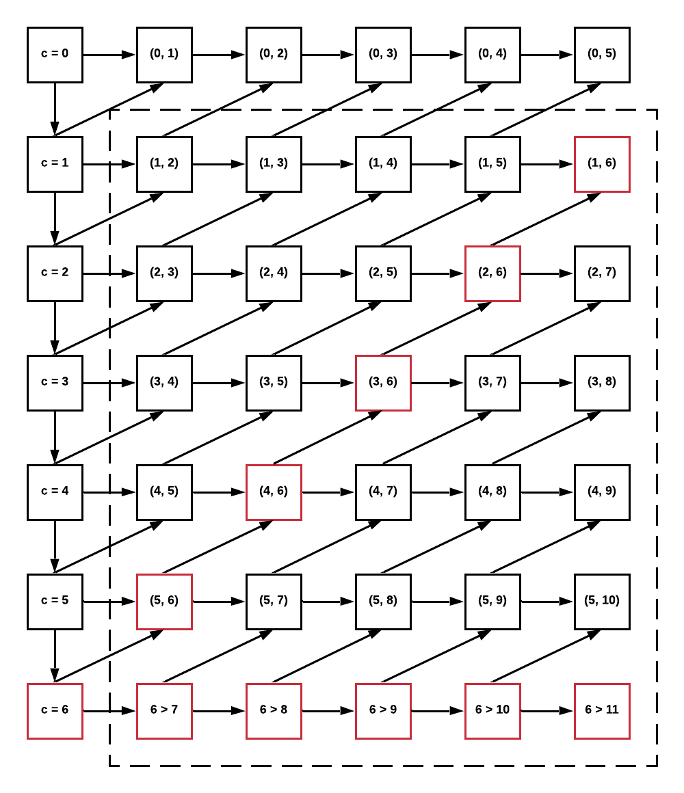

## 1,  System State: Forward Price

Supposed that we can trade futures at maximum 20 time units ahead, the system state is the 20 forward prices for the next 20 delivery time units. That is, if some participant decides to consume some amount of electricity in some future time unit, the trading price is the current forward price. In other words, it's the current value of prices for future time units.

The event is the update of forward prices. In the beginning of every time unit, the net ejection and price are calculated, and the length of any time unit is the pre-defined. So, fixed-increment time advance mechanism has been used to represent the simulation clock. The net ejection is the sum of ejections from all participants in the node, and the price is calculated following the pre-defined algorithm. Usually, if the net ejection is greater than 0, which means there is power surplus, the price will go down. If the net ejection is smaller than 0, the price will rise up. We assume that there is no time delay to calculate the price, which makes a lot of sense because the mechanism doesn't require too much computation resource.

Usually, the length should be set that the prosumers have sufficient time to make decisions without refreshing the price. For example, 1 minute is long enough for a human to decide how much electricity he/she is going to consume in the next 1 hour. Because of low requirement for computation resource, the length can be set very short, nevertheless, there is no point to do so.

## 2,  Illustration of the State List

`forward_max = 3`

|  c  | Time Unit  | StateList | list[1] | list[2] | list[3] | list[4] |
|:---:|:----------:|:---------:|:-------:|:-------:|:-------:|:-------:|
|  0  |   (0, l]   | StateHead | (0, 1)  | (0, 2)  | (0, 3)  | (0, 4)  |
|  1  |  (l, 2 l]  |  (1, 1)   | (1, 2)  | (1, 3)  | (1, 4)  | (1, 5)  |
|  2  | (2 l, 3 l] |  (2, 2)   | (2, 3)  | (2, 4)  | (2, 5)  | (2, 6)  |
|  3  | (3 l, 4 l] |  (3, 3)   | (3, 4)  | (3, 5)  | (3, 6)  | (3, 7)  |
|  4  | (4 l, 5 l] |  (4, 4)   | (4, 5)  | (4, 6)  | (4, 7)  | (4, 8)  |
|  5  | (5 l, 6 l] |  (5, 5)   | (5, 6)  | (5, 7)  | (5, 8)  | (5, 9)  |

`(c, s)` means the price for time unit `(s * l, (s + 1) * l]` at `(c * l, (c + 1) * l]`.

All `State`s in `StateList(0)` and last `State` in other `StateList`s don't have `ref_c`, while other `State`s have `ref_c` being the `State` in last time unit.

Python has a garbage system, which will delete the instance without reference directly.
