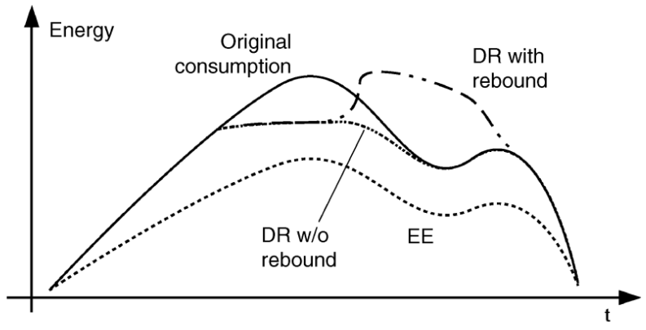

## 1, Introduction

Retail Spot Market (RSM) is the most popular market in the world, because there is almost no prerequisite.

> Markets with progressively shorter trading periods and a spot market. Forward markets handle trading in large amounts of energy over long periods of time. They operate slowly and close far in advance of the beginning of the delivery period (also known as “real time”). Markets for smaller amounts of energy to be delivered over shorter time periods operate faster and can therefore operate much closer to real time. The spot market is the market of last resort and thus operates closest to real time. It typically handles only a small fraction of the overall energy needs. This arrangement not only helps market participants manage their risks but also gives the system operator time to identify conditions that might affect the operational reliability of the system. In the next section, we discuss the various types of forward markets for electrical energy. [_kirschen2018fundamentals_]

There are two major features in RexNet:

- Provision of more advanced control devices allow on-time prevention of catastrophic accidents.
- The division of responsibility is more clear. It's easier to find the responsible agent to pay for the distraction from emergency issues.

incumbent electricity market families

## 2, Day-Ahead Market

![Figure 1, Market decision timeline: one day-ahead market and 24 balancing markets. \[1\]](../images/RexNet-Energy_3.png)

### RexNet-Energy-Reservex vs Double Auction Mechanism

> In a centralized or pool-based trading system, producers and consumers submit their bids and offers to the system operator, who also acts as market operator. The system operator, which must be independent from all the other parties, selects the bids and offers that optimally clear the market while respecting the constraints imposed by the transmission network. As part of this process, the system operator also determines the market clearing prices. [_kirschen2018fundamental_]

Double auction mechanism is centralized one-time market clearing.

* Small-scale prosumers are still unable to participate directly in the market directly.
* It takes a lot of computation power to support double auction and nodal pricing.
* The profits of renewable energy companies mainly come from government subsidy.
* The entire electricity market system is too complicated.
* Lots of information, especially those associated with pseudo-fixed cost, like start up cost, adjusting rate and non-linear efficiency is neglected in double auction.
* Renewable energy company can never trade in high price.

### Direct Participation of Small-Scale Prosumers

> Most small and medium electricity consumers have very little incentive to take an active part in an electricity market. Even when they are aggregated, the retailer that represents them has only a limited ability to adjust consumption in responses to changes in prices. The transaction costs are therefore reduced significantly if demand is deemed to be passive and is represented by a load forecast as is the case in many centralized markets. Many economists are unhappy with this approach because they feel that direct negotia­tions between consumers and producers are essential if efficient prices are to be reached. Some economists thus dislike centralized markets simply because they are only an administered approximation of a market rather than a true market. [_kirschen2018fundamentals_]

### Smart Meters

The installation of smart meters is just a small step to a smarter energy market. Right now, there is no incentive to install the smart meters.

> In addition, in a liberalised electricity market, there are many other related tasks that must be performed effectively, such as the metering of generation supplies and load consumption, the operation of billing and settlement systems, and the monitoring and enforcement of the market
rules and processes. [_biggar2014economics_]

## 2, Balancing Market as a Two-Sides Market

> The market of last resort for electrical energy is therefore not a true spot market. It is instead what one might call a “managed spot market” because the system operator is counterparty to all trades. This means that market participants do not buy or sell from each other but deal only with the system operator, who decides how much power it needs to buy or sell to maintain the system’s stability. The spot price is then calculated based on the bids and offers submitted by the market participants and selected by the system operator. Each system operator runs its own spot market and all generators, retailers, large consumers, and speculators who trade energy within the area overseen by a system operator are subject to its rules. In particular, any difference between what a market participant was contractually committed to do and what it actually did is settled at the spot market price. [_kirschen2018fundamentals_]

### Two-Price Settlement

> In a two-price market, real-time deviations are priced differently depending on the imbalance sign. Deviations that are in the opposite direction to the overall system imbalance, which help the system restore the balance between production and consumption, are priced at the day-ahead market price. On the contrary, imbalances of the same sign as that of the system are settled at the clearing price of the balancing market. [_morales2013integrating_]

![Figure 1, Producer imbalance and arbitrage opportunity between balancing and day-ahead markets in the two-price system. \[2\]](../images/RexNet-Energy_4.png)

## 3, RexNet-Energy-Reservex vs Market with Demand Response

__Retailers for demand side and demand response programs can never be the solution to the inelasticity in demand side, though there are more and more smart meters installed, trying to record the consumption with reference to time.__ Firstly, it's hard to understand the consumption pattern of small participants. By taking into account all the meteorological, astronomical, economic, cultural, and special factors that influence the consumption of electricity and using the most sophisticated forecasting techniques available, it is possible to predict the value of demand at any hour with an average accuracy of about 1.5-2%, which is far from good. Secondly, protection of customers' privacy and prediction precision are dilemma. Thirdly, a competitive market is ought to allow small consumers to change their retailers, which can cause a lot of trouble. Also, there are too much work to do when designing these programs, which are very complex and with uncertainty by nature. When some factors change, it also takes a long time to modify the program. Finally, the consumer cannot participate in the process, which means they can’t "respond" to "response", so the effect cannot be too significant. Like in Denmark, the interval of the changing temperature by demand response in district heating network is +-2. Because too low temperature during night can be very uncomfortable for sleeping people -- let alone some still-waking people. On the other hand, when people go to work everyday during the day, the district hearing company usually don't lower the temperature because they have no way to know. Markets for prosumption services are different from existing engagement platforms, such as demand reduction or demand response programs. Because prosumers can receive price signals directly and participate in the market with their own strategy.

> The demand side can also provide balancing resources. A consumer could offer to reduce its consumption if the price it would receive for this reduction is greater than the value it places on consuming electricity during that period. Such demand reductions have the advantage that they can be implemented very quickly. It is also conceivable that consumers might offer to increase their demand if the price is sufficiently low. [_kirschen2018fundamentals_]

## 4, Capacity Market

The independent system operator is counterparty to capacity providers.

> Since these offers of balancing resources are submitted shortly before real time, the system operator may be concerned about the amount or the price of balancing resources that will be offered. To reduce the risk of not having enough balancing resources or of having to pay a very high price for these resources, it can purchase balancing resources on a long-term basis. Under such contracts, the supplier is paid a fixed price (often called the option fee) to keep available some generation capacity. The contract also specifies the price or exercise fee to be paid for each megawatt-hour produced using this capacity. The system operator would call upon this contract only if the exercise fee is lower than what it would have to pay for a similar balancing resource offered on a short-term basis. As the terminology suggests, these contracts are equivalent to the option contracts used in financial and commodity markets. Their purpose is the same: to give the buyer (in this case the system operator) some flexibility and some protection against high prices while guaranteeing some revenues to the supplier. [_kirschen2018fundamentals_]

However, the ISO doesn't exist in RexNet, so there is no need for capacity market.

Option

## 5, Complementary Services

In the Internet era, the complementary services can be easily provided by mobile phones, smart TV or other electronic devices.

> Restaurants have discovered the benefits of complementary services by adding a bar. Diverting waiting customers into the lounge during busy periods can be profitable for the restaurant as well as soothing to anxious consumers. Movie theaters traditionally have sold popcorn and soft drinks, but now they also include video games in their lobbies. These examples illustrate complementary services being offered to occupy waiting consumers. [_fitzsimmons2008service_]

## 6, Demand-Side Management

> Dynamic DSM does not necessarily reduce energy consumption, only consumption patterns are influenced. If a process is interrupted for some reason, it might have to “catch up” once it has green lights again. An example is a water pumping system that can — because of its storage tanks — easily be shed for 30 min. After the shed it has to fill up its tanks again, since they were drained during the shed period. A so-called “rebound effect” (or payback) takes place, energy is typically not saved and maybe even a new peak is generated (see figure 3). [_palensky2011demand_]

_Figure 3, impact of improved energy efficiency versus demand response._

> A much quicker response is provided by the many flavors of Demand Response (DR). Typically, a signal is broadcast, e.g., by the distribution or transmission system operator (DSO/TSO). This signal might contain a price or a command for load shedding/shifting. The deadline is not necessarily instantaneous: the signal might refer to a situation next day at 12:00 noon since often grid emergencies can be anticipated. [_palensky2011demand_]

> If, for instance, a utility or system operator issues an emergency message to the DRAS, the server forwards the message to all clients that participate in the “emergency program.” Transactions need to be recorded by the DRAS since financial incentives are connected with reacting to such events. The above system is almost open-loop control, since neither load models nor online feedback is used. [_palensky2011demand_]
