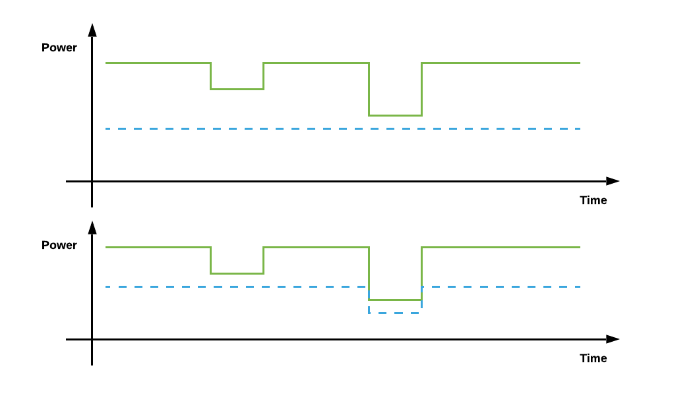

## 1, Introduction

> A major challenge for the electricity industry in the next few decades will be the effective extension of the wholesale market down to the level of small customers, and the effective integration of small customers into the wholesale market. [_biggar2014economics_]

> Instead of providing a reliable supply of electricity, the function of the new electric power industry is to provide a platform on which parties can trade and exchange electricity, with prices that reflect the supply and demand conditions at each different point on the network. In other words, the electric power industry exists not to provide a reliable supply of electricity but to provide a market, with market signals that allow customers (both generators and consumers of electricity) to make efficient decisions regarding the use of the existing set of assets and investment in new asset. [_biggar2014economics_]

## 2， Power System

> All electric power systems consist of three primary physical elements: Devices for converting energy in other forms into electrical energy (also known as generators), devices associated with transporting or delivering electrical energy to where it is consumed (wires and networks), and devices for converting that electrical energy into the myriad goods and services that make up modern life (such as lights, heaters, motors and electronic devices). [_biggar2014economics_]

### Electricity Transmission and Distribution Networks

> The large-scale network or grid is usually divided into two components: the high-voltage transmission network and the low-voltage distribution network. In practice there is no bright-line distinction between these two types of networks. The distinction will vary across different regions, across networks and across countries. [_biggar2014economics_]

## 4, System Security

> An option that conveys to the owner the right to buy at a specific price is referred to as a call; an option that conveys the right of the owner to sell at a specific price is referred to as a put. Both are commonly traded, but the call option is more frequently discussed. [_Option, Wikipedia_]

> To achieve security, a substantial operational reserve must be maintained at all time. This reserve allows the prompt restoration of the balance between generation and load in the event of the failure of a generating unit. It also prevents the system from collapsing following a fault on the transmission system. While some interruptible contracts allow the system operator to disconnect loads at very short notice in the event of an emergency, most of this reserve has traditionally been provided by the supply side. The separation of generation and system operation that accompanies the introduction of competition gives a chance to the demand side to take a more active part in the provision of security for the system. Consumers who do not mind being totally or partially disconnected during emergencies should be given the opportunity to offer their load as a contribution to the reserve. In exchange, they would receive an option fee and an exercise fee proportional to the energy not supplied if their load is disconnected. If the demand side is used to handle emergencies in the transmission system, the amount of these option and exercise fees will depend on the location of the consumer. [_kirschen2003demand_]

## 5, VPPs
