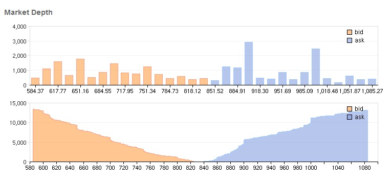
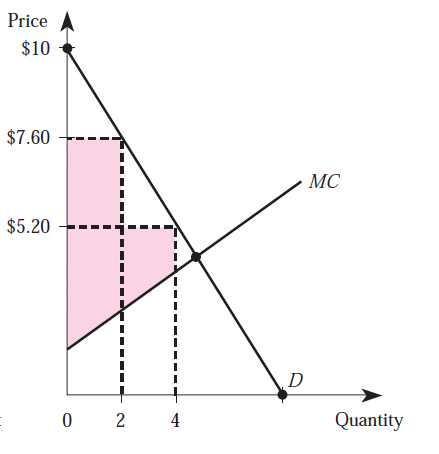

> Think about the market solution proposed, whether it has sufficient depth and liquidity to have credible price signals.

## 1, Introduction

## 2, Liquidity

## 3, Depth

http://www.futuresmag.com/2014/04/30/trading-market-depth
https://en.wikipedia.org/wiki/Market_depth

## 4, Market Power

> When a generator attempts to withhold capacity in order to increase the local market price, the impact on the local market price depends on the willingness and ability of other generators in the market to increase their output in response to the withdrawal, together with the willingness and ability of loads to reduce their demand. [_biggar2014economics_]

> One of the primary reasons that wholesale electricity markets are prone to market power is the lack of responsiveness of electricity customers to wholesale prices. [_biggar2014economics_]

## 5, Market Power and Network Congestion

> transmission constraints reduce the geographic scope of the relevant market – reducing the number of generators in direct competition with the generator exercising market power. [_biggar2014economics_]

It is necessary to have nodal prices in order to lower the network investments and mitigate market powers.

> Network congestion is another primary determinant of opportunities to exercise market power. Networks should be operated and planned in a way that takes into account the potential for market power. This may mean increasing the capacity of a network link merely to increase competition between generators. [_biggar2014economics_]

### Market Segmentation and Price Discrimination

> Price discrimination prevails if different (groups of) consumers pay different prices for what appears to be the same or a similar service or good. Market segmentation prevails whenever firms manage to divide the market into subgroups of consumers in which consumers belonging to different groups end up paying different prices. [_shy2008price_]

