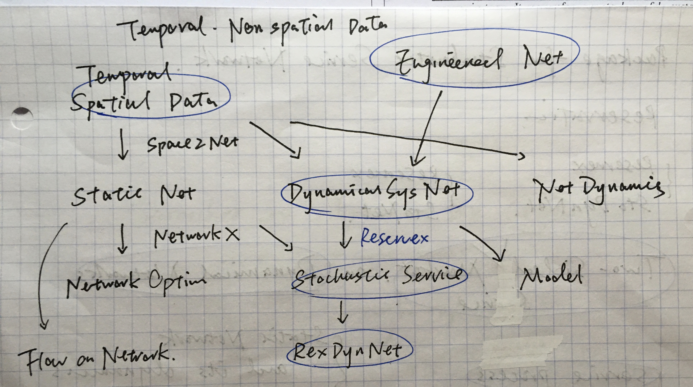
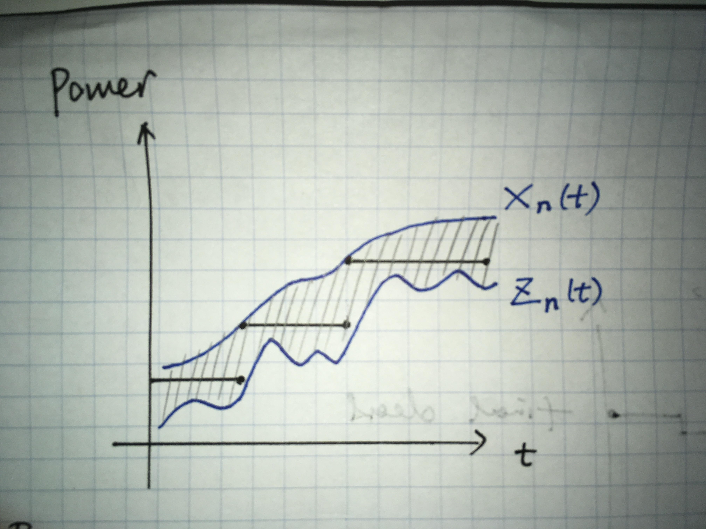

To establish spatially and temporally networked three-sided order-driven continuous double auction market by designing a centralized intermediation exchange, behaviors of prosumers and physical dynamics will be modeled by agent-based simulation and multi-input multi-output control models respectively, and possible strategies will be formulated.

## 1, Introduction

Lots of real-world systems, like power grids, district heating networks, canteen chains, can be viewed as __stochastic service networks (SSN)__. SSNs consist of two parts, __two-sided service markets (TSSM)__ and __service delivery networks (SDN)__. TSSMs are different from ordinary markets because of stochasticity from both sides. For example, the power output of renewable energy generation technologies cannot be controlled directly. Usually, the service processes require facility devices, goods and labors, which are seen as SDNs as a whole.

|           Object           |         Tool         |
|:--------------------------:|:--------------------:|
| Stochastic Service Network |        RexNet        |
|  Two-Sided Service Market  | Reservation Exchange |
|  Service Delivery Network  |        CEEFC         |
|      Passive Conduit       |    SpaceMeterNet     |

__RexNet__ is a framework to model and control stochastic service networks. It is composed of several toolboxes, which are illustrated in figure 1 and summarized in the following sections.

## 2, Reservation Exchange for Two-Sided Service Market

Reservation Exchange for Stochastic Service (Reservex) is a centralized reservation mechanism for time-dependent service with stochastic supply and demand, where participants can trade standardized `futures contract` to buy or sell specific quantities of a `retailing asset` at a specific price with delivery set at a specified `time unit` in the future. The market for this kind of trade is special. Usually, the `delivery network` is needed, and supply-demand balance needed to be satisfied all the time. RFM respects all the constraints, and allows small-scale participation in the meantime. The `exchanger` is the centralized agent to organise the market in `primal network`. It is responsible for collecting contracts, setting prices and maintaining the delivery network. Participants have to register with an exchanger, and the exchanger is counterpart to all its registered participants, the group of which forms its `population`. The prices for futures contract, `forward price`, are set by the exchanger and are the same for its population. There may be several exchangers in the market. Exchangers manage the trades among each other, which composes the `secondary network`. Overall, RFM encourages early booking, prediction and flexibility. It can be applied in many areas, among which the most promising two are distributed energy system, Internet streaming and food distribution.

## 3, PEEFC: Model and Control Service Delivery Network

The system in SDN maybe dynamical, which means the states of the system is dynamical and the structure or parameters of the system is not time-invariant. The control of SDN is multivariable control, which will discussed in more detail in the first part.

## 4, Toolbox

- [ReservexSim](https://github.com/edxu96/ReservexSim): Discrete Event Simulation of Reservation Exchange for Stochastic Service
- [CEEFC](https://github.com/edxu96/CEEFC): Model and Control of Large-Scale Reservex-Based Service Delivery Network
- [SpaceMeterNet](https://github.com/edxu96/SpaceMeterNet): Space as Static Networks or Dynamical Systems on Networks

## 5, Advantages and Disadvantages

- minimize the amount of power reserve needed

## 6, Applications

Try to treat the trading as a game that prosumers have to play all the time.

### 6.1, Reservex-Energy: Low-Carbon Low-Cost Energy System Based on Retail Futures Market

The most prospective large-scale application is the low-carbon low-cost energy system based on RFM. Future low-carbon energy systems require participation from renewable energy and small-scale prosumers. The double auction mechanism and its auxiliary markets leave no space for that, and they prevent developing or under-developed areas to realize liberalization because they are too expensive to be established.

The advantages of RFM-Energy:
- Direct participation of small-scale prosumers
- Less computation power
- Support for progressive development
- Feasible for under-developed area
- No need of auxiliary markets
- Easy-to-calculate nodal pricing
- Reduce intermediation cost

### 6.2, Reservex-Food

## 7, More Info

- The mathematical descriptions of RexNet can be found in [edxu96/ReservexSim/math](https://github.com/edxu96/ReservexSim/tree/master/math).
- 随机服务预订交易所。随机服务预订交易所是一个中央预订系统，专为有一定随机性的服务设计。它可以被应用于分布式能源系统，互联网串流服务，生鲜食品销售等服务市场中。虽然项目是用英文写的，但是有[RexNet-Docs/中文简介](https://edxu96.gitbook.io/rexnet-docs/translation/intro)。
- Hi, there. I'm Edward J. Xu. I am looking for partners, because this promising but intractable project requires lots of statistics, operations research, and discrete dynamic simulation knowledge. You are more than welcome to contact me. Detailed contact information can be found in my personal website [edxu96.github.io](https://edxu96.github.io).
- Direct discussion about RexNet can be found in [RexNet-Docs/RexNet](https://edxu96.gitbook.io/rexnet-docs/mechanism-description/rexnet) .
